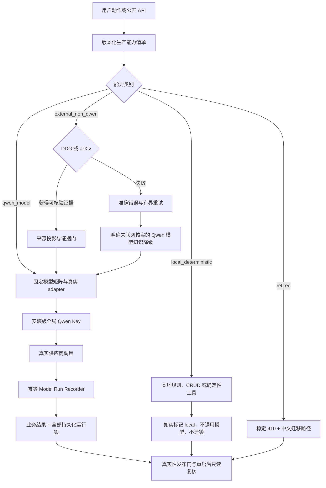

# BridGes 第六轮可靠性与 Qwen 真实性改进方案

Decision status: approved

Last updated: 2026-08-13

## 目标

把 BridGes 从“功能入口存在、部分测试通过、模型能力已经登记”升级为一套可以从真实用户旅程、真实外部请求和持久化运行证据共同验证的可靠系统。本轮同时解决三个用户已实际遇到的问题，并完成所有公开功能的全局 Qwen Key 真实性审计：

- 普通主题必须真实进入 arXiv 请求，不能把无主题分页请求误报成论文搜索失败。
- 用户按 Enter 创建首轮后，焦点必须进入主内容，不能让蓝色“跳转到主内容”覆盖左上角 Logo；正常键盘 skip-link 能力仍要保留。
- 学习模式必须在 8 秒公网预算内可靠尝试 DuckDuckGo，保留真实错误和尝试记录；DDG 最终失败时，只能进入明确标注的 Qwen 模型知识降级，不能伪造联网或引用。
- 所有宣称使用 Qwen 的现代产品能力必须通过安装级全局 Key 调用真实生产 adapter，使用批准的固定模型，并为每次实际调用保存可追溯的 `model_run_lock`。
- 本来不需要模型的本地确定性功能必须诚实保持本地，不得为了“看起来智能”而强行调用 Qwen；外部非 Qwen 检索也不得继承或泄露 Qwen Key。
- 已冻结退役的旧 Expression 与 Media 写入口必须返回稳定 410，不能继续由模板、进程内存或测试 Stub 伪装成生产模型成功。
- 发布负责人最终能用一条失败关闭的真实探针命令证明：公开能力分类完整、生产接线真实、模型矩阵固定、调用锁完整、凭据没有泄露。

本方案的可靠性定位是：

> **成功有真实证据，失败有准确边界，模型调用可追溯，本地能力不冒充模型。**

## 用户故事

- `US-01`：作为论文搜索用户，我希望普通主题真正发送给 arXiv，并获得来源真实的论文卡片或可操作的失败原因。
- `US-02`：作为键盘用户，我希望按 Enter 创建新对话后焦点落在主内容，同时保留刷新页面后用 Tab 跳过重复导航的能力。
- `US-03`：作为学习模式用户，我希望系统真实尝试 DuckDuckGo；搜索成功时给出可核验来源，失败时明确说明未联网核实并允许重试。
- `US-04`：作为学习者，我希望联网失败不会伪造引用或错误推进教学计划，仍可获得由真实 Qwen 提供、边界清楚的模型知识背景回答。
- `US-05`：作为普通聊天、Humanizer、Career、知识库和媒体功能用户，我希望宣称由 Qwen 生成的结果确实来自全局 Key 对应的真实供应商调用，而不是 Stub 或模板。
- `US-06`：作为画像用户，我希望明确自述可以安全、快速地本地抽取，歧义陈述才交给 Qwen；两条路径都如实披露来源。
- `US-07`：作为知识库用户，我希望 OCR、入库向量和查询向量来自批准的真实 Qwen 模型，失败时不会以空文本、模板或关键词降级冒充模型成功。
- `US-08`：作为图片、视频和语音用户，我希望生成、替代文本、供应商取消、ASR 与 TTS 等真实外部动作均可审计，纯本地读取不会制造假锁。
- `US-09`：作为旧 API 调用者，我希望收到稳定 410、中文迁移说明和现代入口，而不是继续得到不持久、不可审计的假成功结果。
- `US-10`：作为运维和发布负责人，我希望启动与发布门能阻止模型漂移、生产 Stub、未绑定 adapter、直接客户端旁路和调用锁缺失。

## 已验证现状

### arXiv 论文搜索

普通主题路径存在已确定的本地构造缺陷。`src/bridges/arxiv_mcp/client.py` 只在发现 `author:`、`title:`、`id:`、`year:` 等结构化字段时组装检索约束；输入 `Transformer` 这类纯普通主题时，规范化后的主题没有进入 `search_query`，上游只收到分页与排序参数。

截图对应的生产记录显示该轮最终为 `arxiv_request`、0 条结果，且没有模型运行锁。这能证明失败发生在 Qwen 之前，但现有错误折叠已经丢失具体上游 4xx 类别，不能事后断言当时究竟是 400、代理阻断还是其他上游状态。

论文检索与论文卡片字段整理属于 `external_non_qwen`：标题、作者、摘要、链接必须来自真实 Atom 响应；卡片中的中文摘要、相关性说明和学习建议当前是确定性整理，不应冒充 Qwen。只有真实论文返回后的最终自然语言综合才允许调用 Qwen，并需另存运行锁。

主要证据：

- `src/bridges/arxiv_mcp/client.py` 的查询参数构造和 HTTP 错误映射。
- `src/bridges/arxiv_mcp/service.py` 的论文投影与确定性字段整理。
- `src/bridges/chat/turn.py` 的论文路由、最终 Qwen 综合和引用校验。

### 首轮 Enter 后的蓝色跳转链接

真实 Playwright Chromium 已稳定复现：鼠标点击发送后，最终焦点会进入 `main#main-content`；在输入框按 Enter 后，Next 客户端导航先把焦点放到新路由的首个 DOM 节点，即 skip link。由于这次程序化聚焦继承了键盘输入模态，链接仍匹配 `:focus-visible`。

当前 `AppShell` 错误地把 `:focus-visible` 当成“用户主动 Tab 聚焦”的判据，因此 Enter 路径不会把焦点归一到主内容。CSS 本身正常工作：链接一旦匹配 `:focus-visible`，就会展开为截图中的蓝色“跳转到主内容”。这不是 Logo 损坏，也不能通过删除 skip link、改透明色或永久取消焦点来修复。

现有全栈 E2E 还暴露了一个独立基线错误：全新 SQLite 缺少 `learning_project_migration_conversations`，会让最近对话和首轮创建在到达焦点断言前失败。该迁移缺陷需要单独修复，不能混入前端焦点补丁。

主要证据：

- `apps/web/src/components/layout/AppShell.tsx` 的 pathname 焦点 effect。
- `apps/web/src/components/design-system/SkipLink.tsx` 与 `apps/web/src/styles/globals.css`。
- `apps/web/e2e/issue13-new-chat-composer.spec.ts` 的 Enter 路径测试缺口。

### DuckDuckGo 学习联网

生产会话已确认真实触发学习模式搜索，但最终投影为 `web_search_timeout`，`attempt_count=0`、`query_count=0`、`provider_attempts=[]`、`searched_at=null`。同一轮随后通过真实 `qwen3.7-plus-2026-05-26` 成功生成正文，教学计划和课次没有推进。

已确定的代码根因不是“系统完全没有调用搜索”，而是外层 `_parallel_search` 和内层 `WebSearchService` 共用同一个 8 秒绝对 deadline。外层在边界把尚未进入旧 `done` 集合的 future 改写成稀疏超时；future 即使在随后有界清理窗口内形成了真实投影，也只被回收，不再被消费。下层真实错误、查询记录和提供方尝试因此丢失。

后续同款真实探针曾在约 1.3 秒内报告 DDG ready，同主题完整搜索曾在约 5.6 秒返回 5 条结果、其中 3 条可核验。这说明 DDG 不是持续不可达，但不能反推截图时刻的具体上游原因。DDG 是无需 Key 的公开第三方端点，系统可以保证有界尝试、错误保真和安全降级，不能保证它永远在线、不限流或页面结构永不变化。

截图中的“已参考 4 条相关信息”也不是 4 条网络来源，而是 4 条已授权画像信息。当前并列文案容易让用户把画像计数误认为搜索证据，需要明确改成“已使用 4 条用户画像信息进行个性化（不是资料来源）”。

主要证据：

- `src/bridges/chat/turn.py` 的公开搜索并行编排、投影映射和模型知识降级。
- `src/bridges/web_search/service.py` 与 `client.py` 的 DDG deadline、尝试和来源验证。
- `src/bridges/learning/teaching_gate.py` 的证据门和不推进语义。

### 全局 Qwen Key 与生产调用

当前产品使用安装级全局 Qwen Key，不是每账号单独 Key。生产数据库已有 `qwen_text_chat`、TTS、ASR 的真实成功运行锁，且生产环境不是 fixture/cassette/Stub，证明全局 Key 和部分主链确实可用；这不能自动证明每一项公开功能都已真实接线。

只读审计得到以下分类：

| 功能旅程 | 当前实际情况 | 需要的动作 |
| --- | --- | --- |
| 普通聊天 | 真实 `qwen_text_chat`，消息和运行锁已持久化 | 保持并纳入最终真实性门 |
| 学习模式 | DDG 搜索本身不用 Qwen；成功或安全降级后的最终正文使用真实文本模型 | 修复 DDG 编排并区分搜索与模型两个阶段 |
| arXiv | 检索不使用 Qwen；成功后的最终综合使用文本模型 | 修复普通 query，禁止伪论文和静默 DDG 替代 |
| Humanizer | 生产走真实结构化 adapter，但首稿和修订锁被结果合同丢弃 | 保存每次模型调用锁并与消息关联 |
| Career | 生产走真实结构化 adapter，但生成/修复锁被丢弃，消息终态可为 `model_id=None` | 保存全部调用锁，失败不得提升为完成 |
| Profile | 明确信号常见路径由本地规则处理；只有歧义输入调用真实 Qwen，Qwen 锁当前丢失 | 保留 hybrid，诚实标记 `local/qwen`，只给真实 Qwen 分支落锁 |
| 知识库 OCR | 生产端口会直连真实 Qwen OCR，但绕过统一 gateway，只返回文本 | 统一审计端口，逐页保存成功、失败和重试锁 |
| 入库/查询 Embedding | 生产会直连真实 Qwen Embedding，但只返回向量，索引模型 ID 不是调用锁 | 入库、重建、查询全部记录真实批次/查询锁 |
| 图片/视频主链 | 代码主链真实调用 Qwen Image/Wan 并写锁；当前生产库缺少实际媒体任务，尚不能据此宣称 live 已验证 | 保持主链，并由最终真实 smoke 证明供应商返回 |
| 图片替代文本与图片/视频取消 | 会执行真实视觉/供应商动作，但调用锁丢失 | 补齐成功、失败和取消锁；纯本地读取不造锁 |
| ASR/TTS | 已有真实成功锁 | 纳入固定矩阵和最终真实性门 |
| 旧 `/expression` 写入口 | 登记为模型能力但生产缺 adapter；确定性生成器仍可交付正文，模型状态和输出被忽略 | 返回 410并移除伪能力，不为即将退役入口补模型 |
| 旧 `/media` 写入口 | 图表/图形/分镜主要是确定性或进程内能力；旧 accessibility TTS 还有锁缺口 | 按 ADR-0026 返回 410，现代聊天媒体链不受影响 |
| 登录、账户、会话列表、画像编辑、材料 CRUD、关键词检索 | 本地确定性操作，不应调用 Qwen | 在真实性门中证明零模型调用，避免错误“全功能都要调用模型” |

### 模型矩阵与运行审计

ADR-0009 和 `src/bridges/ai/fixed_models.py` 试图建立固定模型单一事实源，但生产组合仍散落 `qwen3.6-flash`、`qwen3-vl-plus`、`qwen-vl-ocr` 等字面量。结构化输出、画像、Vision 和 OCR 没有被完整纳入统一矩阵；测试环境还会为未绑定能力自动补 Stub，使“测试通过”不能证明生产接线完整。

现有 `model_run_lock` 也不是所有模型调用的统一审计接缝。Humanizer、Career、Profile、OCR、Embedding 和部分媒体动作会在不同层丢弃锁。若只让业务结果成功、事后再尽力写锁，会出现“用户已拿到结果，但无法证明由哪个真实模型生成”的不可修复审计空洞。

## 已冻结的 grilling 决策

1. 产品继续使用安装级全局 Qwen Key，不改成每账号 Key；账户之间仍需隔离数据、上下文、业务 run 和锁关联。
2. 通用网页搜索只使用 DuckDuckGo，不申请、不接入 Brave、Tavily 或其他备用搜索 Key，也不保留静默 provider fallback。
3. DDG 最终失败时，允许真实 Qwen 使用模型知识给出谨慎背景回答；正文只标记一次“本轮未联网核实”，引用必须为空，不创建或推进依赖联网证据的教学计划与课次。
4. DDG-only 的可靠性目标是“成功时证据可靠；失败时错误准确、重试有界、降级安全且可观测”，不承诺第三方公开端点每轮必然成功。
5. Profile 保留混合抽取：明确自述、更正等安全信号本地处理；歧义信号才调用 Qwen。必须如实标记来源，本地路径零模型锁，Qwen 路径保存真实锁。
6. 旧 `/expression` 和旧 `/media` 写 API 按 ADR-0026 退役并返回稳定 410；不为即将删除的伪能力补 adapter，也不强迫合法的确定性图表工具改成模型生成。
7. `qwen_text_chat`、`qwen_structured_output`、`qwen_profile_extraction` 统一使用 `qwen3.7-plus-2026-05-26`。
8. Vision/OCR 先使用真实全局 Key 做兼容 smoke：兼容则对齐 `qwen3.7-plus-2026-05-26`；不兼容则必须先更新 ADR、记录证据和明确例外，之后才能保留独立模型。
9. Embedding、ASR、TTS、Image、Video 沿用既有批准矩阵；所有模型 ID 只从 `fixed_models.py` 的单一事实源引用，禁止静默换模型、能力或本地模板。
10. 每一次真实模型动作都必须有独立、持久化、幂等的运行锁，包括成功、失败、超时、重试、修订、修复和供应商取消；业务主锁不能替代同一 run 的完整调用历史。
11. Key、Authorization、prompt、响应正文、用户消息、OCR 文本和材料内容不得进入运行锁、普通日志或发布报告。
12. 最终发布门按功能实际职责分类：`qwen_model`、`external_non_qwen`、`local_deterministic`、`retired`。只有第一类必须调用 Qwen，其他类别必须证明没有伪装或凭据泄露。

## 目标架构

### 四类能力合同

1. **`qwen_model`**
   - 必须由 production composition 绑定真实 adapter，并通过安装级全局 Key 调用批准模型。
   - 模型实际返回 ID 必须与固定矩阵一致；权限不足、超时、解析失败和模型漂移均失败关闭。
   - 每次实际外部动作分别落锁，业务投影可指向主要锁，但不能折叠重试或修复历史。

2. **`external_non_qwen`**
   - DDG 与 arXiv 使用各自固定公开端点和安全 URL 合同，不读取、不继承、不发送 Qwen Key。
   - 只有真实返回并通过来源验证的数据才能进入证据门；模型知识不能回填成搜索成功。
   - 最终自然语言综合若调用 Qwen，必须作为独立阶段和独立运行锁记录。

3. **`local_deterministic`**
   - 账户、资料管理、安全规则、明确画像信号、关键词检索等本地功能不需要模型。
   - 本地结果必须披露 `local`/确定性来源，不生成模型 ID 或假运行锁。
   - 确定性能力不是低质量的同义词；缺陷在于把它错误宣传成真实模型生成。

4. **`retired`**
   - 冻结清单中的旧写入口返回稳定 410、中文原因与现代替代路径。
   - 退役能力不进入生产 MODEL registry，不由测试 Stub 补齐，也不产生模板假成功。
   - 历史只读和导出兼容面按 ADR 保留，不在本轮删除用户已有数据。

### DuckDuckGo 可靠性原则

- PUBLIC_SEARCH 用户可见硬截止保持 8 秒；DDG provider deadline 默认提前 750ms，为结果汇总、投影持久化和 SSE 终态留出交接预算。
- 外层和内层只能使用一个预算单一事实源；清理窗口内完成的真实终态必须被重新消费，不能被旧 `done` 快照覆盖。
- 每轮 DDG 最多两次实际请求：首次加一次受剩余预算约束的重试或查询改写，两者不能叠加成第三次。
- connect、DNS/offline 暂态和明确可重试 5xx 才允许一次重试；timeout 只有剩余预算足够时重试；challenge、429、权限、取消和安全错误不立即重试。
- 重试前使用 200ms 可取消退避；剩余时间不足最小请求窗口与 750ms 交接预留时不启动第二次。
- DDG provider timeout、PUBLIC_SEARCH stage timeout 和用户取消必须使用不同错误语义；实际请求发生后，投影不能仍显示零次尝试。

### Qwen 模型与凭据原则

- 全局 Key 只由固定凭据解析和生产组合根消费，业务服务不读取环境变量，也不在日志中探测 Key 值。
- 真实 live smoke 显式 opt-in，必须禁用 Stub、fixture 和 cassette；缺 Key、网络或供应商权限时为失败或 `inconclusive`，绝不伪通过。
- 运行锁只保存 capability、provider、model、status、时间、调用序号和安全业务关联；不保存模型输入输出和用户内容。
- 进程重启后仍能只读查到锁和业务关联，才算完成真实性闭环。

## 反馈环与发布定义

### 确定性反馈环

- arXiv 使用会在缺少 `search_query`/`id_list` 时返回 400 的受控 HTTP seam，证明普通主题真正穿过请求边界；另以显式真实 smoke 验证固定上游。
- skip link 使用真实 Chromium 与 Next 客户端路由验证 Enter、鼠标和刷新后 Tab 三条路径；jsdom 不能代替 `:focus-visible` 输入模态测试。
- DDG 使用 barrier/fake clock 在 deadline 前、交接窗口、stage deadline 后和用户取消时确定性复现，循环运行验证终态不会丢失。
- 模型审计先用可控 adapter 验证锁的成功、失败、重试、幂等、事务和账户隔离，再用全局 Key live suite 证明真实供应商返回。

### 真实性硬门

- 所有公开能力必须在机器可读清单中恰好分类一次；遗漏、重复或未知能力直接阻止发布。
- 每个 `qwen_model` 必须有真实 adapter、批准模型和完整锁；生产 Stub、`no_adapter`、直接 Qwen 客户端旁路和模型字面量漂移直接失败。
- `external_non_qwen` 和 `local_deterministic` 的代表旅程必须证明模型调用数为 0；DDG 失败后的 Qwen 降级是另一条独立调用，不能算作搜索成功。
- `retired` 路由必须稳定 410，无生成副作用；legacy 410 不计作“模型能力缺失”。
- 报告只能输出 build、capability、类别、provider、model、status、latency 和 lock ID 等脱敏证据。

### 真实发布探针

- 使用同一个安装级全局 Key，分别对 chat、structured、profile 歧义分支、Vision、OCR、Embedding、ASR、TTS、Image、Wan 执行最小成本真实调用。
- 同一轮同时验证 Profile 本地分支、本地 CRUD、DDG 和 arXiv 检索阶段没有意外调用 Qwen。
- 媒体取消只有在存在可安全取消的真实任务时才验证；没有任务不能伪造成功。
- live suite 完成后重启应用并复查数据库，确认全部模型运行锁与业务对象关联仍存在。
- 任一能力未真实接线、型号漂移、调用无锁、错误被提升为成功或报告泄露敏感内容时，发布命令非零退出。

## Issue 地图

| # | Issue | Priority | Status | Blocked by |
| --- | --- | --- | --- | --- |
| 01 | [修复 arXiv 普通关键词并建立真实搜索反馈环](issues/01-arxiv-live-search-feedback-loop.md) | P0 | ready-for-agent | None |
| 02 | [修复 Enter 创建首轮后 skip link 误占焦点](issues/02-skip-link-enter-focus.md) | P0 | ready-for-agent | None |
| 03 | [修复 DDG deadline 交接、错误保真与有限重试](issues/03-ddg-deadline-error-retry.md) | P0 | ready-for-agent | None |
| 04 | [将 DDG 健康探针接入降级状态与发布门](issues/04-ddg-health-release-probe.md) | P1 | ready-for-agent | 03 |
| 05 | [将画像信息文案明确为已授权用户背景](issues/05-profile-context-wording.md) | P2 | ready-for-agent | None |
| 06 | [修复全新 E2E SQLite 缺少迁移会话表](issues/06-e2e-sqlite-migration-table.md) | P1 | ready-for-agent | None |
| 07 | [退役旧 Expression 写入口，停止确定性草稿伪装为 Qwen 成功](issues/07-retire-legacy-expression-writes.md) | P0 | ready-for-agent | None |
| 08 | [退役旧 Media 写入口，保留现代聊天图片与视频主链](issues/08-retire-legacy-media-writes.md) | P1 | ready-for-agent | None |
| 09 | [固化生产 Qwen 模型矩阵与真实 adapter 启动门禁](issues/09-freeze-production-model-matrix.md) | P0 | ready-for-agent | 07, 08 |
| 10 | [建立通用、持久化、幂等的 model_run_lock 接口](issues/10-expand-durable-model-run-audit.md) | P0 | ready-for-agent | None |
| 11 | [补齐 Humanizer 真实 Qwen 首稿与修订审计闭环](issues/11-humanizer-real-qwen-audit.md) | P0 | ready-for-agent | 09, 10 |
| 12 | [补齐 Career 真实 Qwen 生成与修复审计闭环](issues/12-career-real-qwen-audit.md) | P1 | ready-for-agent | 09, 10 |
| 13 | [保留 Profile 混合抽取并诚实标记来源与 Qwen 审计](issues/13-profile-hybrid-extraction-audit.md) | P1 | ready-for-agent | 09, 10 |
| 14 | [统一知识库 OCR 的真实 Qwen 页级调用与持久化锁](issues/14-knowledge-ocr-real-qwen-audit.md) | P0 | ready-for-agent | 09, 10 |
| 15 | [统一知识库入库、重建与查询 Embedding 的真实 Qwen 审计](issues/15-knowledge-embedding-real-qwen-audit.md) | P0 | ready-for-agent | 09, 10 |
| 16 | [补齐图片替代文本及图片/视频供应商取消调用锁](issues/16-media-edge-model-run-locks.md) | P1 | ready-for-agent | 09, 10 |
| 17 | [建立全功能 Qwen 真实性发布门](issues/17-production-qwen-authenticity-gate.md) | P0 release gate | ready-for-agent | 01, 03, 07–16 |

### 推荐执行波次

1. 波次 A：01、02、03、05、06、07、08、10 并行。先修复三个独立用户问题、E2E 基线与两个生产真实性前置合同。
2. 波次 B：03 完成后执行 04；07、08 完成后执行 09。此时建立 DDG 运行观测并冻结生产模型矩阵。
3. 波次 C：09、10 完成后，11–16 按用户旅程并行迁移，每张 issue 都保持可独立验收。
4. 波次 D：01、03、07–16 全部完成后执行 17，组合真实供应商探针、能力分类和重启复核，形成最终发布证据。
5. 全局收口：02、04、05、06 虽不阻塞 Qwen 真实性门，仍必须完成后才能宣布本轮 17 张 issue 整体交付。

## 全局完成定义

- 17 个 Issue 的验收标准、测试计划和依赖全部完成；实现中发现的新公开能力已先加入能力清单并分类。
- `Transformer` 等普通主题真实进入 arXiv `search_query`；论文卡片只展示真实 Atom 数据，检索 worker 不继承 Qwen Key。
- Enter 首轮导航后焦点进入 `main-content`，蓝色 skip link 不再误显；刷新后首个 Tab 的可访问路径仍正常。
- DDG 在固定 8 秒总预算内完成有界尝试；真实投影不会被外层稀疏超时覆盖，所有实际请求都有准确尝试记录。
- DDG 成功时只有可核验来源进入证据门；失败时引用为空、正文明确未联网核实、教学计划不推进，并由真实 Qwen 提供安全背景回答。
- `/health/degraded` 和真实发布探针能显示 DDG 状态；DDG 瞬时失败不会让具备 Qwen 安全降级的整个聊天产品拒绝流量。
- 画像信息计数不再被误解为来源数量；全新 E2E SQLite 启动具备完整迁移表且重复迁移幂等。
- 旧 Expression/Media 写入口稳定 410，生产不再注册伪模型能力；现代聊天 Humanizer、图片、视频和语音入口不受误伤。
- 固定模型矩阵与 ADR 一致，所有生产模型 ID 来自单一事实源；Vision/OCR 已有真实兼容结论或先行批准的 ADR 例外。
- Humanizer、Career、Profile Qwen 分支、OCR、Embedding、媒体边缘动作的每次真实调用都有持久化运行锁；本地路径不造锁。
- 全功能 live suite 禁用 Stub、fixture 和 cassette，使用安装级全局 Key获得真实供应商结果；重启后仍可查到业务关联和全部锁。
- 发布报告不含 Key、Authorization、prompt、响应正文或用户材料；任一真实性硬门失败时保持当前生产版本，不发布不完整能力。

## 风险与处理

- **DuckDuckGo 仍可能限流或挑战**：不承诺第三方永远可用；通过双 deadline、最多一次重试、准确错误、缓存健康状态和 Qwen 安全降级控制影响。
- **重试放大限流**：challenge 与 429 不立即重试；每轮最多两次 DDG 请求，且共享 8 秒预算。
- **扩大运行锁造成 schema 与事务风险**：采用 expand-first，先增加向后兼容接口和双读，再按用户旅程迁移，最后由发布门收口；回滚应用不删除审计数据。
- **模型统一后出现供应商不兼容**：Vision/OCR 先做真实 smoke；不兼容时先更新 ADR，不用静默 fallback 或临时硬编码绕过。
- **真实探针产生成本或外部副作用**：使用最小样本、最小媒体规格和专用 probe run；取消动作只对可安全取消任务执行，报告成本与延迟。
- **把“真实调用”误解为“所有功能都调用模型”**：四类能力清单是权威边界，本地规则和外部检索必须同时证明零意外 Qwen 调用。
- **旧 API 退役误伤现代入口**：410 按冻结端点清单实施，契约测试同时证明现代 chat image/video/speech/Humanizer 保持可用；历史数据只读与导出不删除。
- **焦点修复破坏无障碍**：只在 pathname 变化且当前焦点确实是 skip link 时归一到 main，不删除 skip link、不修改通用隐藏类、不依赖固定延时。
- **测试替身再次掩盖生产缺口**：production-composition 与 live suite 显式禁止 Stub、fixture、cassette 和确定性模型 adapter；缺凭据或网络只能失败或 `inconclusive`。
- **敏感信息进入审计**：锁和报告使用字段允许列表，增加日志/产物扫描；Key 和用户内容从合同层禁止持久化。

## Comments

- 2026-08-13：基于用户提供的《六次改进》问题清单、真实生产只读记录、代码路径、确定性复现和真实 Chromium 测试完成诊断。
- 2026-08-13：通过 grilling 冻结全局 Key、DDG-only、安全模型知识降级、Profile hybrid、旧 API 410、固定模型矩阵和全调用锁策略。
- 2026-08-13：用户明确拒绝申请备用搜索 Key；此前 Brave/Tavily 等方案作废，通用搜索只保留 DuckDuckGo。
- 2026-08-13：用户批准按 17 个 tracer-bullet Issue 发布；每张任务可独立领取，宽泛的运行审计采用 expand-first，再按用户旅程迁移，最终由真实性 Contract 收口。
- 2026-08-13：本 README 汇总批准决策和执行地图；单张 Issue 的验收标准是实现权威，发生冲突时应先更新本 README、相关 ADR 与 Issue，再修改生产合同。
