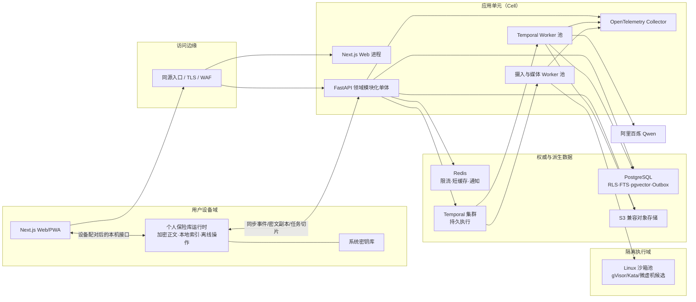

# 系统架构、数据治理与工程质量蓝图

形成日期：2026-07-24  
状态：已由用户通过逻辑原型确认  
适用范围：成熟科教智能体完整产品，不是 MVP

## 1. 架构结论

系统采用：

> **设备侧个人保险库 + 云/自托管领域模块化单体 + Temporal 持久工作流 + PostgreSQL 权威控制数据 + 独立强隔离沙箱 + Next.js 项目工作台**

这是“逻辑深模块、物理少进程、按风险拆运行时”的架构，不按功能菜单拆微服务。

- Qwen、LlamaIndex、LangGraph、Temporal、pgvector 都放在项目稳定接口之后，不能成为领域数据模型。
- PostgreSQL 是账户、授权、项目、共享对象、工作流状态、出处和审计元数据的事务权威。
- 私人原文、个人画像正文、长期记忆正文和私人索引默认由设备侧个人保险库加密保存；服务器只保存必要控制元数据、密文副本和用户明确授权的任务切片。
- 共享项目和机构自有对象由服务器项目域管理，但机构管理员不因管理身份获得个人保险库正文。
- Temporal 负责长任务、人工等待、定时器、有限重试、取消、补偿和事件回放；项目自己的工作流定义、运行 ID、双状态机、类型化产物和质量门仍是领域真相。
- Redis 只做限流、短缓存和非权威通知；不做工作流真相、长期队列、画像或会话正文存储。
- 生成代码、动画和交互媒体只能进入独立 Linux 沙箱执行池，不能与主数据库、模型密钥或内部网络共域。
- Conda `agent` 只用于本地开发。生产运行独立支持手动分进程、统一 CLI、Docker、Podman，不要求 Conda。

## 2. 设计原则

1. **按语义划分模块，按风险和扩缩划分进程。**
2. **一个权威事实只有一个写入模块。** 其他模块通过接口或事件获取结果，不能越表写入。
3. **接口即测试面。** 测试验证可观察结果和不变量，不依赖内部框架对象。
4. **作用域先于检索与推理。** 未完成身份、对象域、授权和密钥时期检查前，不能查询索引、缓存、队列或模型。
5. **正文与控制数据分离。** 队列、日志、追踪和审计只传受控引用、哈希和最小字段。
6. **运行完成不等于产物可发布。** 工作流运行状态、产物可信状态、人工批准和发布状态分离。
7. **删除与撤权优先传播。** 新写入、召回、同步和恢复在墓碑与撤权未知时失败闭锁。
8. **本地优先不是“本机单用户”。** 设备侧数据仍绑定账户、对象域、授权版本和密钥时期。
9. **生产合同不依赖开发工具。** `environment.yml` 不能成为生产部署前提。

## 3. 总体拓扑



### 3.1 物理进程

| 进程/设施 | 职责 | 为何独立 |
|---|---|---|
| `web` | Next.js 项目主壳、服务端渲染、静态资源 | Node 运行时与前端独立扩缩 |
| `api` | 认证、领域命令/查询、授权、同步入口、上传协调 | 权威事务入口 |
| `worker-interactive` | 教学、证据、表达等低时延工作流活动 | 与 API 解耦，支持重放和限流 |
| `worker-batch` | 摄入、索引、评测、删除、迁移等长任务 | 避免挤占交互任务 |
| `worker-media` | OCR/ASR/TTS、分镜、媒体编排 | 资源模型不同 |
| `sandbox-runner` | 运行不可信代码和渲染 | 必须位于独立安全域 |
| PostgreSQL | 事务真相、RLS、FTS、pgvector、Outbox | 一致性中心 |
| Temporal | 持久工作流执行 | 可靠等待、重试、信号和回放 |
| Redis | 临时缓存、限流、通知 | 可丢失、可旁路 |
| S3 兼容存储 | 项目对象、密文副本、派生资产、评测结果 | 大对象和生命周期管理 |
| OTel Collector | 脱敏后收集 trace/metric/log | 后端可替换 |
| 个人保险库运行时 | 设备侧私人正文、索引、离线操作、密钥 | 满足本地优先与跨设备控制 |

`api` 与各 worker 使用同一 Python 领域代码，但以不同入口和最小数据库角色运行。它们不是独立业务微服务。

### 3.2 扩展方式

- 先横向扩 `web`、`api` 和不同任务队列的 worker。
- 以项目/机构哈希把请求路由到应用单元；一个单元拥有独立应用资源和数据库连接池。
- 普通租户共享 PostgreSQL 集群并由 RLS、对象授权和密钥域隔离。
- 高隔离机构可进入独立应用单元或独立数据库，但复用同一 Schema、迁移、模块接口和评测套件。
- 只有出现独立故障域、数据主权或持续容量证据时，才把某模块拆为远程部署；拆分通过既有接口，不改变领域语义。

## 4. 深模块与接口

### 4.1 身份与会话模块

隐藏密码哈希、邮箱验证、MFA、OIDC、会话轮换、设备证书、撤销和风控。

主要接口：

- `register_account(registration) -> VerificationChallenge`
- `authenticate(credential, device) -> Session`
- `resolve_subject(session) -> SubjectContext`
- `revoke_session_or_device(target, reason) -> Revocation`

实现采用 Argon2id、服务端不透明会话、`Secure + HttpOnly + SameSite` Cookie、CSRF 防护；OIDC 是机构登录适配器，不取代本地账户归属。

### 4.2 作用域与授权模块

这是所有数据、工作流、索引、缓存和工具调用共用的唯一授权解释器。

主要接口：

- `authorize(subject, action, object_ref, purpose) -> AuthorizationDecision`
- `compile_scope(subject, requested_objects, purpose) -> ScopeEnvelope`
- `invalidate(grant_or_object_event) -> InvalidationPlan`

接口同时返回允许对象、字段裁剪、用途、有效期、策略版本、密钥时期和拒绝理由。调用者不能只获取布尔值后自行扩展范围。

### 4.3 对象归属与协作模块

隐藏个人保险库、显式共享项目、机构管理域、角色基线、对象授权、邀请、复制共享、审批和退出规则。

主要接口：

- `create_owned_object(owner, domain, descriptor) -> ObjectRef`
- `share_as_project_copy(source, preview, grant) -> ProjectObjectRef`
- `apply_membership_change(change) -> AccessPropagationPlan`
- `request_human_decision(subject, object, decision_type) -> HumanTask`

“分享”创建最小化项目副本，不挂载个人保险库引用。

### 4.4 个人画像与学习模块

统一维护画像观察、候选画像、画像断言、学习使命、学习记录、知识状态、路径和记忆切片，但各对象保持独立。

主要接口：

- `observe(event, authorization) -> ProfileObservation`
- `propose_profile(observations) -> CandidateProfile`
- `confirm_profile(candidate, human_decision) -> ProfileAssertionVersion`
- `compile_memory_slice(work_order, scope) -> MemorySlice`
- `record_learning_evidence(evidence) -> KnowledgeStateProposal`

模型只能提出候选；稳定画像和知识状态更新经过证据门与用户/治理确认。

### 4.5 科学证据模块

隐藏 Source—Document—Chunk、Claim—Evidence、冲突、措辞强度、Citation 和领域包规则。

主要接口：

- `ingest(source, scope) -> IngestionRunRef`
- `build_evidence(question, scope, domain_pack) -> EvidenceSet`
- `qualify_claims(claims, evidence_set) -> ClaimGraph`
- `compile_fact_lock(claim_graph, task_contract) -> FactLock`
- `validate_publication(artifact, fact_lock) -> ValidationReport`

LlamaIndex、FTS、pgvector 和 rerank 都是内部适配器，调用者不接触其对象。

### 4.6 科学创作模块

统一教学设计、科学表达和多模态创作的任务入口，内部使用不同专业策略。

主要接口：

- `design_teaching(work_order, evidence, memory_slice) -> TeachingPlan`
- `draft_expression(contract, claim_graph, fact_lock) -> ExpressionDraft`
- `design_media(goal, claim_graph, teaching_plan) -> MediaStoryboard`
- `revise(artifact, feedback, immutable_fact_lock) -> ArtifactVersion`

它不拥有授权、证据或画像，只消费已验证的类型化产物。

### 4.7 工作流控制模块

隐藏 DSL 编译、Temporal 适配器、双状态机、幂等、预算、重试、取消、补偿、质量门与人工等待。

主要接口：

- `compile(work_order, scope_envelope) -> WorkflowPlan`
- `start(plan) -> RunRef`
- `signal(run, typed_signal) -> RunState`
- `cancel(run, reason) -> CancellationResult`
- `inspect(run) -> RunProjection`

生产使用 Temporal 适配器；测试和逻辑原型使用确定性内存适配器。Temporal payload 只携带 ID、版本、哈希和短期票据，大正文通过受控对象引用读取。

### 4.8 评测与运行模块

主要接口：

- `execute_suite(suite, candidate, baseline) -> EvaluationRun`
- `compare(run_pair) -> EvaluationResultBundle`
- `decide_release(result_bundle, gate_policy) -> ReleaseDecision`

它复用生产模块接口重放，而不是维护一套“评测专用业务逻辑”。

### 4.9 外部能力网关模块

将 Qwen、邮件、对象存储、OCR/ASR/TTS、来源连接器和沙箱暴露为稳定逻辑能力。每次解析产生模型运行锁或工具运行锁。浏览器不能直接获得供应商密钥。

## 5. 数据分层与权威关系

### 5.1 四类数据域

| 数据域 | 明文权威 | 服务器保存 | 默认云模型权限 |
|---|---|---|---|
| 公共科学目录 | PostgreSQL/S3 | 公共元数据、合法快照、状态和索引 | 按任务可用 |
| 个人保险库 | 用户设备 | 控制元数据、内容哈希、密文副本、墓碑和同步确认 | 仅本次用户授权的最小任务切片 |
| 显式共享项目/机构对象 | PostgreSQL/S3 | 项目正文、版本、权限、密钥与出处 | 按项目授权和风险策略 |
| 临时任务胶囊 | 临时加密对象 | 最小上下文、用途、TTL、运行绑定 | 仅绑定运行和模型网关 |

设备离线时，服务器不能读取只在设备上的私人正文；系统应显示“需要该设备上线”，不能静默改用其他用户数据或模型参数记忆。

### 5.2 PostgreSQL Schema

按模块分 Schema，模块只写自己的表：

- `identity`：account、credential、session、device、mfa、oidc_link；
- `governance`：tenant、membership、project、role、object_registry、object_grant、authorization_snapshot、policy_version、key_epoch、tombstone；
- `sync`：replica、operation、device_ack、conflict_branch、resolution；
- `profile`：observation、candidate、assertion_version、learning_mission、learning_record、knowledge_state、memory_slice；
- `science`：source、document_version、chunk_version、claim_version、evidence、citation、conflict、fact_lock；
- `creation`：expression_contract、draft_version、storyboard_version、media_object_version；
- `workflow`：definition_version、run、node_attempt、event、artifact_ref、gate_result、human_task、tool_call、compensation、outbox；
- `evaluation`：suite_version、case_version、run_lock、result_bundle、release_decision；
- `audit`：security_event、access_event、signature_batch。

`object_registry` 只保存所有对象共有的归属、域、敏感级别、版本指针和删除状态；业务字段仍在类型化表中，禁止演变成通用 EAV。

### 5.3 版本与并发

- 外部稳定 ID 使用 UUIDv7/ULID 类时间可排序随机 ID，数据库自增 ID 不进入跨系统合同。
- 重要对象采用不可变版本行 + 当前指针；修改不覆盖历史。
- 命令携带 `expected_version`，使用乐观并发控制。
- 科学语义、事实锁、归属、授权或删除冲突保留分支并进入人工门。
- 评论、标签集合和不重叠结构字段才允许确定性合并。
- 每次事务同时写业务状态和 Outbox；发布器把事件送入 Temporal、缓存失效、同步和观测管道。

### 5.4 RLS 与数据库角色

- 浏览器永不直连数据库。
- `api` 每个事务先由认证模块解析主体，再设置不可伪造的事务级 subject/user/tenant/project/purpose。
- RLS 依据对象域、owner、project membership、object grant 和 tombstone 执行；应用条件查询是第二层，不是替代品。
- worker 使用专用数据库角色和运行上下文信封，不能获得全库旁路。
- migration、备份和安全事件角色独立，日常应用进程无 `BYPASSRLS`。
- 公共目录和私人数据使用不同 Schema/策略，防止“公开缓存”误收私人结果。

## 6. 设备保险库与加密同步

### 6.1 设备侧

个人保险库运行时由同一代码库产出独立可安装程序，终端用户不需要 Conda。它包含：

- 加密本地元数据数据库；
- 加密文件与媒体存储；
- 私人全文/向量索引；
- 待同步操作日志；
- 设备证书、密钥包装和任务胶囊授权；
- 仅监听 loopback 的本机接口，并与 Web/PWA 做一次性配对。

浏览器轻量模式可使用加密 IndexedDB/OPFS 适配器，但大文件、长期索引和强离线能力使用个人保险库运行时。两种适配器遵守同一 Vault 接口。

### 6.2 密钥

- 设备私钥进入系统密钥库，不进入配置文件。
- 个人对象使用对象数据密钥，由用户/设备密钥包装。
- 共享项目使用项目密钥，按成员设备包装；撤权产生新密钥时期。
- 服务器需要处理共享项目正文时，使用部署密钥管理服务做信封加密。
- 个人密文副本的同步权、存储权和模型计算权是三个独立授权。
- 日志、Temporal 历史、Redis 和追踪禁止存放密钥、完整提示或解密正文。

### 6.3 同步

同步协议按以下顺序执行：

1. 认证设备和当前会话；
2. 拉取策略、撤权、密钥时期和删除墓碑；
3. 使本地过期授权失效；
4. 交换已签名、带基础版本和因果关系的操作；
5. 再次进行对象级授权；
6. 确定性合并或创建冲突分支；
7. 写入新版本和 Outbox；
8. 返回服务器确认与其他设备待确认状态。

不用“最后写入者获胜”处理科学语义。删除墓碑优先于离线编辑；旧操作进入隔离区，不复活对象。

## 7. 工作流、任务队列与副作用

### 7.1 Temporal 的角色

选择 Temporal 作为生产持久工作流运行时，原因是系统普遍存在长任务、人工等待、定时复习、限次重试、撤权信号、取消、补偿和版本升级。自研 PostgreSQL 状态机只保留为领域投影和极小维护任务，不承担完整编排。

LangGraph 只允许作为某个专业节点内部的受限推理图适配器，不负责跨天等待、授权、产物状态或发布。

### 7.2 队列

按工作负载设置任务队列：

- `interactive`：短课、普通证据问答和表达修订；
- `ingestion`：解析、OCR/ASR、分块、embedding 和索引；
- `media`：分镜、渲染、TTS 和媒体校验；
- `evaluation`：基线双跑、纵向评测和统计汇总；
- `governance`：删除、撤权、密钥轮换、来源失效传播；
- `sandbox`：强隔离执行。

每个队列独立并发、预算和优先级。用户/租户配额不能被拆成多个队列绕过。

### 7.3 幂等与副作用

- 每个命令、节点尝试、工具调用和外部写操作有幂等键。
- 数据库写入与 Outbox 在一个事务提交。
- 外部副作用遵循“准备—执行—确认—补偿”；状态不明时查询幂等结果，不盲目重试。
- 只有超时、限流、瞬时网络和可证明不改语义的格式错误可以重试。
- 授权拒绝、删除、冲突、安全策略和人工否决失败闭锁。
- 取消先阻止新活动和结果提交，再撤销临时票据并运行已声明补偿。

## 8. 缓存、索引与限流

### 8.1 缓存

Redis 键必须包含：

`deployment_cell + tenant/user + object_domain + project + authorization_version + key_epoch + object/content_version + model/schema/version`

- 私人响应不做跨用户缓存。
- 授权、撤权、删除、来源失效和模型/Schema 升级通过 Outbox 触发失效。
- Redis 不可用时绕过缓存并降低并发，不改变权威结果。
- CDN 只缓存公开静态资源和明确公开内容；认证页面与私人响应使用禁止共享缓存头。

### 8.2 索引

- 公共目录、个人保险库和项目索引物理/逻辑分区。
- 任何检索先编译作用域，再做 FTS/pgvector 预过滤，然后融合与重排，输出后二次校验可见性。
- embedding、分块或元数据策略变化创建新索引版本，后台重建、双读评测、原子切换。
- 内容哈希相同也不能泄露另一账户是否上传过文件。

### 8.3 限流与配额

按 IP、账户、设备、租户、项目、动作、模型能力、Token、并发任务和风险级别组合限流：

- 注册、登录、恢复、邀请和导出使用更严格风控；
- 交互任务保留容量，不被批量摄入或评测饿死；
- 高成本多模态和沙箱任务使用租户配额与并发舱；
- 429 返回可解释的等待/配额信息，不静默降级到未验证模型；
- 限流计数可以在 Redis，配额结算和授权仍在 PostgreSQL。

## 9. 配置、密钥与四种生产部署

### 9.1 两层可复现合同

**本地开发合同**

- `environment.yml` 声明 Conda 环境名 `agent` 和开发所需运行时/native 依赖；
- `pyproject.toml`、Python 锁文件、`package.json`、`pnpm-lock.yaml` 锁定应用依赖；
- Windows/Linux 开发执行相同多用户、RLS、工作流和失败闭锁测试；
- Conda 不写入生产镜像、生产主机要求或运行时检测。

**生产运行合同**

- 发布 Python wheel/独立运行产物、Next.js standalone 产物和带 digest 的 OCI 镜像；
- 手动分进程、统一 CLI、Docker、Podman读取同一配置 Schema；
- 使用同一 Alembic 迁移、领域包注册、健康检查、备份、删除和恢复语义；
- 环境差异只能通过配置值表达，不能维护四套代码路径。

### 9.2 CLI

建议统一入口：

```text
science-companion doctor
science-companion migrate
science-companion serve --profile production
science-companion api
science-companion web
science-companion worker --queue interactive
science-companion worker --queue batch
```

`serve` 同时监管前后端应用进程，满足一个 CLI 命令启动前后端；基础设施既可连接外部托管实例，也可由 Docker/Podman 清单提供。生产的 Web、API、worker 仍是独立进程，不塞进同一解释器。

### 9.3 配置优先级

`内建安全默认值 < 版本化配置文件 < 环境变量 < secret/file reference < 启动参数白名单`

设置对象启动时一次解析并验证；未知键、弱安全组合和缺失密钥使对应能力失败闭锁。密钥不允许通过普通启动参数、前端变量或日志暴露。

### 9.4 健康检查

- `/health/live`：进程事件循环可响应；
- `/health/ready`：迁移版本、数据库、对象存储、Temporal、领域包和关键配置就绪；
- `/health/degraded`：Qwen、Redis、来源接口、沙箱等非核心依赖状态与降级能力；
- `doctor`：DNS、端口、文件权限、密钥引用、时间同步、迁移、模型能力探针和存储读写。

API 不能因 Qwen 离线而完全不提供本地浏览，但数据库、授权或 RLS 不可靠时必须停止私人读写。

## 10. 审计与可观测性

### 10.1 审计

追加式审计事件记录 actor、角色、设备、对象、域、操作、授权决定、策略版本、理由、时间和因果事件。

- 不复制个人画像、学习答案、私人材料、完整提示和模型输出正文；
- 正文审查通过受控对象访问完成；
- 高敏感正文访问要求目的、时限、双人批准和自动收回；
- 事件批次哈希链/签名并周期导出到不可修改存储；
- 删除审计保留“发生了删除及验证结果”，不保留被删正文。

### 10.2 OpenTelemetry

所有 trace、metric、log 使用：

- `trace_id/run_id/workflow_version`
- 假名化 actor、tenant、project、object domain；
- model/tool/domain-pack/schema/index 版本；
- queue wait、node latency、token、cost、retry、gate 和 terminal reason。

在 SDK 入口做字段白名单和脱敏，Collector 再做第二次处理。观测后端不能成为绕过授权搜索用户正文的旁路。

### 10.3 SLO

分别定义：

- 认证和授权可用性；
- 交互任务成功率与 P95/P99；
- 长任务按时收敛率；
- 证据与发布门完整率；
- 撤权/删除传播时延；
- 同步确认和冲突率；
- 沙箱排队和失败闭锁；
- 单位成功任务成本。

科学质量和跨账户泄漏使用评测硬门，不用普通可用性 SLO 平均。

## 11. 故障降级

| 故障 | 系统行为 |
|---|---|
| PostgreSQL/RLS/授权异常 | 私人读取与全部写入失败闭锁；不从缓存兜底 |
| Temporal 不可用 | 不启动新长任务；保留已提交请求和状态，恢复后重试调度 |
| Redis 不可用 | 绕过缓存、收紧并发；权威状态不丢失 |
| S3 不可用 | 元数据可浏览；需要对象正文的步骤阻塞，禁止发布缺失产物 |
| Qwen 不可用/限流 | 本地浏览编辑和证据查看可用；有限重试或已验证同区备选，显示实际模型 |
| OCR/ASR/TTS 失败 | 保留原件和可编辑草稿，允许人工修正，不伪造完成 |
| 沙箱不可用 | 只交付不可运行设计/代码草稿，多模态成品不能发布 |
| 个人保险库设备离线 | 不能使用该设备独有私人内容；显示等待设备，不改用其他来源 |
| 同步授权未知 | 停止提交内容，先同步撤权、墓碑和密钥时期 |
| OTel 后端不可用 | 本地有界缓冲/丢弃低级遥测；关键审计仍在事务库与 Outbox |
| 模型/领域包/索引版本失效 | 新运行停止使用；已有产物进入重新验证或失效传播 |

## 12. 备份、迁移与恢复

- PostgreSQL 使用 PITR、加密备份和定期完整恢复演练。
- S3 开启对象版本和生命周期，备份与数据库版本建立一致性清单。
- Temporal 使用独立 Schema/数据库和受支持的备份升级流程；领域运行摘要仍可从项目账本审计。
- Alembic 使用 expand/contract 窗口；应用版本先兼容新旧 Schema，再回填、切读、最后收缩。
- 不可逆迁移必须有导出、校验和前滚修复计划，不承诺虚假一键回滚。
- 恢复后先重放撤权、密钥时期和删除墓碑，再开放普通读取。
- embedding、分块、领域包和模型升级通过双版本、双读/双跑、原子指针切换。
- 每季度至少演练数据库全恢复、对象缺失、区域故障、密钥轮换、墓碑重放和工作流恢复。

## 13. 工程质量与测试金字塔

### 13.1 模块接口测试

- 纯规则和状态转换单元测试；
- 权限、版本、事实锁、删除、同步和队列不变量使用性质测试；
- 每个模块只通过其接口测试，避免测试框架内部对象；
- 时钟、ID、模型、对象存储和外部来源通过适配器注入。

### 13.2 合同与集成

- PostgreSQL 真实 RLS、事务、并发和 Alembic 迁移；
- Temporal workflow replay、activity 幂等、人工信号、取消和版本升级；
- S3 权限、哈希、生命周期和短期 URL；
- Redis 丢失/过期/串号；
- Qwen、LlamaIndex、OIDC、邮件、沙箱的合同测试与本地假适配器；
- 前后端 Schema 由 OpenAPI/生成类型校验，禁止手工漂移。

### 13.3 端到端与安全

- Playwright 覆盖注册、登录、会话轮换、账户切换、项目、质量门、恢复和无障碍；
- 两用户、两机构、两项目、相同对象名和相同内容哈希的隔离矩阵；
- 队列、缓存、索引、导出、日志、备份和恢复的越权测试；
- 提示注入、SSRF、恶意文档、文件炸弹、沙箱逃逸、邀请劫持和重放；
- 离线撤权、删除复活、密钥回退和冲突覆盖；
- 负载、容量、长稳、故障注入和灾难恢复。

### 13.4 持续评测

复用票据“建立持续评测、基线对比与消融体系”的六层结构。所有模型、裁判、工作流、领域包、索引和架构适配器升级都生成评测运行锁并与稳定版配对双跑。

### 13.5 CI/CD 门

1. 提交门：格式、类型、模块接口、确定性不变量；
2. 合并门：PostgreSQL/RLS、Temporal replay、契约、核心 E2E；
3. 夜间门：完整 E2E、跨账户、故障、部署矩阵和模型固定样本；
4. 发布候选门：迁移/恢复、容量、安全、持续评测、SBOM 和签名；
5. 灰度门：影子流量、按单元灰度、自动停止和人工批准；
6. 发布后门：SLO、漂移、硬门事件和快速回滚。

## 14. 仓库与依赖方向

建议单仓库：

```text
apps/
  web/                  # Next.js
  api/                  # FastAPI 组合入口
  worker/               # Temporal worker 入口
  vault-runtime/        # 个人保险库运行时
packages/
  domain/               # 纯领域对象与规则
  modules/              # 深模块实现
  contracts/            # Schema、事件、OpenAPI 生成源
  adapters/             # Qwen、Temporal、S3、Redis、LlamaIndex、OIDC
  evaluation/           # 评测套件执行
infra/
  compose/              # Docker/Podman 共用清单
  manual/               # systemd/Windows 服务与反向代理示例
  migrations/
  observability/
domain-packs/
tests/
```

依赖方向固定为：

`应用入口 → 模块接口 → 领域规则`  
`适配器 → 模块声明的内部端口`

领域层不能导入 FastAPI、SQLAlchemy、Temporal、LlamaIndex、Qwen SDK、Redis 或 UI 类型。

## 15. 原型要验证的问题

逻辑原型不验证界面美观，而验证下列架构不变量：

1. 用户 A 创建私人对象后，切换到用户 B 不能通过读取、缓存或任务引用访问；
2. 分享产生项目副本，不让项目成员读取个人原件；
3. 撤权会取消后续活动、轮换密钥并使旧运行不能提交；
4. 删除墓碑优先于离线编辑，旧编辑进入隔离而不复活对象；
5. Redis/Qwen/沙箱失败可以降级，PostgreSQL/授权失败必须闭锁；
6. `agent` 只允许本地开发配置，生产四种路径不依赖 Conda；
7. 手动分进程、统一 CLI、Docker、Podman 使用相同模块、配置和状态语义。

配套原型见：

- [原型说明](../prototypes/system-architecture/README.md)
- [状态模型](../prototypes/system-architecture/architecture_model.py)
- [交互终端](../prototypes/system-architecture/architecture_tui.py)
- [待确认结论](../prototypes/system-architecture/NOTES.md)

## 16. 已确认的默认组合

用户已确认以下组合：

1. 业务核心采用 Python/FastAPI 领域模块化单体，不按菜单拆微服务；
2. 生产持久工作流采用 Temporal，LangGraph 仅作专业节点内部可替换适配器；
3. PostgreSQL + RLS + FTS + pgvector 承载首个正式数据与检索平面；
4. 设备侧个人保险库承载默认本地优先正文和私人索引；
5. Redis 保持非权威，S3 保存大对象，Linux 沙箱独立安全域；
6. Conda `agent` 只用于本地开发；
7. 生产支持手动分进程、统一 CLI、Docker、Podman 四种同合同路径。

后续实现若通过验证 spike 发现适配器性能或兼容性不足，只调整相关实现与内部 seam，不推翻已经确认的模块接口、科学、画像、协作和评测边界。
