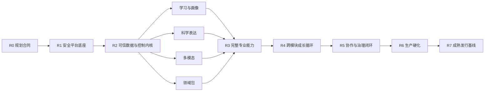

# 成熟项目开发路线、团队并行计划与阶段验收

形成日期：2026-07-24  
状态：已确认  
适用范围：科教智能体从规划收敛到成熟生产基线的完整开发过程

## 1. 结论

项目采用：

> **八阶段成熟度门 + 十二个长期责任域 + 六级发布证据门**

八个阶段只控制依赖、集成和证据成熟度，不代表按阶段向用户交付残缺产品。项目不设 MVP，也不以人力、算力或时间为由删减已确认能力；首次正式发布必须同时满足完整产品能力、科学可信、安全隔离、长期个性化、多模态、协作、本地优先、持续评测、容量恢复和四种生产部署等价要求。

路线的基本单位不是“做完一个页面”或“某团队代码合并”，而是**可运行、可评测、可迁移、可恢复的内部集成增量**。任何阶段只有在其进入条件、完成定义和跨模块证据全部满足后才能推进。

本路线明确排除作品演示、比赛答辩、宣传视频和路演材料；这些不属于项目开发路线。

## 2. 前提、边界与取舍

### 2.1 已确认前提

- 团队人员充足，可建立长期稳定的专业责任域；
- 算力充足，可运行完整回归、配对双跑、容量测试和多模态评测；
- 开发时间充裕，阶段推进由证据而非日历截止日决定；
- 基座模型使用 Qwen 系列，但权威用户状态、科学裁决、权限和发布门属于本地系统；
- 本地开发使用 Conda 环境 `agent`；
- Conda `agent` 不进入生产要求、生产镜像或终端用户运行环境；
- 生产支持手动分进程、统一 CLI、Docker、Podman，四种路径共享同一运行合同；
- 所有功能页面均要求登录，不同用户拥有独立画像、学习路径、项目、材料、索引、记忆和评测结果。

### 2.2 关键取舍

1. **成熟基线优先于尽早发布**：允许内部集成环境持续运行，但不把不完整内部版本包装为对外产品。
2. **契约先行优先于团队自由耦合**：人员充足不等于允许各团队各建一套对象、权限或状态语义。
3. **深模块优先于过早微服务**：团队按领域责任并行，生产核心仍以领域模块化单体和按风险拆分的进程为主。
4. **证据门优先于完成百分比**：安全、科学、迁移和恢复问题不能被其他模块的高完成度平均。
5. **前向迁移优先于虚假一键回滚**：数据和索引变更使用扩展—回填—双运行—切换—收缩；不可逆变更必须有导出、校验和前滚修复。
6. **独立验证优先于自证正确**：构建团队不能独自签署自己负责的科学、安全和发布硬门。

## 3. 项目运行模型

### 3.1 三层计划

| 层 | 作用 | 权威对象 |
|---|---|---|
| 产品能力层 | 确保九类一级能力和科学成长循环完整 | 能力矩阵、用户旅程、验收场景 |
| 工程责任层 | 确保每个稳定领域接口有唯一维护责任 | 责任域、接口目录、数据所有权 |
| 成熟度门层 | 确保集成版本具备推进证据 | 阶段状态、门禁结果、风险与签字 |

三层不得互相替代。产品能力全部“有代码”不代表系统已成熟；工程底座稳定也不代表教学、表达和多模态闭环已经完成。

### 3.2 需求可追踪

每项开发工作必须关联：

- 比赛硬约束或已确认产品需求；
- 对应的领域对象和责任域；
- 接口、数据、权限和风险影响；
- 自动测试、持续评测案例和人工验收场景；
- 迁移、部署、观测、文档和回滚影响；
- 所属阶段门与完成证据。

使用稳定的 `requirement_id`、`contract_id`、`risk_id` 和 `evidence_id`，禁止只在会议记录或聊天中保存关键范围。

### 3.3 内部集成版本

每个阶段形成可部署的内部集成版本，但只用于验证：

- 必须来自锁定依赖和可追踪构建；
- 必须能创建合成用户、租户、项目和设备；
- 必须能运行当前阶段已有的 L0/L1/L2 评测；
- 必须有迁移、健康检查、观测和清理路径；
- 未达到成熟发行基线时必须清楚标为内部验证版。

内部版本不得通过关闭权限、硬编码单用户或跳过质量门来换取可运行。

## 4. 十二个长期责任域

人员按稳定业务和安全边界组织，而不是按临时页面或模型名称组织。

| 责任域 | 主要所有权 | 关键交付 | 必须独立协作的门 |
|---|---|---|---|
| D1 产品、教学研究与需求治理 | 科学成长循环、用户旅程、学习方法、需求追踪 | 能力矩阵、学习研究方案、产品验收场景 | 科学、教学、用户有效性 |
| D2 前端体验与无障碍 | 认证入口、项目主壳、任务舞台、检查器、响应式 | Next.js 前端、设计系统、完整流程无障碍 | 权限、状态语义、WCAG 实测 |
| D3 身份、授权与安全工程 | 账户、会话、RLS、对象授权、风险策略 | 身份模块、策略引擎、威胁模型、安全测试 | 独立安全签字、红队 |
| D4 协作、保险库与同步 | 三域边界、设备副本、密钥时期、撤权删除 | 个人保险库运行时、同步协议、协作模型 | D3 授权门、D11 恢复演练 |
| D5 科学证据与 RAG | 来源、Document、Claim、Evidence、Citation、事实锁 | 摄入检索流水线、出处图、证据质量门 | D6 领域规则、D12 科学评测 |
| D6 领域包与专家治理 | Manifest、规则、夹具、签名、发行、失效 | 八类领域包、专家工作台、发行签名链 | 独立复核、平台发行、安全治理 |
| D7 画像、记忆与学习实验室 | 画像观察、知识状态、学习记录、路径 | 画像治理、教学工作流、纵向个性化 | 隐私、教学研究、逐用户评测 |
| D8 科学表达引擎 | 表达任务契约、事实锁映射、体裁和中文表达 | 四类表达工作流、差异比较、修订闭环 | D5 事实门、目标用户盲测 |
| D9 多模态科学实验室 | 科学媒体对象、分镜、渲染、可编辑源 | 摄入、图表、交互、动画、音频和无障碍替代 | 沙箱安全、科学一致性、媒体评测 |
| D10 智能体编排与控制平面 | 工作流 DSL、运行信封、类型化产物、质量门 | Temporal 工作流、人工任务、补偿和审计链 | D3 授权、各专业域合同、D12 评测 |
| D11 平台、数据与可靠性 | PostgreSQL、S3、Redis、索引、迁移、CLI、部署、可观测 | 平台运行时、迁移工具、四种部署、SRE 运行手册 | 安全、容量、恢复与供应链 |
| D12 持续评测与发行质量 | 套件、案例、运行锁、基线、消融、统计和发布裁决 | 评测中心、结果包、G0—G5 门和发行记录 | 独立专家、用户、无障碍与运营签字 |

### 4.1 责任原则

- 每个权威写模型只有一个责任域拥有，其他团队通过版本化接口提交命令；
- 前后端 Schema 由合同源生成，不分别手写；
- D3、D6、D12 对关键安全、领域包和发行裁决保持职责分离；
- 文档由对象所有者编写，D11 维护运行文档框架，D12 校验文档是否足以复现；
- 各责任域可以提前研究后续阶段，但不能把尚未通过上游合同的成果标记为已集成。

## 5. 八阶段成熟开发路线

阶段是证据门，不规定固定周数。团队可并行工作，但阶段状态只能按顺序推进。

### R0：规划合同与可追踪基线

**进入条件**

- 产品、证据、画像、表达、多模态、编排、前端、评测、架构、协作和领域包治理决策已经形成；
- 项目范围明确排除 MVP、演示和答辩工作。

**并行工作**

- D1 建立比赛要求—产品能力—用户旅程追踪矩阵；
- 各责任域确认领域对象、稳定术语、写模型和依赖方向；
- D3 建立数据分类、威胁模型和安全硬门；
- D11 建立目标仓库结构、构建产物和运行环境合同；
- D12 建立评测章程、核心金集计划、基线与发布门；
- 全体建立风险台账、技术 spike 清单和决策记录。

**完成定义**

1. 所有确认能力有唯一需求标识、责任域和验收证据类型；
2. 数据归属、个人/项目/机构三域和多用户隔离边界无歧义；
3. 稳定对象、模块接口、事件和状态机有版本策略；
4. 安全科学硬门、人工门和不可接受风险已登记；
5. Qwen、检索、工作流、沙箱、RLS、同步、迁移和部署 spike 有明确问题、数据集与裁决标准；
6. 评测不依赖未来临时补建，L0—L5 分层和 G0—G5 门已有所有者。

### R1：安全平台底座

**进入条件**

- R0 的需求、领域、风险和评测章程通过评审；
- 破坏性技术选择仍保留适配边界。

**并行工作**

- 建立单仓库、Conda `agent` 开发合同、Python/Node 锁文件和 CI；
- 建立 Next.js、FastAPI、worker、个人保险库运行时和合同包骨架；
- 建立注册、登录、退出、凭据恢复、会话轮换和认证守卫；
- 建立 PostgreSQL Schema、对象注册表、RLS、S3 适配器和 Outbox；
- 建立 Temporal、模型网关、能力注册表、类型化工作流骨架；
- 建立追加式审计、OpenTelemetry、健康检查和配置解析；
- 建立手动分进程、统一 CLI、Docker、Podman 的最小生产运行骨架。

**完成定义**

1. 两用户、两项目、两机构的合成隔离测试可重复运行；
2. 浏览器、API、worker、缓存、索引和对象存储都携带主体与对象域；
3. 数据库 RLS 与应用授权双层生效，后台 worker 无全库旁路；
4. 类型化命令、事件、产物和错误合同能跨前后端生成；
5. 一个无业务语义的持久工作流能暂停、恢复、取消、幂等和审计；
6. 四种生产路径能执行同一 `doctor`、`migrate` 和健康检查冒烟；
7. Conda `agent` 只出现在本地开发合同中。

### R2：可信数据与控制内核

**进入条件**

- R1 多用户安全底座和运行骨架通过；
- 关键框架 spike 已形成采纳、调整或拒绝决定。

**并行工作**

- D5 完成来源登记、隔离解析、版本化分块、混合检索、Claim—Evidence—Wording 和事实锁核心；
- D6 完成领域包 Schema、规则执行器、夹具运行器、依赖锁和签名验证内核；
- D7 完成画像观察、候选画像、学习记录、知识状态和记忆切片内核；
- D10 完成运行上下文信封、工作流 DSL、双状态机、质量门和人工任务；
- D11 完成数据库迁移、索引版本、双读切换、对象版本和恢复底座；
- D12 完成评测套件、案例、运行锁、结果包和合成环境执行器。

**完成定义**

1. 来源摄入到 Claim 级证据验证的参考链可重放；
2. 候选画像不能静默晋升，删除和撤权能传播到任务与索引；
3. 运行成功不等于产物可发布，非法状态转换被确定性拒绝；
4. 领域包不能放宽平台安全下限或访问秘密；
5. embedding、分块、Schema 和领域包变化均能创建新版本并双运行；
6. 每个核心对象有权限、版本、出处、迁移和评测夹具。

### R3：完整专业能力并行构建

**进入条件**

- R2 的权威对象和控制内核稳定；
- 各专业团队的输入输出合同、质量门和评测切片已冻结为兼容基线。

**并行工作**

- D1/D7 完整建设学习使命、先备诊断、可信资源、短课、练习、即时反馈、间隔/交错复习和路径更新；
- D5/D8 完整建设四类科学表达、论证结构、事实锁、措辞强度、人味复查和用户修订；
- D5/D9 完整建设 PDF、图像、公式、图表、音频、视频摄入以及静态图、交互、动画和朗读产品线；
- D2 建设认证入口、全局科学伙伴、项目主壳、各实验室、检查器和评测中心界面；
- D6 建设八类首批领域包内容、夹具和专家工作台；
- D10 将各专业能力接入受限工作流模板；
- D12 为每条主张建立基线、消融、失败分类和人工量表。

**完成定义**

1. 九类一级产品能力均达到功能完整，不留“以后再做”的核心分支；
2. 每个专业模块具备正常、证据不足、冲突、撤权、模型失败和人工拒绝路径；
3. 所有 Qwen 调用经过能力注册表、运行锁和结构化验证；
4. 多模态生成保留可编辑源、科学绑定、沙箱记录和无障碍替代；
5. 教学记录只由可观察学习证据更新；
6. 每个模块具备 L0/L1 证据、用户可解释状态和运行文档。

### R4：跨模块科学成长循环

**进入条件**

- R3 各专业能力通过模块级合同和质量门；
- 关键跨模块对象的 Schema 进入兼容冻结窗口。

**并行工作**

- 集成全局科学伙伴、项目空间、任务舞台和五类检查器；
- 集成“画像切片—证据—教学/表达/媒体—校验—反馈”完整循环；
- 集成出处图、运行状态、可信状态、版本比较和人工待办；
- 建立跨模块取消、补偿、失败闭锁和重新验证；
- 运行完整认证、项目、任务、发布和恢复的 Playwright 流程；
- 运行科学成长循环的 L2 端到端回归和 L3 纵向轨迹。

**跨模块集成门**

1. **作用域门**：每次调用携带主体、用户、租户、项目、对象、授权版本和密钥时期；
2. **合同门**：生产者和消费者使用同一 Schema 哈希，兼容性由自动测试证明；
3. **出处门**：产物可追到输入、来源、画像切片、模型、工具、规则和人工决定；
4. **状态门**：运行、产物可信和发布状态不混合；
5. **质量门**：科学、教学、表达、多模态、安全门按任务组合执行；
6. **体验门**：用户能理解当前状态、阻塞原因、数据使用和下一责任人；
7. **评测门**：每个端到端流程有稳定版基线、失败夹具和结果包。

**完成定义**

- 五条核心闭环均能在异常场景下进入合法终态；
- 刷新、深链、跨标签页、账户切换和长任务恢复不丢失权威状态；
- 用户 B 无法借由缓存、索引、任务引用、导出或观测读取用户 A 数据；
- 关键流程完成键盘、屏幕阅读器、缩放、重排和减少动画实测；
- 所有跨模块缺陷进入回归集，不用局部补丁绕过合同。

### R5：协作、本地优先与治理闭环

**进入条件**

- R4 单用户和项目内科学成长循环稳定；
- 对象归属、授权、出处和状态可完整传播。

**并行工作**

- 完成个人保险库运行时、设备配对、加密本地存储和任务胶囊；
- 完成设备副本、因果同步、冲突分支、删除墓碑和密钥时期；
- 完成显式共享项目、机构管理域、对象授权、邀请、退出和审批；
- 完成领域包内容签名、独立验证、发行签名、灰度、撤销和回滚；
- 完成来源、领域包、索引、模型和授权失效的下游影响传播；
- 建立跨设备、跨机构、离线撤权和管理员越权 L2/L3 测试。

**完成定义**

1. 加入机构不会改变个人保险库所有权；
2. 分享生成最小项目副本，不暴露个人原件；
3. 离线编辑不能复活删除对象或覆盖未知科学语义；
4. 撤权立即阻止服务器新访问，并诚实显示待设备确认状态；
5. 领域包职责分离签名不能被单人、按钮或安全管理员绕过；
6. 失效事件能定位受影响运行、Claim、产物、项目和用户动作；
7. 多设备、多账户和多机构边界纳入恢复、备份和观测测试。

### R6：生产硬化与部署等价

**进入条件**

- R5 的完整功能、协作和治理闭环通过；
- 功能范围冻结，只接受缺陷、风险、迁移和运维就绪变更。

**并行工作**

- 运行交互、摄入、多模态、评测、治理和沙箱六类队列的容量模型；
- 运行 P50/P95/P99、吞吐、队列、背压、取消、长稳和单位成功任务成本测试；
- 执行数据库切换、Temporal 中断、Redis 丢失、S3 错误、Qwen 限流、沙箱失败、网络分区、磁盘不足和进程重启演练；
- 执行数据库完整恢复、对象缺失、密钥轮换、墓碑重放、工作流恢复和索引重建；
- 完成提示注入、SSRF、恶意文档、文件炸弹、沙箱逃逸、邀请劫持、重放和供应链红队；
- 在全新环境验证手动分进程、统一 CLI、Docker、Podman；
- 完成 SBOM、依赖/镜像签名、漏洞裁决、密钥轮换和最小权限；
- 完成用户、管理员、专家、开发、运维、安全、数据和事故响应文档。

**完成定义**

1. 容量阈值来自目标负载、实测分布和明确余量，不凭空写固定数字；
2. 所有故障在预算内进入预期降级、等待或闭锁状态，没有错误发布；
3. 恢复后先重放撤权、密钥时期和删除墓碑，再开放私人读写；
4. 四种生产路径使用同一配置 Schema、迁移、健康、存储、备份和状态语义；
5. 生产不依赖 Conda，终端用户不需要安装开发环境；
6. 关键告警都有所有者、运行手册、演练记录和关闭证据；
7. 未解决关键安全、科学、数据完整性和恢复风险为零。

### R7：成熟发行基线

**进入条件**

- R6 完成生产硬化；
- 候选版本、迁移、模型、领域包、索引、工作流、提示和评测套件全部冻结并形成运行锁。

**六级发布证据门**

| 门 | 必须证明 | 不允许的例外 |
|---|---|---|
| G0 构建完整性 | 代码、依赖、数据、模型、领域包、迁移、镜像和文档可解析可复现 | 未锁定版本、来源不明产物 |
| G1 确定性正确性 | Schema、状态机、权限、引用、单位公式、幂等、删除和迁移不变量全过 | 用模型判断代替确定性断言 |
| G2 安全与科学硬门 | 跨账户泄漏、越权、伪造关键引用、删除复活、沙箱逃逸和高风险越界为零 | 被总分平均、临时关闭测试 |
| G3 质量非劣与目标改进 | 科学、教学、个性化、表达、多模态、可靠性和可用性相对稳定版非劣；目标能力有改进证据 | 只报平均分、不看受损用户 |
| G4 人工有效性 | 独立专家、目标用户、无障碍实测和模型裁判校准通过 | 构建团队自行替代独立评审 |
| G5 运营就绪 | 容量、成本、尾时延、降级、备份、恢复、监控、告警、回滚和事故响应通过 | 未演练的纸面运行手册 |

**正式完成定义**

- 九类一级能力及其关键二级功能全部进入成熟能力矩阵；
- 五条科学成长闭环和治理闭环均通过端到端与纵向证据；
- 八类领域包具备签名、评测、灰度、失效和回滚能力；
- 多用户、协作、机构和多设备边界通过零容忍硬门；
- 手动分进程、统一 CLI、Docker、Podman 均可由运行锁复现；
- 发行签字包含产品、科学、教学、安全、数据、无障碍、工程和运营独立责任人；
- 已知局限、禁止场景和降级行为进入正式产品及运维文档。

达到 R7 后才形成首个成熟发行基线。之后的版本继续沿用相同门禁，不退回“快速上线后补治理”。

## 6. 团队并行和依赖控制

### 6.1 并行原则

每个阶段采用四条同步轨：

1. **合同轨**：先冻结输入输出、权限、错误、状态和版本规则；
2. **实现轨**：各责任域在自己的写模型和适配器内并行；
3. **夹具轨**：消费者、D12 和安全团队同步建立正常与失败案例；
4. **集成轨**：只接收合同测试、迁移说明、观测和文档齐备的增量。

团队可以在上游合同候选期间开发适配器或模拟器，但只有稳定合同通过后才算集成成果。

### 6.2 关键依赖

更细的硬依赖：

- 身份、对象域和 RLS 先于任何私人数据模块；
- 类型化合同和运行上下文信封先于专业工作流接入；
- Claim—Evidence—Wording 和事实锁先于表达与多模态发布；
- 画像证据和授权门先于学习路径自动更新；
- 沙箱和科学媒体对象先于生成代码运行；
- 评测套件和运行锁先于任何“质量提升”主张；
- 迁移和索引版本协议先于模型、Schema、分块或 embedding 升级；
- 领域包签名治理先于领域包正式激活；
- 四种部署骨架应在 R1 建立，完整等价证据在 R6 收口。

### 6.3 集成所有权

- 生产者负责兼容合同、迁移和发布说明；
- 消费者负责消费方合同测试和失败行为；
- D10 负责工作流组合，不替专业域解释科学语义；
- D3 对权限和风险规则有否决权，但不能替业务域编辑内容；
- D12 负责证据完整性和发行裁决流程，不替各域制造通过证据；
- 任何跨域争议先保留分支和证据，再由具名责任人裁决，不使用最后写入者获胜。

## 7. 统一完成定义

组件、模块、工作流和阶段都必须满足以下完成定义；不因“只是后端”或“只是模型能力”而豁免。

1. 范围与非目标可追到已确认需求；
2. 领域对象、接口、状态和错误有版本化合同；
3. 权限、用户/租户/项目/对象域和数据分类明确；
4. 正常、边界、失败、撤权、删除、并发和恢复路径已实现；
5. 自动测试、持续评测和必要人工验证均有证据；
6. 审计、指标、追踪、告警和敏感字段裁剪齐备；
7. 数据库、对象、索引、缓存和工作流历史有迁移方案；
8. 配置、密钥、健康检查和四种部署影响已处理；
9. 性能、容量、成本和降级边界已测量；
10. 用户、开发、运维、安全和恢复文档已更新；
11. 没有未关闭的关键安全、科学或数据完整性风险；
12. 失败案例已加入回归集，修复前后结果可比较。

“代码已合并”“页面能打开”“模型回答看起来不错”“单次 happy path 成功”均不构成完成。

## 8. 数据、Schema 与索引迁移

### 8.1 统一迁移清单

每项变更必须声明是否影响：

- PostgreSQL Schema、RLS、触发器和数据库角色；
- 对象存储键、内容格式、加密包装和生命周期；
- Temporal 工作流定义、历史重放和活动版本；
- 前后端 API、事件和类型化产物 Schema；
- embedding、分块、FTS、pgvector 和关系投影；
- 模型运行锁、提示、工具和能力注册表；
- 领域包、规则、夹具、签名和依赖锁；
- 评测套件、数据卡、裁判和统计可比性；
- 个人保险库、设备副本、密钥时期和删除墓碑。

### 8.2 标准流程

`提案 → 影响集 → 扩展 → 回填 → 双读/双写或双跑 → 差异验证 → 原子切换 → 观察窗口 → 收缩 → 恢复演练`

- 扩展阶段必须向前兼容当前应用；
- 回填可暂停、可续传、有幂等键和进度审计；
- 双运行比较业务语义，不只比较行数；
- 切换使用版本指针，不让多个 worker 竞态迁移；
- 收缩前确认所有旧读写方、离线设备和长工作流已退出；
- 不可逆变更保留导出、校验、前滚修复和恢复手册；
- 任何授权、密钥时期、墓碑或科学语义差异都进入人工门。

### 8.3 索引迁移

embedding 模型、维度、规范化、分块器、元数据策略或权限过滤变化时：

1. 创建独立索引版本；
2. 在同一对象与权限快照上后台重建；
3. 运行词法/向量/融合检索及 Claim 支持率双读评测；
4. 检查跨账户、撤权、删除和状态失效；
5. 原子切换当前索引指针；
6. 保留受控回退窗口；
7. 安全清理旧索引并留下删除验证。

禁止在原索引内混写不同 embedding 或权限语义。

### 8.4 迁移门

破坏性变更一旦登记，与之相关的合同、集成、部署和发行证据自动失效。只有迁移、回放、恢复和下游双跑全部通过后才能重新取证。

## 9. 质量、安全与供应链基线

### 9.1 测试与评测层

- 提交：纯规则、类型、模块接口、受影响 L0、跨账户冒烟；
- 合并：真实 PostgreSQL/RLS、Temporal replay、合同、核心 E2E；
- 夜间：全量 L1、核心 L2、部署矩阵轮换、随机种子重复；
- 周期集成：全量 L2、L3 抽样、对抗、故障、领域包闭包；
- 候选发布：隐藏回归、稳定版配对双跑、容量、恢复和完整红队；
- 重大升级：模型、裁判、工作流、领域包、Schema 和索引旧新双跑；
- 线上：影子、灰度、漂移、事故和用户纠正回灌。

### 9.2 零容忍硬门

以下任一实例都会闭锁候选：

- 跨账户、跨租户、跨项目或个人保险库泄漏；
- 未认证访问功能页面、越权工具或后台任务丢失主体；
- 关键引用伪造、证据失效未拦截、高风险科学越界；
- 删除后复活、撤权后继续提交、密钥时期回退；
- 人工门、领域包职责分离或平台下限被绕过；
- 沙箱逃逸、秘密泄露或未声明供应链执行；
- 运行、可信和发布状态被错误合并；
- 审计链断裂或关键事件无法归因。

### 9.3 供应链

- Python、Node、系统依赖、模型、领域包、评测数据和镜像全部有版本与摘要；
- 生成 SBOM、许可证清单、漏洞报告和裁决记录；
- 构建产物签名，部署固定 digest；
- 镜像非 root、最小能力、只读根，秘密使用文件或密钥服务引用；
- 沙箱不挂载容器套接字、不接触生产网络和长期凭据；
- 高危漏洞、签名异常或来源不明依赖直接阻断。

## 10. 容量、长稳与故障演练

### 10.1 工作负载模型

至少分别测量：

- 普通科学问答和短课交互；
- 长 PDF、图表、公式和混合媒体摄入；
- 混合检索、Claim 验证和引用渲染；
- 科学表达长文与多版本修订；
- 动画、交互、TTS 和沙箱渲染；
- 多用户、多项目和协作审批；
- 夜间全量评测和领域包双跑；
- 撤权、删除、密钥轮换、失效传播和索引重建。

每类报告吞吐、队列等待、P50/P95/P99、Token、CPU/GPU、内存、存储、网络、失败率、重试、降级和单位成功任务成本。质量门不能为降低成本而省略。

### 10.2 演练矩阵

| 故障 | 预期行为 |
|---|---|
| PostgreSQL/RLS/授权异常 | 私人读取和全部写入闭锁，不从缓存兜底 |
| Temporal 中断或 worker 重启 | 不重复副作用，可重放、恢复、取消或补偿 |
| Redis 丢失/陈旧 | 绕过缓存、收紧并发，权威状态不变 |
| S3 错误或对象缺失 | 元数据可见，依赖正文的任务和发布阻塞 |
| Qwen 限流、下架或区域错误 | 有界重试或经验证同区替代；不跨区静默降级 |
| 沙箱不可用或逃逸探针 | 只保留不可运行草稿，成品发布闭锁 |
| 网络分区和离线设备 | 先同步策略、撤权、墓碑和密钥时期 |
| 磁盘不足、日志后端异常 | 保护权威写入和关键审计，丢弃低级遥测 |
| 数据库/对象恢复 | 先重放安全与删除状态，再开放普通访问 |
| 模型、领域包、索引失效 | 停止新使用，建立影响集并重新验证 |

### 10.3 演练完成证据

- 故障注入条件和观测可复现；
- 系统进入预期合法状态，没有越权或错误发布；
- 恢复时间、数据损失边界和人工步骤实测；
- 告警准确到达具名责任人；
- 运行手册由非作者按照文档成功执行；
- 失败案例进入长期回归集。

## 11. 文档与部署就绪

### 11.1 必备文档

- 产品能力矩阵、用户旅程、术语和非目标；
- 架构图、模块接口、数据字典、事件目录和 ADR；
- API/OpenAPI、工作流 DSL、领域包和评测合同；
- 威胁模型、权限矩阵、隐私、数据保留和删除说明；
- 模型能力注册、数据流、成本和降级说明；
- 数据库、索引、工作流、领域包和设备同步迁移手册；
- 安装、配置、密钥、备份、恢复、升级、回滚和卸载手册；
- SLO、告警、容量、值班、事故响应和事后复盘模板；
- 用户、项目负责人、机构管理员、领域专家和评审者指南；
- 已知局限、禁止场景、人工责任和无障碍说明。

### 11.2 四种生产路径验收矩阵

每种路径都必须在全新环境执行：

1. 校验安装产物与摘要；
2. 注入同一配置 Schema 和密钥引用；
3. 运行 `science-companion doctor`；
4. 运行单实例受控迁移；
5. 启动 Web、API、worker 和必要基础设施；
6. 验证 live、ready、degraded 健康语义；
7. 运行注册、登录、项目、任务、队列和对象存储冒烟；
8. 运行隔离、降级、停止和优雅关闭；
9. 执行备份、恢复和版本升级；
10. 导出同格式日志、追踪、审计和复现信息。

四种路径允许进程监管和基础设施提供方式不同，不允许权限、数据、迁移和健康语义不同。统一 CLI 同时启动前后端不等于把它们塞进同一生产进程。

## 12. 需求变更与风险消减

### 12.1 变更等级

| 等级 | 示例 | 流程 |
|---|---|---|
| C0 局部实现 | 不改变合同的内部修复 | 模块测试、受影响评测、普通评审 |
| C1 兼容合同 | 新增可选字段、兼容能力 | 消费者合同测试、版本说明、灰度 |
| C2 破坏性迁移 | Schema、索引、工作流、领域包主版本 | RFC、影响集、双运行、恢复演练、重新取证 |
| C3 安全/科学边界 | 权限、数据域、人工门、平台下限、高风险规则 | 独立安全/科学评审、威胁建模、红队、G2 重跑 |

### 12.2 变更流程

`问题与证据 → RFC → 影响集 → spike/原型 → 责任人裁决 → 实施计划 → 迁移/双跑 → 门禁重取证 → 文档与回归`

RFC 必须说明：

- 为什么现有设计不能满足需求；
- 影响哪些对象、用户、领域包、部署和历史运行；
- 哪些旧证据会失效；
- 数据迁移、兼容窗口、恢复和前滚计划；
- 风险、反对意见和替代方案；
- 需要哪些独立签字。

功能开关只能控制暴露和灰度，不能关闭权限、出处、科学、安全和审计门。

### 12.3 风险台账

每个风险记录：

- 触发条件、最坏影响和受影响对象；
- 发生可能性与可检测性；
- 风险所有者、独立监督者和到期复核点；
- 预防、检测、控制、恢复和回归案例；
- 当前证据、剩余风险和关闭标准。

关键风险不能以“团队知道了”关闭；必须由演练、评测、迁移或独立复核证明风险已降低到接受边界。

### 12.4 范围变化

- 新需求先进入能力矩阵和依赖分析，再进入开发；
- 删除已确认核心能力属于目的地变更，必须由用户明确批准，不能由团队以工期为由静默降级；
- 比赛要求、科学安全和多用户隔离不得降级为后续事项；
- 需求冲突时优先保留科学事实、用户控制、安全和可复现性。

## 13. 阶段验收会议的输入与裁决

阶段验收不是进度汇报。输入必须包括：

- 本阶段需求追踪和完成定义；
- 构建摘要、迁移版本和部署复现命令；
- 自动测试、评测结果包、失败样本和人工裁决；
- 安全、科学、数据、无障碍和运营风险状态；
- 跨模块合同和消费者签字；
- 容量、故障、恢复和回滚证据；
- 文档差异与已知局限；
- 下一阶段依赖和仍未解除的风险。

裁决只能是：

- `PASS`：全部条件满足；
- `WAIT_HUMAN`：等待具名人工决定；
- `RETRYABLE_FAIL`：修复后在同一合同内重验；
- `FAIL_CLOSED`：安全、科学、权限或完整性问题闭锁；
- `INVALIDATED`：上游变化使已有证据失效。

禁止“基本通过”“先进入下一阶段再补”“带风险上线”等无结构裁决。

## 14. 逻辑原型

本票使用一次性状态模型验证：

1. 局部成果不能绕过当前阶段证据；
2. 破坏性合同变更会使相关证据失效并强制迁移生命周期；
3. 跨账户隔离等安全硬失败会立即闭锁；
4. 修复硬失败后仍需重新取证，不能直接恢复“通过”；
5. 手动分进程、统一 CLI、Docker、Podman 未全部等价时不能完成生产硬化。

原型入口见[成熟项目开发路线逻辑原型](../prototypes/development-roadmap/README.md)。

## 15. 总体验收标准

1. 路线不包含 MVP、作品演示、答辩或宣传事项；
2. 阶段由证据推进，不按假设工期强制推进；
3. 十二个责任域有稳定对象和唯一写模型所有权；
4. 所有功能页面需要认证，多用户隔离贯穿全栈；
5. 九类一级能力均有完整实现和异常路径；
6. 科学成长循环、教学、表达、多模态、画像和质量闭环可端到端重放；
7. Qwen 只经模型网关使用，不持有权威用户状态；
8. 工作流运行、产物可信和发布状态始终分离；
9. 安全科学硬门不能被总分或进度抵消；
10. 领域包发行满足职责分离、签名、灰度、失效和回滚；
11. 画像与学习路径逐用户独立，只有证据才能更新知识状态；
12. 本地保险库、协作项目和机构域边界通过离线与撤权验证；
13. Schema、数据、索引、工作流和领域包升级均有双运行与迁移证据；
14. 容量、长稳、故障、恢复、红队和供应链演练全部完成；
15. 手动分进程、统一 CLI、Docker、Podman 遵守同一生产运行合同；
16. Conda `agent` 只用于本地开发；
17. 文档足以让非作者完成部署、恢复和事故处置；
18. 发行候选通过 G0—G5，且无未关闭关键风险；
19. 模型、领域包、裁判、索引和工作流升级都有旧新配对双跑；
20. 任何事故和用户/专家纠正都会沉淀为回归案例。

## 16. 确认结果

用户于 2026-07-24 确认采用：

> **八阶段成熟度门作为主路线，十二个责任域全程并行，G0—G5 作为唯一正式发行门；内部阶段不对外承诺残缺产品。**

本文件据此成为正式决策，并用于最后《科教智能体项目规划书》的开发路线、团队组织、工程质量、部署和验收章节。一次性终端原型不进入生产实现。
