# 科教智能体项目规划书

版本：1.0  
形成日期：2026-07-24  
定位：面向成熟产品研发的规范性项目蓝图  
技术时效快照核验日：2026-07-24  
状态：已汇编，待进入 R0 规划合同基线

> 本规划书定义一套面向科学学习、科学表达和长期陪伴的成熟科教智能体产品。它不是 MVP 方案，也不包含作品演示、比赛答辩、宣传视频或路演安排。  
> 文中“规范”表示必须遵守的稳定边界；“示例”只帮助理解；“时效快照”必须在实施前复核。若附录、示例与正文冲突，以正文的唯一规范性归属为准。

## 阅读与执行方式

- 稳定章节标识采用 `P<部>-C<章>`；需求采用 `REQ-*`；合同采用 `CONTRACT-*`；风险采用 `RISK-*`；图采用 `FIG-*`。
- 六条黄金路径负责解释跨章连接，各领域规则仍以对应权威章节为准。
- 每章给出目标、关键对象、规范、异常与验收；实施团队应把验收项转成测试、评测或人工审查证据。
- 技术型号、价格、限流和外部接口只在 `P4-C19` 与附录 K 维护。
- 规划来源为十五项已确认决策及其研究资产；来源索引见附录 L。

## 目录

1. 第一部：方向、约束与差异化（第 1—3 章）
2. 第二部：产品、用户与科学成长体验（第 4—10 章）
3. 第三部：可信智能、治理与长期陪伴（第 11—15 章）
4. 第四部：系统工程、数据与生产运行（第 16—19 章）
5. 第五部：评测、开发路线与成熟交付（第 20—22 章）
6. 附录 A—M：术语、追踪、合同、治理、评测、安全、部署与验收

# 第一部：方向、约束与差异化

## 第 1 章 项目摘要与成熟产品定位（P1-C01）

> 黄金路径：全部。输入：比赛要求、用户硬约束和已确认决策。输出：产品使命、边界和成熟发行定义。失败闭锁点：把本项目降格为通用聊天机器人、单次生成器或残缺 MVP。

### 1.1 项目使命

本项目建设“长期科学学习与表达伙伴”：系统在持续互动中理解每位用户的知识基础、学习使命、研究兴趣、表达偏好和授权边界，把可信科学证据转化为适合不同受众的解释、课程、表达与多模态作品，并通过可验证反馈持续改进。

产品把比赛要求中的两个维度合成一个闭环：

- “数字分身”不是人格模仿，而是可查看、可撤回、证据化的逐用户画像与学习路径；
- “更有人味”不是规避检测，而是在事实锁、证据强度和体裁责任之内，生成自然、有分寸、符合中文语境和真实任务的表达；
- 两者通过“画像最小切片 → 可信证据 → 个性化解释/创作 → 双重校验 → 用户反馈 → 合法更新”形成统一系统。

### 1.2 核心用户与价值主张

| 核心用户 | 主要任务 | 现有痛点 | 本项目价值 |
|---|---|---|---|
| 大学生 | 理解课程、建立知识结构、完成科学表达 | 固定课程不贴合基础，答案缺少可验证来源 | 逐用户学习路径、短课与检索练习、Claim 级证据 |
| 研究生 | 文献理解、汇报、论文辅助、多模态展示 | 资料分散，引用与措辞强度容易失配 | 项目化证据管理、事实锁、论证与版本比较 |
| 青年科研人员 | 跨学科学习、科研传播、协作审阅 | 高专业门槛与受众表达冲突 | 领域包、体裁契约、可审计协作和发布门 |
| 深度科学爱好者 | 系统学习、验证观点、创作科普 | 普通聊天工具缺少长期路径和证据边界 | 可信资源、长期成长循环、诚实降级 |

教师、导师、科普创作者、领域专家和机构管理员是扩展角色；他们进入相同产品体系，但不形成另一套割裂产品。

### 1.3 产品主张

1. **可信**：每个重要科学判断可追到来源版本、精确位置、支持/反驳/限制关系和适用措辞。
2. **个性化**：系统只使用当前任务所需、已授权、可解释的画像与记忆切片。
3. **可学习**：教学围绕学习使命、最近发展区、检索练习、即时反馈、间隔与交错展开。
4. **可创作**：文本、图像、公式、图表、音频、视频、动画与交互拥有统一出处和质量门。
5. **可治理**：多用户隔离、协作、领域包、模型、工作流、人工决定、删除和失效均可审计。
6. **可复现**：运行锁冻结模型、提示、数据、领域包、工具、Schema 和工作流版本。

### 1.4 成熟产品边界

**规范：**

- 所有功能页面必须先注册、登录；不同用户的画像、学习路径、材料、索引、记忆、项目与评测结果互不干涉。
- Qwen 是基座模型和外部能力提供者，但不拥有权威用户状态、权限、科学结论或工作流状态。
- Conda 环境 `agent` 只服务本地开发；生产必须独立支持手动分进程、统一 CLI、Docker 和 Podman。
- 项目在 R7 并通过 G0—G5 后形成首个成熟发行基线，不以时间、人力或算力不足裁剪核心能力。

**明确非目标：**

- 通用聊天机器人、无边界情绪陪伴、临床诊断与处方；
- 名人模仿、冒充真人、未经授权替用户发声；
- 以“去 AI 味”或规避检测器为目标的改写；
- 无证据高置信结论、自由群聊式多智能体、无限自主循环；
- 默认上传完整个人画像、私人材料或全量会话；
- 把运行成功、科学合格、人工批准和正式发布合并成一个“完成”状态。

### 1.5 成功定义

正式成熟发行必须同时证明：

- 九类一级能力和关键二级能力功能完整；
- 六条黄金路径在正常、冲突、撤权、删除、来源失效和模型离线场景下均进入合法终态；
- 科学准确、教学增益、纵向个性化、中文表达、多模态、隐私安全、可靠性和可用性均有基线/消融/人工证据；
- 跨账户、越权、伪造关键引用、删除复活、沙箱逃逸和高风险越界为零；
- 四种生产运行路径具有等价配置、迁移、健康、备份、恢复和数据语义。

### 本章验收

1. 产品使命能同时解释数字分身、有人味表达和科学传播；
2. 所有核心用户任务能映射到至少一条黄金路径；
3. 非目标中不存在后文章节静默引入的能力；
4. “成熟发行”有可验证门，不以功能清单或演示成功替代。

来源：[成熟产品能力体系](decisions/02-product-capability-system.md)、[最终文档结构决策](decisions/16-final-plan-document-structure.md)。

## 第 2 章 比赛要求、成功标准与覆盖方法（P1-C02）

> 黄金路径：全部。输入：`C:\Users\33755\Desktop\项目要求.txt`、用户追加硬约束。输出：需求追踪与验收制度。失败闭锁点：硬约束缺少唯一正文落点或验收证据。

### 2.1 需求分级

| ID | 需求 | 级别 | 唯一规范性落点 | 主要证据 |
|---|---|---|---|---|
| REQ-SCI-01 | 科学事实准确 | 零容忍/评分核心 | P3-C11 | Claim 断言、引用定位、G2 |
| REQ-SCI-02 | 内容清晰、适配受众 | 评分核心 | P2-C07、P2-C08 | 用户盲测、学习增益 |
| REQ-PRO-01 | 数字分身与长期陪伴 | 必须 | P3-C12 | 纵向轨迹、画像使用解释 |
| REQ-PRO-02 | 记录—调用—回答—反馈闭环 | 加分/主闭环 | P2-C05、P3-C13 | 黄金路径 1/2/4 |
| REQ-EXP-01 | 中文有人味科学表达 | 必须 | P2-C08 | 事实锁、人味量表、消融 |
| REQ-MM-01 | 文本、语音、图像、视频、交互 | 技术深度 | P2-C09 | 跨媒体一致性与无障碍 |
| REQ-AI-01 | 基于 Qwen 系列 | 硬约束 | P4-C19 | 能力注册表、模型运行锁 |
| REQ-SAFE-01 | 低幻觉和风险识别 | 加分/硬门 | P3-C11、P4-C18 | 对抗集、错误发布率 |
| REQ-EVAL-01 | 开源基线、消融、可复现 | 加分/评分核心 | P5-C20 | 配对双跑、结果包 |
| REQ-ID-01 | 多用户注册、登录、隔离 | 用户硬约束 | P2-C04、P4-C18 | RLS、跨账户零泄漏 |
| REQ-ID-02 | 独立画像和学习路径 | 用户硬约束 | P2-C07、P3-C12 | 逐用户纵向测试 |
| REQ-DEV-01 | Conda `agent` 仅本地开发 | 用户硬约束 | P4-C19 | 环境合同检查 |
| REQ-OPS-01 | 手动/CLI/Docker/Podman | 用户硬约束 | P4-C19 | 部署等价矩阵 |
| REQ-SCOPE-01 | 不做 MVP | 用户硬约束 | P1-C01、P5-C21 | R7 成熟发行基线 |
| REQ-SCOPE-02 | 不含演示、答辩、宣传 | 用户硬约束 | 本章 | 文档范围扫描 |

### 2.2 比赛评分与工程证据

#### FIG-01 比赛要求—产品主张—质量证据总映射

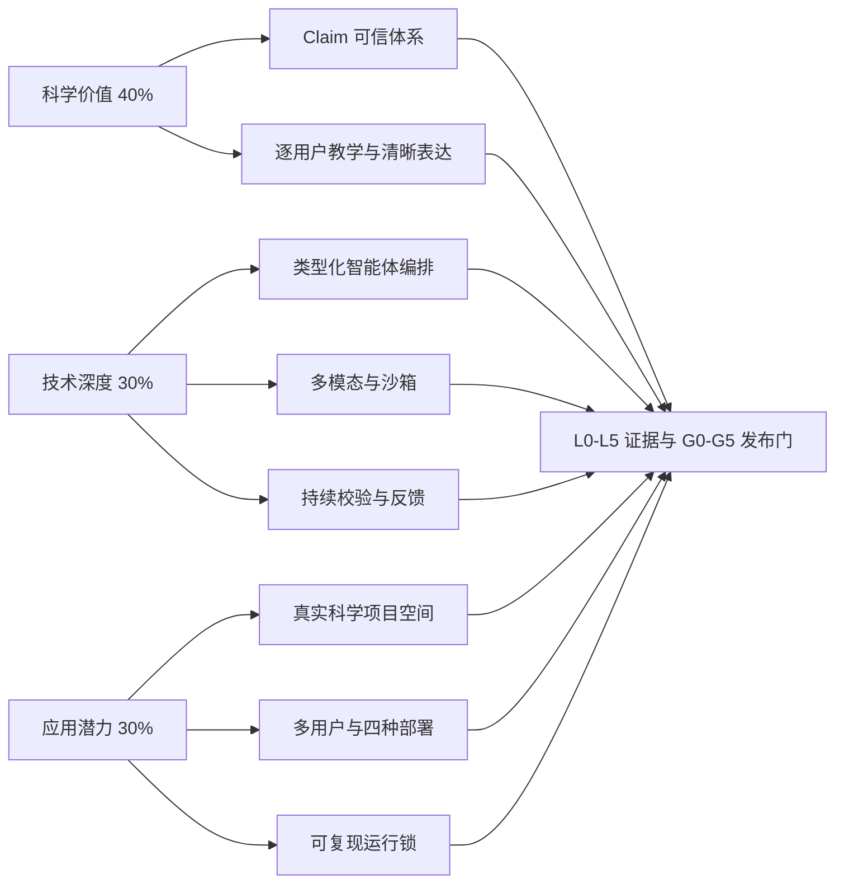

等价说明：科学价值由事实准确、解释清晰和完整性证明；技术深度由编排合同、多模态、校验与稳定性证明；应用潜力由真实工作流、多用户交付和复现能力证明；所有主张最终进入统一证据门。

| 评分维度 | 产品主张 | 不能接受的替代证据 |
|---|---|---|
| 科学事实准确性 | Claim 级证据、冲突与诚实降级 | 挑选几个看起来正确的回答 |
| 清晰度 | 学习增益、受众任务成功、无障碍 | 只做语言流畅度自评 |
| 完整性 | 六条黄金路径、覆盖矩阵 | 功能截图数量 |
| 智能体/技能设计 | DSL、运行信封、类型化产物、双状态机 | 智能体数量或自由群聊 |
| 多模态 | 可编辑源、科学绑定、沙箱、无障碍 | 只输出图片或视频 |
| 校验与稳定性 | 质量门、失败闭锁、重放与恢复 | 模型声称“已检查” |
| 真实价值 | 长期项目、教学和表达闭环 | 单次提示词样例 |
| 交付完整度 | 认证、前端主壳、四种部署 | 只提供开发机启动方式 |
| 可复现 | 运行锁、数据卡、环境与迁移 | 只记录模型名称 |

### 2.3 覆盖制度

1. 每项需求只能有一个主要规范性落点，可以有多个消费章节；
2. 每项需求必须连接领域对象、图表、测试/评测、责任域和成熟度门；
3. 矩阵中的“覆盖”只表示规范已定义，不表示实现或证据已经完成；
4. 需求变更先更新附录 B，再判断是否使现有决策、迁移或评测证据失效；
5. 科学、安全、隔离和删除硬门不能用总分平均；
6. 附录 B 是完整追踪表，本章只保留最高层硬约束。

### 本章验收

- 15 项硬约束均有章节与证据；
- 评分项没有被当作系统模块重复实现；
- 文档不包含演示、答辩、宣传、路演或排练步骤；
- 自动扫描不得出现将产品称为 MVP 的实施阶段。

来源：[比赛约束与参考设计研究](research/01-competition-and-reference-synthesis.md)。

## 第 3 章 设计原则、差异化与参考项目取舍（P1-C03）

> 黄金路径：全部。输入：十份灵感材料和比赛约束研究。输出：统一原则与取舍矩阵。失败闭锁点：直接复制参考项目机制而破坏科学证据、用户控制或多用户边界。

### 3.1 八条统一原则

1. 科学判断先于表达优化；
2. 证据相关性不等于证据强度；
3. 个性化必须证据化、授权化和可撤回；
4. 长任务必须项目化、类型化和可恢复；
5. 用户面对统一产品，内部能力按稳定领域边界组织；
6. 模型负责语义能力，确定性系统负责权限、状态、规则和终止；
7. 失败必须诚实显现，不能以自由文本或未验证替代静默兜底；
8. 评测、出处、迁移和部署从第一阶段就是产品合同。

### 3.2 灵感材料取舍

| 参考材料 | 直接采用 | 调整采用 | 不采用 |
|---|---|---|---|
| AutoAgent | 自然语言需求转结构化工作流、验证意识 | 规划器只能在模板与权限内选路 | 动态生成无约束代理代码 |
| Claude Code | 生命周期 Hook、审查与验证分离 | Hook 改为不可扩权的领域事件 | 用 Hook 绕过质量门 |
| cognitive-profile | 薄画像、来源和更新意识 | 发展为候选—断言—切片治理 | 整段不可追踪用户总结 |
| Humanizer-zh | 可操作中文痕迹复查 | 受事实锁、体裁和受众约束 | 以逃避检测为目标 |
| LlamaIndex | 可组合摄入、索引、检索适配 | 隐藏在科学证据模块之后 | 把框架对象当领域真相 |
| ManimCat | 先教学设计、分镜，再生成与验证 | 扩展到全部科学媒体对象 | 一句提示直接发布动画 |
| nanobot | 小内核、状态机、通道解耦 | 升级为持久工作流与控制平面 | 自由消息转述状态 |
| nuwa-skill | 材料蒸馏、出处纪律 | 形成领域包来源与规则流水线 | 把材料摘要视为权威 |
| Qwen 百炼路由 | 按能力、区域、风险路由 | 建立供应商无关能力注册表 | 在业务合同硬编码型号 |
| scientific-humanization | 事实锁、措辞强度 | 与 Claim 证据和体裁契约结合 | 为自然度降低结论约束 |

### 3.3 项目差异化

- **Claim—Evidence—Wording 三层科学图谱**：不仅“能检索”，还控制每句话可以说多强。
- **可解释的长期个性化增益**：能够回答“本次用了哪条画像、为何使用、结果是否更好”。
- **逐用户教学路径**：学习记录来自展示出的理解，不把浏览和完成率冒充掌握。
- **可审计科学创作**：文本、图表、公式、动画、语音和交互共享事实锁与出处。
- **治理即能力**：领域包签名、失效传播、撤权删除和评测事故回灌都是产品功能。
- **部署语义统一**：开发环境与四种生产载体清晰分离，生产行为不因部署方式改变。

### 本章验收

1. 每项参考模式都标明直接采用、调整或拒绝；
2. 差异化主张能由 P5-C20 的基线或消融验证；
3. 任一外部框架可替换时，核心领域对象与历史数据仍可解释；
4. 参考项目不得成为产品品牌、业务模型或权限边界。

来源：[参考项目综合研究](research/01-competition-and-reference-synthesis.md)。

# 第二部：产品、用户与科学成长体验

## 第 4 章 核心用户、身份与使用边界（P2-C04）

> 黄金路径：全部。输入：注册/登录、账户与对象域。输出：认证主体和用户级归属。失败闭锁点：未认证访问、跨账户召回、后台任务丢失主体。

### 4.1 身份模型

- `UserAccount` 是人的长期身份和个人数据归属边界；
- `Session` 是可撤销、轮换、绑定设备与风险状态的访问凭据；
- `SubjectContext` 记录当前账户、设备、会话、可选机构角色；
- `ObjectRef` 明确对象所有者、对象域、项目、敏感级别、版本和删除状态；
- 加入机构不会转移个人保险库所有权；一个账户可加入多个相互隔离的机构。

### 4.2 认证流程

公共层只提供注册、登录、凭据恢复、邀请预览、隐私与服务状态。所有功能页面由服务端认证守卫和 API 授权共同保护。

| 流程 | 必需控制 | 用户反馈 | 关键测试 |
|---|---|---|---|
| 注册 | 邮箱验证、密码策略、协议、可选 MFA | 不泄露他人账户信息 | 枚举、速率、重复提交 |
| 登录 | Argon2id、不透明会话、CSRF、防重放 | 清楚显示账户和设备 | 会话固定、暴力尝试 |
| 恢复 | 统一模糊响应、令牌短时单用 | 完成后撤销相关会话 | 账户枚举、旧链接重放 |
| 退出/撤销 | 服务端撤销、Cookie 清理、缓存隔离 | 显示受影响设备 | 后退页、离线与后台任务 |
| 切换账户 | 处理未保存内容，清空 UI/搜索/缓存状态 | 持续显示当前账户 | 前一用户内容残留 |

### 4.3 每用户独立对象

每个用户独立拥有账户设置、证据化画像、候选画像、学习使命、知识状态、学习记录、学习路径、项目、材料、EvidenceSet、索引、记忆、工作流、产物、反馈与评测结果。API、worker、队列、缓存、索引、对象存储、日志引用和导出均必须携带相同作用域信封。

### 4.4 角色边界

| 角色 | 可做 | 默认不可做 |
|---|---|---|
| 账户本人 | 管理个人对象、创建项目、确认画像与路径 | 绕过科学/安全门 |
| 项目编辑者 | 编辑获授权项目对象 | 读取成员个人保险库 |
| 项目审阅者 | 评论、裁决指定产物 | 修改未授权正文 |
| 导师 | 查看用户主动分享的证明/项目对象 | 查看全部学习记录 |
| 机构管理员 | 管理成员、席位、机构策略和机构对象 | 浏览个人画像、记忆、私人材料 |
| 领域专家 | 在资质范围内维护或复核领域包 | 同版本自写自审 |
| 安全管理员 | 隔离、暂停、紧急撤销 | 编辑科学规则或直接发布 |

### 本章验收

- 未登录访问所有功能路由均被拒绝；
- 两账户、两项目、两机构的合成环境中跨域泄漏率为零；
- worker、索引和缓存无法在缺少 `SubjectContext` 时运行；
- 账户切换、权限撤回和深链恢复不显示旧数据。

来源：[前端信息架构](decisions/09-frontend-information-architecture.md)、[协作与同步边界](decisions/13-collaboration-organization-sync-boundaries.md)。

## 第 5 章 科学成长循环与黄金路径（P2-C05）

> 黄金路径：本章定义全部六条。输入：认证用户、学习使命或项目任务。输出：具名端到端旅程和跨章对象流。失败闭锁点：把旅程当成跳过横切合同的演示脚本。

### 5.1 科学成长循环

#### FIG-03 科学成长循环

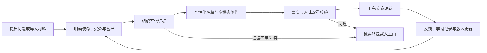

等价说明：任务从目标定界进入证据、创作、校验和人工反馈；只有合法反馈能更新学习记录、画像或产物版本；证据不足与冲突不会被生成环节掩盖。

### 5.2 六条黄金路径

#### FIG-04 六条黄金路径总览

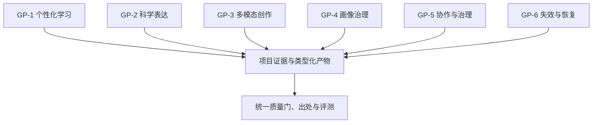

| 路径 | 入口 | 核心对象流 | 合法终点 |
|---|---|---|---|
| GP-1 个性化学习 | 用户建立学习使命 | Mission → MemorySlice → EvidenceSet → TeachingPlan → Exercise → LearningRecord | 路径经用户确认更新，或因证据不足等待 |
| GP-2 科学表达 | 创建表达任务契约 | ExpressionBrief → ClaimGraph → FactLock → Draft → Review → Revision | 合格/批准版本，或冲突闭锁 |
| GP-3 多模态创作 | 选择教学与传播目标 | SourceAsset → Storyboard → EditableSource → Sandbox → MediaObject | 科学一致且无障碍的版本 |
| GP-4 画像治理 | 产生画像观察 | Observation → Candidate → Evidence/Auth Gate → HumanDecision → Assertion | 确认、冻结、纠正、删除或拒绝 |
| GP-5 协作与治理 | 用户显式分享对象 | Preview → ProjectCopy → Role/ObjectGrant → Comment/Approval → Publish | 受项目权限约束的发布或撤回 |
| GP-6 失效与恢复 | 来源/授权/包/索引失效 | Event → ImpactSet → Contain → Invalidate → Revalidate → Recover | 新版本重新取证，或保持不可用 |

### 5.3 贯穿异常场景

| 场景 | 必需行为 | 禁止行为 |
|---|---|---|
| 证据冲突 | 保留分支、降低措辞、等待裁决 | 模型投票或最后写入获胜 |
| 授权撤回 | 停止新调用与提交、取消/补偿 | 继续使用旧授权快照 |
| 来源失效 | 阻断新发布、定位既有影响 | 静默替换历史证据 |
| 模型离线/限流 | 有界重试、已验证同区替代或等待 | 跨区、跨能力静默降级 |
| 删除传播 | 墓碑优先、隔离离线修改 | 备份恢复后复活 |
| 沙箱失败 | 保留可编辑草稿，隔离成品 | 把未运行媒体标为完成 |

### 5.4 状态在旅程中的表达

任何路径同时维护：

- 工作流运行状态：`DRAFT/COMPILED/RUNNING/WAITING_HUMAN/RETRYING/SUCCEEDED/BLOCKED/CANCELLED`；
- 产物可信状态：`NOT_CREATED/DRAFT/EVIDENCE_BOUND/QUALIFIED/APPROVED/CONFLICTED/QUARANTINED/INVALIDATED`；
- 发布资格：由授权、人工决定、发布门和当前失效状态共同决定。

### 本章验收

1. 六条路径均能追到对应权威章节、对象和评测；
2. 正常与五类异常场景都有合法终态；
3. 任一路径都不能直接写稳定画像、绕过事实锁或跳过发布门；
4. 用户反馈被路由到回答修订、画像候选、学习记录或产品问题，而不是混写。

## 第 6 章 产品能力体系与跨模块闭环（P2-C06）

> 黄金路径：全部。输入：科学成长循环。输出：统一产品能力地图与功能边界。失败闭锁点：按页面复制业务真相，或让聊天窗口承载所有复杂流程。

### 6.1 产品结构

#### FIG-02 全局科学伙伴 + 科学项目空间 + 九类能力地图

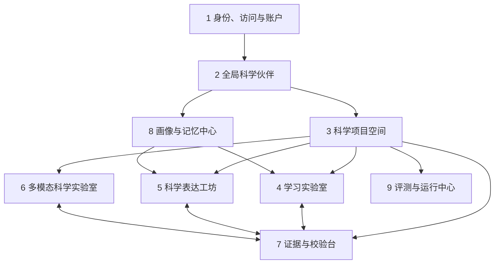

等价说明：身份是所有能力的前置；伙伴负责路由，项目空间承载上下文；学习、表达和多模态共享证据台；画像按最小切片影响学习和表达；评测贯穿运行。

### 6.2 九类一级能力

| ID | 能力 | 关键二级功能 | 权威对象 |
|---|---|---|---|
| CAP-01 | 身份、访问与账户 | 注册、登录、恢复、会话、设备、授权、导出、注销 | Account、Session、Device |
| CAP-02 | 全局科学伙伴 | 对话、意图、跨项目提醒、任务分流 | WorkOrder |
| CAP-03 | 科学项目空间 | 材料、证据、产物、版本、任务舞台 | Project、ArtifactRef |
| CAP-04 | 学习实验室 | 使命、诊断、短课、练习、间隔/交错、路径 | Mission、TeachingPlan、LearningRecord |
| CAP-05 | 科学表达工坊 | 契约、论证、事实锁、体裁、人味复查、修订 | ExpressionBrief、FactLock、Draft |
| CAP-06 | 多模态科学实验室 | 摄入、分镜、可编辑源、沙箱、渲染、无障碍 | MediaManifest、Storyboard |
| CAP-07 | 证据与校验台 | Source、Claim、Evidence、冲突、引用、质量门 | EvidenceSet、ClaimGraph |
| CAP-08 | 画像与记忆中心 | 观察、候选、断言、切片、确认、冻结、删除、回滚 | ProfileCandidate、MemorySlice |
| CAP-09 | 评测与运行中心 | 运行轨迹、基线、消融、纵向评测、发布证据 | EvaluationSuite、RunLock |

### 6.3 五类闭环

- 教学闭环：使命 → 资源 → 诊断 → 短课 → 练习 → 学习记录 → 路径调整；
- 表达闭环：任务契约 → 证据 → 事实锁 → 草稿 → 人味/事实复核 → 用户修订；
- 多模态闭环：目标 → 媒体选择 → 分镜 → 源 → 沙箱 → 校验 → 发布；
- 画像闭环：观察 → 候选 → 证据/授权 → 用户确认 → 最小调用 → 反馈；
- 质量闭环：运行/反馈 → 评测 → 基线/消融 → 变更 → 回归 → 受控发布。

### 6.4 跨模块规则

1. 复杂任务必须进入项目与任务舞台；
2. 工作台引用同一对象，不复制 EvidenceSet、FactLock 或画像正文；
3. 模块只能写自己的权威模型；
4. 跨模块通过版本化命令、事件和类型化产物协作；
5. 任何新能力必须进入能力矩阵、责任域、评测与部署合同。

### 本章验收

- 九类能力覆盖所有已确认功能；
- 每项二级能力有对象、页面、权限、失败路径和评测；
- 聊天窗口没有隐藏长任务状态、人工待办和可复用产物；
- 任一能力删除都会触发需求追踪和成熟发行门重新评估。

来源：[成熟产品能力体系](decisions/02-product-capability-system.md)。

## 第 7 章 学习实验室与逐用户学习路径（P2-C07）

> 黄金路径：GP-1、GP-4、GP-6。输入：学习使命、知识状态、记忆切片、可信资源。输出：TeachingPlan、练习、学习记录候选和路径版本。失败闭锁点：把浏览/完成率当作掌握，或让模型静默更新学习路径。

### 7.1 教学目标模型

每次学习从 `LearningMission` 开始，至少记录真实目标、可观察成功标准、范围、约束、期限语境和用户已有材料。系统据此建立概念依赖图，使用学习记录而非泛化标签判断先备知识和最近发展区。

`KnowledgeState` 是“某用户在某知识点、某证据时点上的可撤销判断”，不是统一百分比。它至少包含知识点、状态、置信度、支持记录、反证、适用范围、更新时间和下一验证任务。

### 7.2 教学方法

教学机制参考 [`mattpocock/skills` 的 `teach`](https://github.com/mattpocock/skills/blob/main/skills/productivity/teach/SKILL.md)，并改造为多用户、数据库化和证据化产品：

1. **使命驱动**：每个课程单元服务一个真实学习胜利；
2. **可信资源**：资源进入 EvidenceSet，保留来源、版本、许可和适用范围；
3. **短小自包含课程**：一次只引入完成当前胜利所需的概念；
4. **最近发展区**：在已掌握与尚不可达之间选择下一任务；
5. **检索练习**：要求用户从记忆中解释、计算、比较或应用；
6. **即时反馈**：指出具体正确点、误区和下一步，不只给总分；
7. **间隔与交错**：由知识状态和遗忘证据安排复习；
8. **证据化记录**：只有用户展示理解、纠正误区或明确证明先备能力，才能提出学习记录。

文件式 `MISSION.md`、`RESOURCES.md`、`learning-records` 和 HTML lesson 分别映射为版本化的使命、资源集合、学习记录和课程产物；它们都带账户与项目归属。

### 7.3 标准教学流程

`使命确认 → 先备诊断 → 资源检索与状态核验 → 单一学习胜利 → 讲解/示例 → 检索练习 → 即时反馈 → 延迟复测 → 学习记录候选 → 用户确认路径`

| 环节 | Qwen/智能节点 | 确定性系统 | 人工 |
|---|---|---|---|
| 诊断 | 生成有区分度的问题、分析回答 | 锁定范围、题目版本、评分规则 | 用户确认目标与已有能力 |
| 讲解 | 生成个性化解释和类比 | 事实锁、引用、领域规则 | 用户选择节奏与深度 |
| 练习 | 变式、提示和反馈 | 答案约束、单位公式、尝试记录 | 用户作答 |
| 路径更新 | 提议下一知识点 | 证据门、版本和授权 | 用户确认重要变化 |
| 复习 | 生成跨情境练习 | 间隔调度与防重复 | 用户可延后或调整 |

### 7.4 失败与人工门

- 资源不足：缩小目标或等待补充，不能凭模型常识形成稳定学习记录；
- 诊断结果矛盾：保留多个知识状态候选，通过新任务验证；
- 高风险医学/实验内容：进入领域包与人工门；
- 用户只浏览未作答：记录活动，不记录“已掌握”；
- 用户拒绝画像/记录：继续当前教学，但不跨会话使用；
- 模型不可用：保留使命、资源与已完成记录，路径进入可恢复等待。

### 7.5 学习效果指标

- 延迟检索正确率与迁移任务成功率；
- 误区纠正保持率；
- 预测知识状态与后续表现的校准；
- 相对固定课程、无画像教学和无间隔复习的配对差异；
- 不同基础、专业与无障碍需求用户的受损切片；
- 路径建议接受、修改与拒绝原因。

### 本章验收

1. 两个不同用户在相同主题上得到可解释的不同路径；
2. 没有学习证据时知识状态不会自动晋升；
3. 用户能查看路径变化由哪些记录触发；
4. 删除记录后相关推断、复习任务和评测切片按规则失效；
5. 教学质量同时通过科学门、教学门和纵向评测。

来源：[画像与记忆研究](research/04-profile-memory-governance.md)、[成熟产品能力体系](decisions/02-product-capability-system.md)。

## 第 8 章 科学表达工坊与有人味表达（P2-C08）

> 黄金路径：GP-2、GP-4、GP-5、GP-6。输入：表达任务契约、ClaimGraph、事实锁和最小画像切片。输出：版本化 ExpressionDraft、ReviewReport、RevisionPatch。失败闭锁点：为自然度改变事实、引用、限定条件或责任边界。

### 8.1 “有人味”的正面定义

有人味表达由六个可观察维度组成：真实任务感、受众意识、中文自然度、信息节奏、适度个性和责任分寸。它必须服从科学判断与证据强度，不以模仿特定人物、虚构经历、掩饰 AI 使用或规避检测器为目标。

### 8.2 核心合同

| 对象 | 必需内容 | 所有者 |
|---|---|---|
| `ExpressionBrief` | 目标、受众、体裁、渠道、长度、风险、必需判断、成功标准 | 科学创作模块 |
| `AudienceModel` | 任务相关知识、术语承受度、阅读情境；不等于稳定画像 | 当前任务 |
| `FactLockSet` | 数值、单位、对象、关系、限定、结论强度、术语、公式、引用 | 科学证据模块 |
| `ArgumentPlan` | 论点顺序、证据位置、反例与限制 | 表达模块 |
| `GenreContract` | 必需、可省略、允许与禁止内容、人工责任 | 体裁规则 |
| `StylePolicy` | 授权偏好、中文节奏、禁用模仿和风险约束 | 画像切片 + 任务 |
| `ReviewReport` | 事实、人味、引用、体裁和风险逐项结果 | 多方质量门 |
| `RevisionPatch` | 局部改动、原因、受影响事实锁和版本 | 用户/表达节点 |

### 8.3 证据与措辞强度

| 证据状态 | 允许措辞 | 禁止措辞 |
|---|---|---|
| 多源一致、直接支持、适用条件明确 | “显示”“支持”“在……条件下可得” | 无条件外推 |
| 单一可靠来源或间接证据 | “提示”“与……一致”“初步支持” | “证明”“必然” |
| 有效证据冲突 | “存在分歧”“尚不能裁决”并列依据 | 合并为单一确定结论 |
| 来源状态未知或证据不足 | “目前无法确认”“需要补充……” | 以常识填补引用 |
| 高风险且缺人工审查 | 教育性说明和求助边界 | 诊断、处方、现实安全指令 |

### 8.4 四类体裁

- 科普文案：优先核心概念、类比边界和行动相关性，保留“类比在哪里失效”；
- 课程讲稿：明确学习目标、先备知识、检查理解与练习停顿；
- 科研汇报：分开数据、推断、限制与下一步，图表和口头措辞一致；
- 论文辅助：支持结构、语言、引用核验与论证建议，不虚构数据、实验或作者责任。

### 8.5 表达流水线

`确认任务契约 → 编译受众与画像切片 → 绑定 ClaimGraph/FactLock → 设计论证 → 生成草稿 → 中文人味诊断 → 事实与引用复核 → 用户逐条修订 → 发布门`

诊断器检查空泛开头、机械三段式、重复总结、过度连接词、名词堆叠、翻译腔、无来源权威口吻、情绪过满和不必要免责声明。诊断只提出可定位补丁，不进行破坏事实锁的整体重写。

### 8.6 反馈路由

| 用户反馈 | 合法落点 |
|---|---|
| “这句事实不对” | Claim/Evidence 复核，可能使产物失效 |
| “太像论文，给普通人看不懂” | 当前版本受众/体裁修订 |
| “以后少用这种开场” | 候选表达偏好，待授权确认 |
| “我其实已经学过这个概念” | 学习记录候选，不直接写画像 |
| “不要再使用这条偏好” | 冻结/删除画像断言并重编切片 |

### 本章验收

- 事实锁字段在任何润色前后保持可比较；
- 四类体裁各有独立基线、盲测和高风险场景；
- 人味提升不能显著降低事实、引用或校准；
- 用户能定位每次改动及其原因；
- 模型检测器分数不作为成功指标。

来源：[有人味科学表达研究](research/05-human-scientific-expression.md)。

## 第 9 章 多模态科学实验室（P2-C09）

> 黄金路径：GP-3、GP-5、GP-6。输入：科学材料、教学目标、ClaimGraph 与事实锁。输出：科学媒体对象及可编辑、可访问版本。失败闭锁点：直接发布未审查的生成代码或跨媒体事实不一致。

### 9.1 统一科学媒体对象

`ScientificMediaObject` 由原始 `SourceAsset`、派生资产、`MediaManifest`、Claim/FactLock 绑定、结构化分镜、可编辑源、渲染物、无障碍替代、许可信息和验证记录共同组成。PNG、MP4 或音频文件本身不是完整产物。

#### FIG-12 科学媒体对象与多模态分级创作链

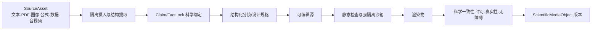

### 9.2 摄入与输出矩阵

| 模态 | 摄入中间结果 | 主要输出 | 确定性验证 |
|---|---|---|---|
| 文本/PDF | 结构树、页码、阅读顺序、引用定位 | 摘要、课程、脚本 | 页码、段落、编码、注入隔离 |
| 图片/扫描 | OCR、区域、图例、尺度、置信度 | 标注图、语义科学图 | 尺寸、区域对应、OCR 差异 |
| 公式 | 符号表、LaTeX/MathML、语义结构 | 推导卡、可访问公式 | 解析、变量、单位、等价检查 |
| 表格/数据 | Schema、单位、缺失与出处 | 数据图表、交互探索 | 数值、轴、单位、聚合、数据表 |
| 音频 | ASR、说话段、时间戳 | 朗读、播客片段 | 字幕对齐、术语、时长 |
| 视频 | 镜头、字幕、帧、音轨 | 讲解视频、动画 | 跨帧事实、字幕、闪烁/动效 |
| 交互 HTML | DOM、资源、脚本、数据依赖 | 模拟器、交互图 | CSP、键盘、状态、沙箱、网络 |

### 9.3 分级创作

- L1 低风险：静态图、朗读或简单图表，仍需出处、可编辑源和无障碍；
- L2 中风险：交互、复杂数据图、教学动画，需要分镜审查与沙箱；
- L3 高风险：医学、实验安全、可能误导现实决策的媒体，必须领域专家与安全人工门。

共同主链是“目标 → 媒体选择 → 分镜 → 源 → 运行 → 科学校验 → 人工确认”。媒体类型由学习或传播目标决定，不以“炫技”优先。

### 9.4 沙箱与供应链

- 生成代码只进入 Linux 强隔离沙箱；默认无生产网络、无密钥、无数据库、只读基础镜像；
- 限制 CPU、内存、进程、文件、时间、出站和输出大小；
- 禁止容器套接字、宿主挂载、自更新器和未声明二进制；
- 依赖固定版本与摘要，生成 SBOM 和许可记录；
- 失败只允许在事实锁不变的前提下有限修复，预算耗尽进入隔离。

### 9.5 无障碍

每个视觉、音频或交互产物必须有适当替代：替代文本、长描述、字幕、文字稿、数据表、键盘路径、减少动画和可暂停控制。无障碍替代与主媒体共享相同 Claim 和版本，不能成为未经核验的另一个答案。

### 本章验收

1. 任一成品可回到来源、分镜、源文件、沙箱和验证记录；
2. 数据图的数值、单位和轴与源数据一致；
3. 跨文本、语音、图像和动画的核心 Claim 一致；
4. 沙箱失败不产生可发布成品；
5. 关键任务可由键盘、屏幕阅读器和减少动画模式完成。

来源：[多模态科学体系研究](research/06-multimodal-science-studio.md)。

## 第 10 章 前端信息架构与关键交互（P2-C10）

> 黄金路径：全部。输入：账户、项目、运行与产物投影。输出：认证后项目主壳、任务舞台和渐进检查器。失败闭锁点：仅隐藏按钮而不做后端授权，或把“运行结束”显示成“可发布”。

### 10.1 四层信息架构

#### FIG-05 登录后项目主壳与页面信息架构

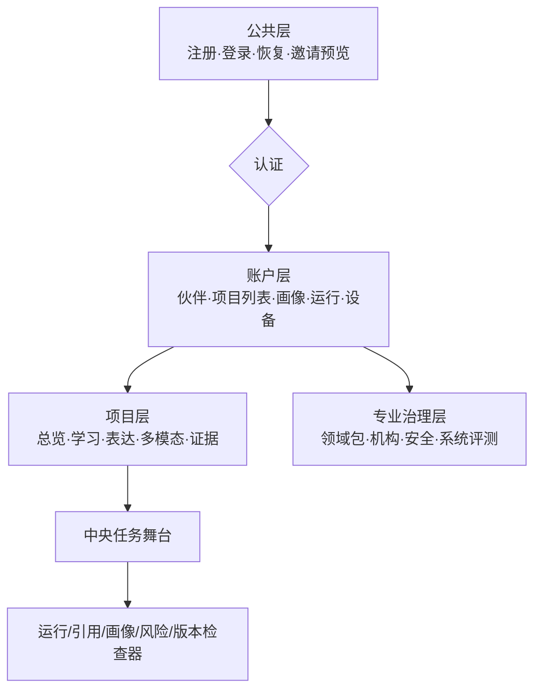

### 10.2 项目主壳

桌面端采用稳定左导航、中央任务画布、右侧上下文检查器；平板改为可停靠面板；手机使用单栏任务流和底部抽屉，不缩小三栏。

项目头部持续显示账户、项目、所有者、对象域、角色、领域包、同步状态、当前版本、运行和人工待办。对象域必须用文字与说明，不只依靠颜色。

### 10.3 伙伴与任务舞台分离

全局科学伙伴负责澄清使命、跨项目协调、推荐下一步和生成 `WorkOrder`。凡是产生可复用产物、多步运行、高风险结论或长期写入的任务，都必须进入任务舞台。

任务舞台固定展示目标、运行状态、可信状态、当前节点、人工待办、中间产物、取消/恢复/有限重试和阻塞原因。模型隐式推理不展示，结构化运行事实必须展示。

### 10.4 五类检查器

| 检查器 | 主要回答 |
|---|---|
| 运行 | 使用何种工作流、能力、模型、工具、预算，为什么终止 |
| 引用 | 哪个 Claim 由何来源版本和位置支持/反驳/限制 |
| 画像切片 | 本次调用哪些条目、为何调用、未调用什么、如何撤回 |
| 风险与质量门 | 哪个门阻塞了运行/产物/发布，安全下一步是什么 |
| 版本比较 | 事实、证据、措辞、媒体、模型、规则和人工修改了什么 |

科学出处图用于专业查看关系，普通用户默认看到任务与下一步；移动端提供等价顺序列表。

### 10.5 页面权限与无障碍

| 页面 | 主要主体 | 关键操作 |
|---|---|---|
| 认证入口 | 未登录用户 | 注册、登录、恢复 |
| 全局伙伴 | 账户本人 | 确认目标、选择项目 |
| 项目总览 | 项目成员 | 继续任务、查看阻塞 |
| 学习实验室 | 本人/获授权导师 | 作答、反馈、确认路径 |
| 表达/多模态 | 项目编辑者 | 编辑、局部修订、送审 |
| 证据台 | 审阅者 | 补证据、裁决冲突 |
| 画像中心 | 账户本人 | 确认、冻结、删除、回滚 |
| 专家/机构治理 | 对应角色 | 分离职责的治理动作 |

Web 以 WCAG 2.2 AA 为最低目标：完整键盘、可见焦点、语义结构、错误播报、4.5:1 正文对比度、至少 44×44 CSS 像素目标、文本缩放、减少动画和图表等价路径。

### 10.6 异常恢复

- 权限在运行中撤回：立即遮蔽正文、刷新授权、显示取消与补偿；
- 来源状态未知：阻止高置信发布，明确“未知”而非“错误”；
- 沙箱失败：保留分镜与源，成品隔离；
- 账户切换：清空搜索建议、页面缓存和运行投影；
- 深链刷新：后端重新鉴权，不信任客户端历史状态；
- 离线撤权未确认：准确显示服务器已阻止、设备待确认。

### 本章验收

- 登录后三个交互内可到达任一核心工作台；
- 用户始终知道账户、项目、对象域和角色；
- 运行状态与可信状态始终并列；
- 主要任务在手机和辅助技术下可完成；
- 跨账户切换、后退、深链和缓存没有内容残留。

来源：[前端信息架构决策](decisions/09-frontend-information-architecture.md)。

# 第三部：可信智能、治理与长期陪伴

## 第 11 章 科学证据、RAG 与 Claim 可信体系（P3-C11）

> 黄金路径：GP-1、GP-2、GP-3、GP-5、GP-6。输入：任务问题、作用域、来源和领域包。输出：EvidenceSet、ClaimGraph、Citation 与 FactLock。失败闭锁点：来源状态未知、证据冲突未处理、引用无法定位或跨用户检索。

### 11.1 核心关系

#### FIG-07 来源—Document—Claim—Evidence—Wording—产物出处图

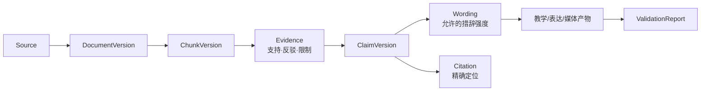

`Source` 表示来源主体及权威范围；`DocumentVersion` 表示可复现内容；`ChunkVersion` 只服务定位与检索；`Claim` 是可验证的最小科学判断；`Evidence` 表示来源片段与 Claim 的关系；`Wording` 控制可说多强；`Citation` 保证读者能定位。

### 11.2 十二阶段可信流水线

#### FIG-08 科学证据 RAG 十二阶段流水线


检索采用作用域预过滤后的 PostgreSQL FTS + pgvector + 融合 + 重排。相关性只决定“值得看”，不能成为证据强度。发布前重新校验来源状态、引用定位、数字单位、公式、限定条件和领域规则。

### 11.3 Claim 证据画像

证据画像至少分开记录：来源角色、直接性、方法质量、独立性、一致性、新旧程度、适用性、内容状态和定位完整性。领域包把这些公共维度映射为学科规则，不建立跨所有学科的单一“可信分”。

| 状态 | 系统行为 |
|---|---|
| `SUPPORTED` | 在适用条件内按证据强度表达 |
| `LIMITED` | 明示限制并降低措辞 |
| `CONFLICTED` | 并列证据、保留分支、等待裁决 |
| `INSUFFICIENT` | 明示未知、请求更多来源或缩小问题 |
| `SOURCE_UNKNOWN` | 阻止高置信发布，安排状态刷新 |
| `INVALIDATED` | 阻断新使用并建立下游影响集 |

### 11.4 确定性/Qwen/人工职责

| 任务 | 确定性 | Qwen | 人工 |
|---|---|---|---|
| 权限、版本、哈希、许可字段 | 裁决 | 不得修改 | 处理例外 |
| 语义 Claim 抽取 | Schema/约束 | 生成候选 | 抽查高风险 |
| 证据关系 | 规则可判部分 | 辅助判断 | 冲突/高风险裁决 |
| 数字、单位、公式 | 解析和计算优先 | 辅助解释 | 复杂学科复核 |
| 措辞 | 上限约束 | 在上限内生成 | 升级强度需确认 |
| 引用 | 定位与版本验证 | 选择候选 | 关键引用抽查 |

### 11.5 领域包接口与隔离

领域包只提供学科差异：来源层级、Claim Schema、证据映射、术语本体、公式单位、措辞规则、校验器需求、误区和夹具。账户权限、沙箱、日志、签名、工作流和发布门属于平台，不允许领域包放宽。

任何检索先编译 `ScopeEnvelope`；公共目录、个人保险库和项目索引分区。检索结果在重排后再次校验可见性，缓存键包含账户/租户、对象域、项目、授权版本、密钥时期和内容版本。

### 本章验收

1. 任一重要句子可定位到 Claim、Evidence、来源版本和位置；
2. 伪造关键引用率为零；
3. 冲突和证据不足不会生成高置信结论；
4. 跨账户、跨项目和已撤权内容检索率为零；
5. 来源失效能传播到既有 Claim、事实锁与产物。

来源：[科学证据、RAG 与领域包研究](research/03-scientific-trust-system.md)。

## 第 12 章 证据化画像、长期记忆与授权治理（P3-C12）

> 黄金路径：GP-1、GP-2、GP-4、GP-6。输入：带来源和授权的用户信号。输出：候选画像、画像断言、学习记录、知识状态与一次性记忆切片。失败闭锁点：敏感推断、跨用户使用、无证据晋升或删除后继续召回。

### 12.1 对象不得混成一个 memory

| 对象 | 作用 | 是否可跨会话 | 稳定写入门 |
|---|---|---:|---|
| 画像观察 | 原子信号及来源 | 可保留到候选判定 | 授权与最小化 |
| 候选画像 | 未充分确认的假设 | 有期限 | 不可按事实使用 |
| 画像断言 | 已确认、带范围的稳定偏好/背景 | 是 | 用户确认或明确治理 |
| 学习记录 | 展示出的理解或误区纠正 | 是 | 可观察学习证据 |
| 知识状态 | 知识点掌握判断 | 是，可撤销 | 多记录与校准规则 |
| 会话记忆 | 当前对话连续性 | 否/短期 | 不自动晋升 |
| 项目记忆 | 项目决策、术语、开放问题 | 仅项目 | 项目权限 |
| 用户置顶事实 | 用户明确要求保存的边界/默认值 | 按授权范围 | 显式指令 |
| 情境信号 | 当前困惑、紧迫度等低置信观察 | 否 | 禁止形成心理诊断 |
| 记忆切片 | 当前任务最小已授权集合 | 单次运行 | 编译后不可变 |

### 12.2 生命周期

#### FIG-09 画像观察—候选—断言—记忆切片—反馈生命周期

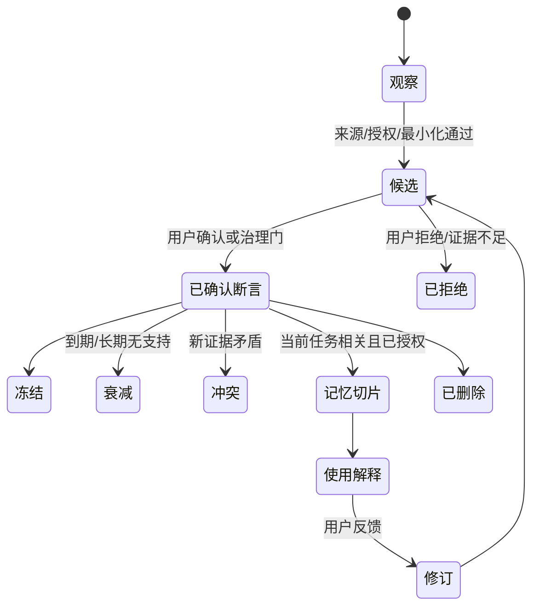

画像断言必须记录来源、置信度、适用场景、允许影响、授权、有效期、敏感级别、版本和反证。修改创建新版本；冲突不覆盖旧记录。

### 12.3 写入门、召回门与使用门

- 写入门：是否有合法来源、明确授权、必要性、最小范围、非敏感推断和可解释证据；
- 召回门：任务相关、用户与对象域匹配、未冻结/删除/过期、允许用于本目的；
- 使用门：模型只接收切片，不可访问完整保险库；回答记录哪些条目影响了什么；
- 反馈门：事实纠正、表达偏好、学习证据和临时情绪分别路由。

### 12.4 用户控制与删除

用户可逐条查看、确认、修改、冻结、删除、导出和回滚。删除流程先写墓碑、阻断召回与新任务，再级联候选、切片、索引、缓存、派生推断和受影响任务；备份进入到期清理。审计保留最小事件和哈希，不保留被删正文。

### 12.5 隐私红队与纵向评测

- 单次情绪、示例人物和引用材料不能成为用户稳定画像；
- 共享项目不能自动召回成员个人画像；
- 用户 B 的反馈不能改变用户 A 的学习路径；
- 删除、冻结或授权变更后，配对回答应发生预期变化；
- 纵向个性化比较“完整切片、无画像、错误画像、过期画像”，验证增益与伤害；
- 对敏感身份、心理诊断、跨场景外推和提示注入做对抗测试。

### 本章验收

- 用户能看到本次实际使用的画像条目及原因；
- 候选画像永远不能静默晋升；
- 独立用户拥有独立画像和学习路径；
- 删除/撤权传播到索引、缓存、运行和评测；
- 个性化增益有纵向证据且不存在受损关键切片。

来源：[画像、记忆与授权研究](research/04-profile-memory-governance.md)。

## 第 13 章 智能体拓扑、工作流协议与质量门（P3-C13）

> 黄金路径：全部。输入：WorkOrder 与 ScopeEnvelope。输出：可重放工作流、类型化产物和合法终态。失败闭锁点：临时扩权、未注册工具、无限重试、自由文本替代合同。

### 13.1 默认编排方案

#### FIG-10 薄监督器、专业工作节点和确定性控制平面拓扑

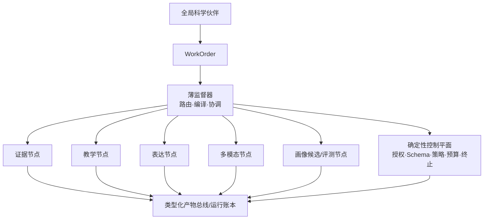

薄监督器只做任务路由、版本化模板编译和执行协调；专业节点负责需要语义推理或生成的工作；确定性控制平面负责权限、Schema、工具、证据、安全、预算、人工门与终止。控制规则优先于模型输出。

### 13.2 运行上下文与类型化产物

`RunContextEnvelope` 至少包含 run/workflow、actor/user/tenant/project、对象集合、授权快照、策略版本、密钥时期、记忆切片引用、事实锁、领域包、能力/模型/工具锁、预算、幂等与追踪。

| 产物 | 作用 |
|---|---|
| WorkOrder | 目标、成功标准、风险与允许范围 |
| ContextSlice | 当前任务最小上下文及授权解释 |
| EvidenceSet | 来源、定位、状态和证据画像 |
| ClaimGraph | Claim、支持、反驳、限制和措辞 |
| TeachingPlan | 学习胜利、先备、讲解、练习和验证 |
| ExpressionDraft | 事实锁绑定的体裁化版本 |
| MediaStoryboard | 场景、状态、旁白和科学绑定 |
| ValidationReport | 逐项质量门结果 |
| ProfileCandidate | 证据、范围、有效期和待确认项 |
| HumanDecision | 责任人、理由、范围和时间 |
| RunSummary | 终态、输出、失败、补偿与资源 |

所有产物带 Schema 版本、所有者、对象域、输入出处、模型/规则版本、状态和内容哈希；修改只创建新版本。

### 13.3 工作流 DSL

工作流声明输入输出 Schema、DAG、条件、读写集合、作用域、能力、领域包、预算、重试、质量门、人工门、失败闭锁、取消、补偿和终止。模型只能在允许的参数与分支中选择，不能运行时生成任意执行代码。

```yaml
# 示例，不是生产配置
workflow: personalized_science_lesson@3
input: WorkOrder@2
nodes:
  - id: retrieve_sources
    capability: scientific_source_discovery
    output: EvidenceSet@3
    retry: {max: 2, only: [timeout, rate_limit]}
  - id: design_lesson
    depends_on: [retrieve_sources, compile_context_slice]
    output: TeachingPlan@2
    gates: [schema_valid, evidence_bound, pedagogy_rules]
human_gates: [learning_path_change]
terminal: [SUCCEEDED, BLOCKED, CANCELLED]
```

### 13.4 双状态与发布门

#### FIG-11 工作流运行状态、产物可信状态和发布门三层状态

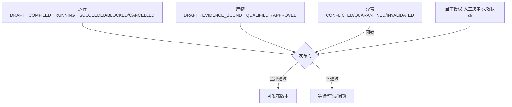

质量门只返回 `PASS`、`WAIT_HUMAN`、`RETRYABLE_FAIL`、`FAIL_CLOSED`、`INVALIDATE`。主要门包括编译、授权、输入、节点输出、科学、教学、表达、多模态和发布。

### 13.5 并行、重试与取消

- 并行只允许在输入冻结、写集不相交、无未决人工决定且汇合规则确定时；
- 汇合保留科学判断、事实锁、归属、授权和删除冲突，不用最后写入或多数票；
- 只对超时、限流、瞬时网络和不改语义的格式错误有限重试；
- 权限拒绝、证据冲突、删除墓碑、安全策略和人工否决失败闭锁；
- 取消立即停止新调度和提交，撤销临时票据，执行已声明补偿。

### 13.6 专业工作流

- 教学：使命 → 切片 → 来源/诊断并行 → 教学计划 → 练习 → 教学门 → 记录候选；
- 表达：契约 → 证据/事实锁 → 论证 → 草稿 → 人味复查 → 事实复核 → 修订 → 发布门；
- 多模态：目标 → 选择 → 分镜 → 源 → 静态检查 → 沙箱 → 科学/无障碍门；
- 画像：观察 → 候选 → 证据/授权 → 用户确认 → 稳定版本。

### 本章验收

- 任一运行能重建 DAG、版本、授权、事件与出处；
- 未注册能力、Schema 不符或作用域不完整时无法启动；
- `SUCCEEDED` 的未批准产物不能发布；
- 重试和并行均有硬边界；
- 撤权后不再出现新工具调用或提交。

来源：[智能体编排决策](decisions/08-agent-orchestration-contracts.md)。

## 第 14 章 领域包、专家治理与发布工作台（P3-C14）

> 黄金路径：GP-1、GP-2、GP-3、GP-5、GP-6。输入：学科来源、规则、校验器和夹具。输出：签名、可灰度、可撤销的领域包版本。失败闭锁点：单人自写自审、包放宽平台下限或签名后内容变化。

### 14.1 平台与领域包边界

平台唯一实现身份、权限、对象域、工作流、审计、沙箱、签名验证和发布门。领域包只拥有学科差异：来源层级、术语本体、Claim Schema、证据映射、公式单位、误区、措辞、校验器需求和评测夹具。

八类首批包：数学与形式证明、物理与化学实验测量、生命科学一般研究、医学高风险教育、地球科学与气候观测、天文学观测与模型、计算机科学与软件文档、跨学科标准与数据集。

### 14.2 Manifest 与风险

`DomainPackManifest` 记录包 ID、语义版本、适用/排除范围、平台兼容、依赖锁、来源策略、规则/校验器/夹具、风险等级、迁移、签名和失效预算。包的规则优先级不得高于平台权限、安全与 H3 下限。

### 14.3 三签发行

#### FIG-13 领域包构成、三类签名和失效传播


三类签名绑定同一 Manifest、内容树、依赖锁、夹具摘要、构建出处和语义 Diff。任何内容变化使旧签名失效。H3 还需合资格领域专家与安全/治理责任人联合签名。

### 14.4 专家工作台

采用“阶段控制台 + 语义 Diff + 责任泳道/失效影响带”：

1. 编写与预检；
2. 内容签名；
3. 独立复核与异议；
4. 平台发行预检；
5. 灰度验证；
6. 发行签名与激活；
7. 监测、失效、撤销和回滚。

| 角色 | 可执行 | 禁止 |
|---|---|---|
| 内容维护者 | 编辑来源/规则/夹具，提交内容签名 | 独立复核自己版本 |
| 独立复核者 | 重跑夹具、抽查来源、提交验证签名 | 编辑后仍以独立身份签名 |
| 平台发行者 | 核验闭包、灰度和签名，追加发行签名 | 编辑规则、覆盖拒绝 |
| 安全管理员 | 隔离、暂停、紧急撤销 | 直接发布或修改科学规则 |
| 资质核验员 | 核验资质范围、有效期 | 替代科学复核 |
| 审计员 | 查看不可变记录 | 修改签名和意见 |

### 14.5 失效与回滚

失效事件状态为 `DETECTED → TRIAGED → CONTAINED → IMPACTED_OBJECTS_FOUND → REMEDIATING → REVALIDATING → CLOSED`。紧急撤销可以先控制，但不能跳过影响报告与复核。回滚是将上一个仍受信、依赖兼容且通过当前平台下限的版本重新设为可选，不是抹除历史。

### 本章验收

- 同一自然人不能对同一摘要完成内容与独立签名；
- 每条规则可追到来源、夹具、复核和发行；
- 语义 Diff 能识别人工作门降低、措辞增强和阻塞翻转；
- 撤销阻止新运行并定位既有影响；
- 任一按钮、文件或 override 都不能放宽平台下限。

来源：[首批领域包研究](research/12-initial-domain-pack-governance.md)、[专家工作台决策](decisions/15-domain-pack-expert-workbench.md)。

## 第 15 章 协作空间、机构租户与跨设备同步（P3-C15）

> 黄金路径：GP-4、GP-5、GP-6。输入：账户、对象归属、分享预览、设备与授权。输出：显式项目副本、授权版本、同步操作和撤权/删除传播。失败闭锁点：机构继承个人数据、最后写入覆盖科学冲突或离线设备绕过墓碑。

### 15.1 三域模型

#### FIG-06 用户、个人保险库、共享项目、机构域边界

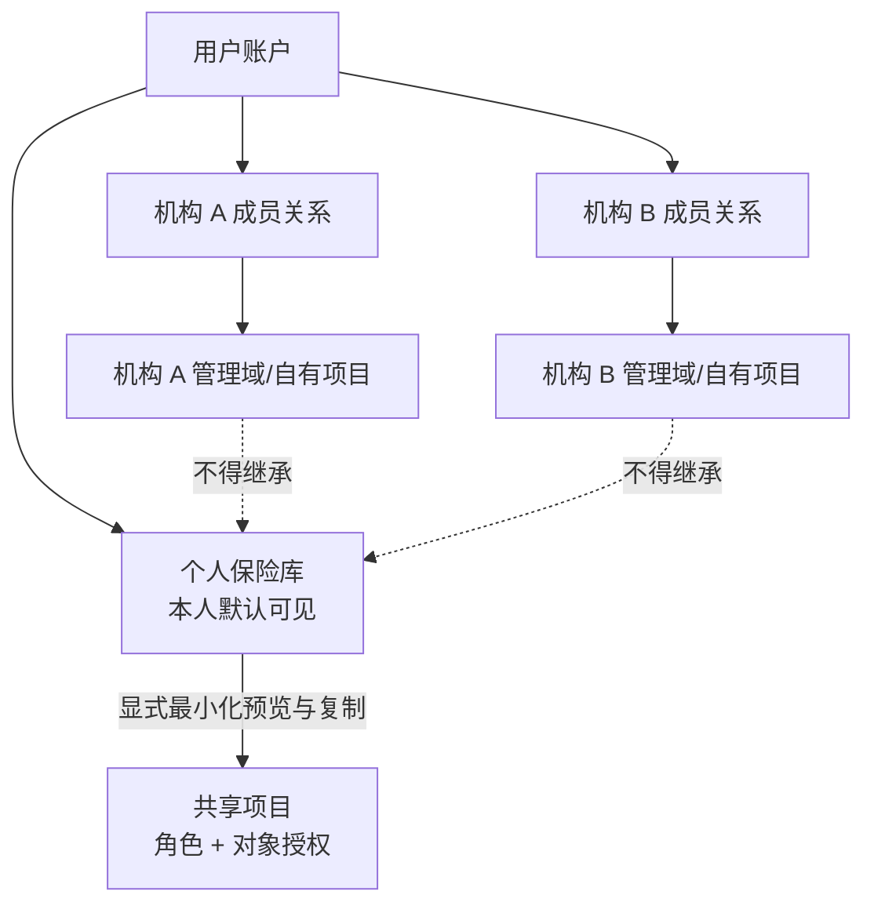

个人保险库、显式共享项目和机构管理域互不自动继承权限。个人对象进入协作默认产生独立最小项目副本，后续私人修改不自动同步。

### 15.2 对象授权

有效权限是账户身份、项目角色、对象授权、用途、期限、风险策略、授权版本和密钥时期的交集。邀请必须说明项目、角色、对象范围、期限、所有权和数据处理；接受邀请前仅显示无敏感内容的预览。

管理员可以管理成员关系、席位、策略与机构自有对象，默认不能读取个人画像、学习记录、私人材料、索引或全局记忆。安全事件中的正文访问需要最小范围、双人批准、时限和审计。

### 15.3 跨设备同步

设备副本绑定用户、设备、对象域、授权版本和密钥时期，不是新所有权域。同步顺序固定为：

`认证设备 → 拉取撤权/策略/密钥时期/墓碑 → 使本地旧授权失效 → 交换签名操作 → 再鉴权 → 合并或建冲突分支 → 写新版本/Outbox → 返回确认`

#### FIG-20 撤权、删除墓碑和离线设备传播时序

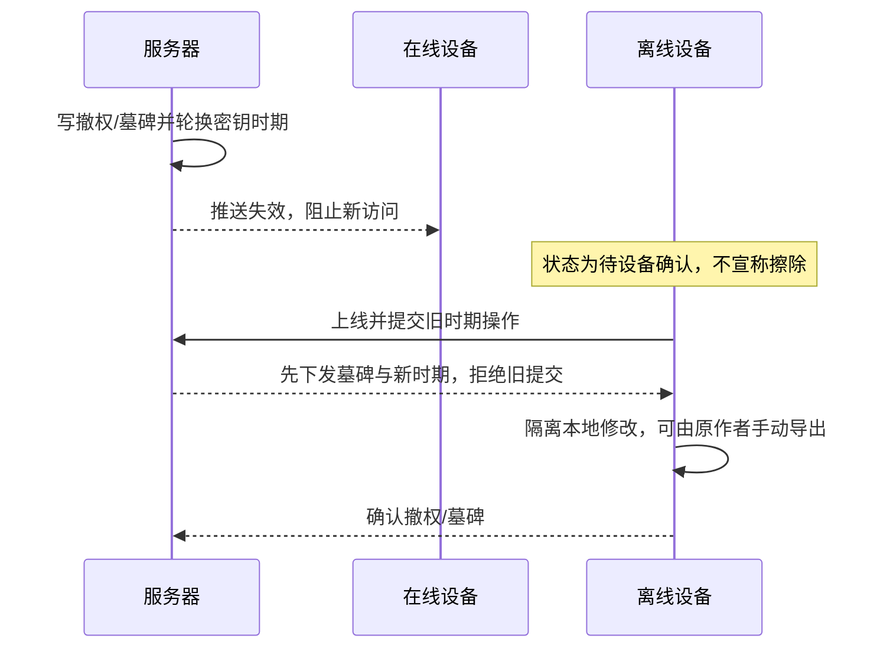

### 15.4 冲突与删除

评论、标签和不重叠字段可确定性合并；事实锁、科学结论强度、对象归属、授权和删除冲突必须保留分支并进入人工门。墓碑优先于离线编辑，备份恢复先重放墓碑和密钥时期。

### 本章验收

- 加入机构不会改变个人保险库所有权；
- 分享前能看到字段、接收方、目的、期限和后续独立性；
- 离线编辑不能复活删除对象；
- 撤权立即阻止服务器新访问，并诚实显示待确认设备；
- 一个账户加入多个机构时，机构之间无法串联数据。

来源：[协作、机构与同步决策](decisions/13-collaboration-organization-sync-boundaries.md)。

# 第四部：系统工程、数据与生产运行

## 第 16 章 总体系统架构与领域模块（P4-C16）

> 黄金路径：全部。输入：产品与领域合同。输出：可扩展、可隔离、可替换的系统拓扑。失败闭锁点：按菜单拆微服务、跨模块越表写入或让框架对象成为领域真相。

### 16.1 架构选择

采用“设备侧个人保险库 + 云/自托管领域模块化单体 + Temporal 持久工作流 + PostgreSQL 权威控制数据 + 独立强隔离沙箱 + Next.js 项目工作台”。逻辑上深模块，物理上少进程，按风险与扩缩证据拆运行时。

#### FIG-14 Web/API/worker/保险库/沙箱/基础设施物理拓扑

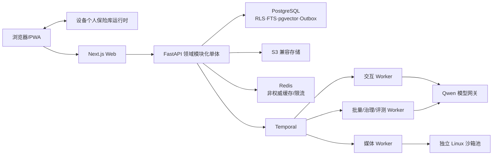

物理进程至少包括 `web`、`api`、`worker-interactive`、`worker-batch`、`worker-media`、`sandbox-runner`、个人保险库运行时和 OpenTelemetry Collector。API 与 worker 复用 Python 领域代码，但使用不同入口、队列和最小数据库角色。

### 16.2 深模块

#### FIG-15 领域模块与依赖方向

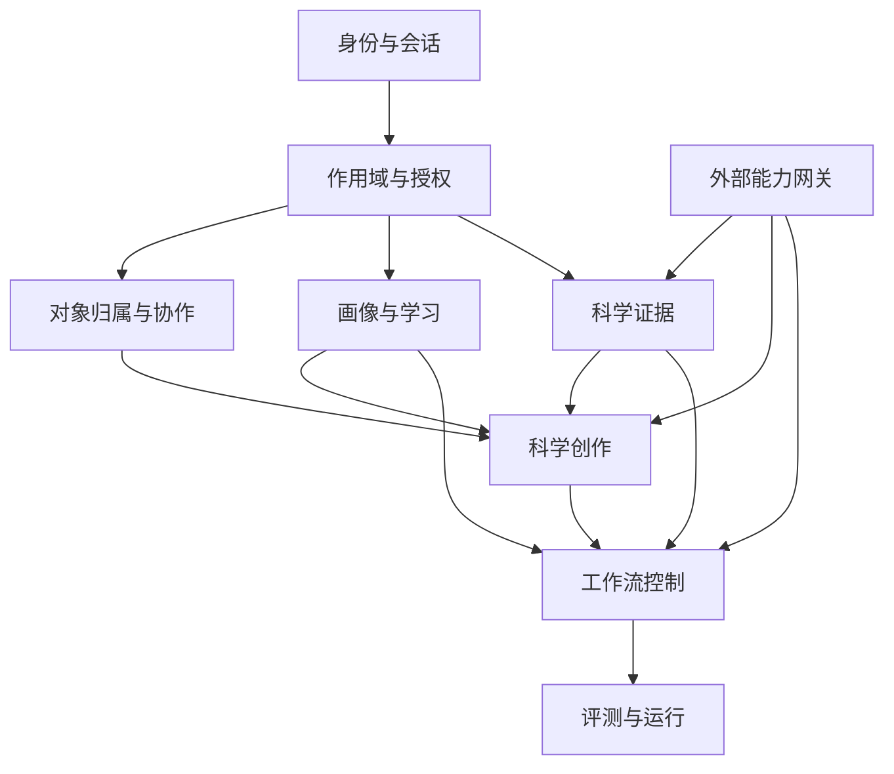

模块拥有自己的写模型，其他模块只能通过稳定接口或事件获取结果。身份、授权、协作、画像学习、证据、创作、工作流、评测和外部能力网关位于同一 Python 应用组合边界内；只有独立故障域、数据主权或持续容量证据才拆远程服务。

### 16.3 基础设施权威关系

| 设施 | 权威内容 | 明确不负责 |
|---|---|---|
| PostgreSQL | 账户、授权、项目、工作流投影、出处、审计元数据 | 大媒体、设备私人明文 |
| S3 | 项目对象、派生媒体、密文副本、评测结果 | 事务权限判断 |
| Temporal | 持久执行、等待、重试、信号、回放 | 领域状态定义、产物可信裁决 |
| Redis | 限流、短缓存、通知 | 工作流真相、画像、长期队列 |
| 个人保险库 | 私人正文、索引、离线操作与密钥 | 独立账户/所有权域 |
| 沙箱 | 不可信代码与渲染 | 生产网络、密钥、数据库 |
| Qwen | 经注册的语义推理/生成能力 | 权威状态、权限和最终科学裁决 |

### 16.4 扩展与失败边界

先横向扩 Web、API 和不同队列 worker；以项目/机构哈希路由到应用单元。普通租户共享集群但以 RLS、对象授权和密钥域隔离；高隔离租户可用独立单元/数据库并复用相同 Schema、迁移与评测。

### 本章验收

- 每个权威对象只有一个写模块；
- API、worker 与沙箱拥有最小角色；
- Redis、Temporal 或 Qwen 故障不改变权威数据语义；
- 框架替换不破坏领域合同和历史运行解释；
- 拓扑支持四种生产部署而不分叉业务代码。

来源：[系统架构与治理决策](decisions/11-system-architecture-and-governance.md)。

## 第 17 章 数据模型、存储、索引与迁移（P4-C17）

> 黄金路径：全部。输入：领域对象版本与事件。输出：一致、隔离、可迁移的数据和索引。失败闭锁点：跨域缓存/索引、覆盖历史、无恢复的破坏性迁移。

### 17.1 四类数据域

#### FIG-16 数据权威域、存储和同步关系

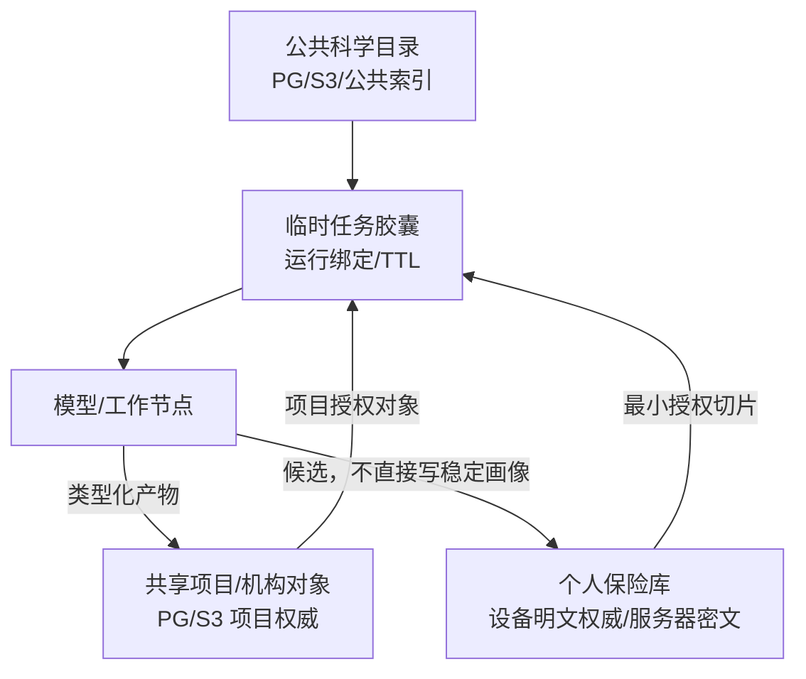

服务器对个人保险库默认只保存控制元数据、哈希、密文副本、墓碑和同步确认；共享项目正文由项目域管理；临时任务胶囊只在绑定运行、目的、对象集合和 TTL 内有效。

### 17.2 Schema 与不变量

PostgreSQL 按模块分 `identity/governance/sync/profile/science/creation/workflow/evaluation/audit` Schema。`object_registry` 只保存共通归属、域、敏感级别、版本指针和删除状态，禁止成为通用 EAV。

- 重要对象使用不可变版本行 + 当前指针；
- 命令携带 `expected_version` 做乐观并发；
- 事务同时写业务状态与 Outbox；
- RLS 依据 owner、domain、membership、object grant、purpose 和 tombstone；
- 日常应用角色无 `BYPASSRLS`；
- 审计保存必要元数据、引用与哈希，不复制敏感正文。

### 17.3 索引与缓存

公共目录、个人保险库和项目索引逻辑/物理分区；任何检索先编译作用域，再做 FTS/pgvector 预过滤、融合与重排，输出后二次鉴权。

Redis 键至少包含部署单元、账户/租户、对象域、项目、授权版本、密钥时期、对象/内容版本和模型/Schema 版本。私人响应不跨用户缓存；Redis 不可用时旁路缓存、收紧并发。

### 17.4 迁移

#### FIG-17 数据与索引 expand/contract、双运行和切换

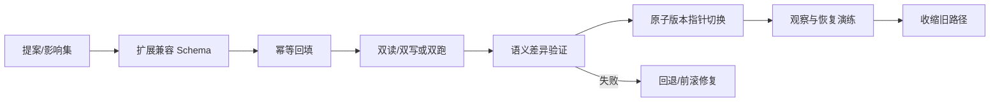

迁移覆盖数据库/RLS、对象格式/加密、Temporal 历史、API/事件/产物 Schema、embedding/分块/索引、模型与提示、领域包、评测套件、设备副本和墓碑。破坏性变更自动使相关合同与发行证据失效，完成双跑、回放和恢复后重新取证。

### 17.5 索引升级

embedding、维度、规范化、分块、元数据或权限过滤变化时创建新索引版本；在相同对象与权限快照上重建，比较词法/向量/融合检索和 Claim 支持率，再原子切换。禁止在一个索引中混写不同 embedding 或权限语义。

### 本章验收

- 两账户数据在 PG、S3、缓存、索引和队列全链路隔离；
- 重要对象历史不可覆盖且可定位当前版本；
- 回填可暂停、续传、幂等和审计；
- 备份恢复后先应用墓碑、撤权和密钥时期；
- 索引升级可双读比较并安全回退。

## 第 18 章 安全、隐私、审计与沙箱（P4-C18）

> 黄金路径：全部，重点 GP-4/5/6。输入：数据分类、信任边界和威胁模型。输出：预防、检测、控制、恢复与回归链。失败闭锁点：跨账户泄漏、越权、秘密泄漏、删除复活、沙箱逃逸。

### 18.1 信任与上云边界

#### FIG-19 安全信任边界、数据上云和临时任务胶囊

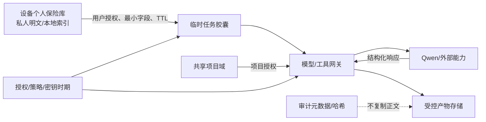

### 18.2 威胁与控制

| 威胁 | 预防 | 检测/响应 |
|---|---|---|
| 跨账户/租户/项目访问 | 服务端会话、统一授权、RLS、对象域索引 | 零容忍测试、访问异常闭锁 |
| 提示注入/恶意文档 | 文档不可信标记、隔离解析、工具/系统指令分层 | 对抗夹具、来源隔离 |
| SSRF/外部抓取 | 出站代理、域/协议策略、DNS 重绑定防护 | 网络审计、请求终止 |
| 文件炸弹/解析器漏洞 | 类型/大小/配额、隔离解析、补丁与沙箱 | 资源告警、隔离对象 |
| 邀请劫持/重放 | 短时单用令牌、绑定项目与身份、二次确认 | 幂等与安全事件 |
| 生成代码逃逸 | 强隔离 Linux、无生产网/密钥、限资源 | 逃逸探针即闭锁 |
| 供应链污染 | 锁定摘要、SBOM、签名、最小镜像 | 漏洞裁决、撤销与重建 |
| 画像滥用 | 最小切片、用途授权、敏感推断禁令 | 使用解释、隐私红队 |
| 删除后复活 | 墓碑优先、恢复重放、密钥轮换 | 删除验证与离线设备追踪 |

### 18.3 密钥与隐私

- 设备私钥进入系统密钥库，不进入配置；
- 个人对象密钥由用户/设备密钥包装，共享项目按成员设备包装并轮换时期；
- 同步权、存储权和模型计算权分开授权；
- Temporal、Redis、追踪、日志不保存密钥、完整提示、私人正文；
- 安全事件正文访问采用目的限定、双人批准、时限、字段裁剪和全审计。

### 18.4 审计

审计事件记录谁、以何角色、在何设备、对哪个对象、基于何授权/策略/密钥时期，执行何命令、工具、人工决定与状态转换。正文通过受控产物权限查看，不通过日志旁路。

### 18.5 安全硬门

以下任一实例直接闭锁候选：未认证功能访问、跨账户泄漏、越权工具、关键引用伪造、高风险越界、撤权后提交、删除复活、密钥时期回退、人工门绕过、沙箱逃逸、秘密泄漏、来源不明执行、审计链断裂。

### 本章验收

- 威胁模型覆盖账户、设备、项目、机构、外部模型、文档和沙箱；
- 权限拒绝不会从缓存、索引或备份兜底；
- 审计可归因且不复制敏感正文；
- 红队失败进入长期回归集；
- 安全控制在四种部署路径下语义一致。

来源：[系统架构与治理决策](decisions/11-system-architecture-and-governance.md)、[协作边界决策](decisions/13-collaboration-organization-sync-boundaries.md)。

## 第 19 章 Qwen 技术栈、配置与四种生产部署（P4-C19）

> 黄金路径：全部。输入：逻辑能力、生产运行合同与环境配置。输出：可替换能力路由、统一 CLI 和四种等价部署。失败闭锁点：业务硬编码模型、生产依赖 Conda、部署方式改变权限或数据语义。

### 19.1 技术栈

| 层 | 主选 | 作用 | 边界/备选 |
|---|---|---|---|
| Web | Next.js + React + TypeScript | 项目主壳、SSR、任务舞台 | 领域合同不放在组件状态 |
| API | Python + FastAPI + Pydantic | 领域模块化单体与契约 | 自有协议隔离框架 |
| 工作流 | Temporal Python SDK | 持久等待、重试、取消、回放 | LangGraph 只可用于节点内部 |
| 数据 | PostgreSQL + RLS + FTS + pgvector | 事务真相与混合检索 | 向量库可在容量证据后替换 |
| 对象/缓存 | S3 兼容 + Redis | 大对象；短缓存/限流 | Redis 永不权威 |
| 迁移 | Alembic + 自有索引/工作流迁移器 | expand/contract | 统一迁移账本 |
| RAG | 自有证据协议 + LlamaIndex 适配器 | 摄入/索引适配 | 不暴露框架领域对象 |
| 可观测 | OpenTelemetry | trace/metric/log | 正文裁剪 |
| 测试 | pytest + Playwright + 评测执行器 | 合同/E2E/纵向 | 生产接口复用 |

### 19.2 Qwen 能力注册

模型网关使用稳定逻辑能力名，例如科学推理、结构化生成、视觉理解、OCR、ASR、TTS、embedding 与 rerank。注册表记录区域、实际模型/版本、输入输出、结构化/工具支持、上下文、限流、成本快照、数据处理、验证状态、替代与禁止降级。

每次运行生成不可变 `ModelRunLock`。业务代码不依赖“latest”别名；升级必须旧新配对双跑。区域错误不得静默跨区。价格和限流只作为容量规划输入，不得通过删质量门降本。

**时效快照（核验日 2026-07-24）：**具体可用型号、价格、限流和接口以[本地技术研究](research/07-qwen-and-technology-stack.md)及[阿里云百炼模型列表](https://help.aliyun.com/zh/model-studio/models)重新核验；任何实施时引用都必须记录再次核验日期。

### 19.3 本地开发合同

- 开发者使用 Conda 环境 `agent` 管理本地 Python/native 工具；
- `environment.yml` 声明开发环境，`pyproject.toml`/Python 锁文件与 `package.json`/`pnpm-lock.yaml` 锁应用依赖；
- Windows 与 Linux 开发都运行多用户、RLS、工作流、迁移和失败闭锁测试；
- 终端用户不需要 Conda；生产镜像和主机不得检测或要求 `agent` 环境。

### 19.4 统一生产运行合同

#### FIG-18 手动分进程、统一 CLI、Docker、Podman 统一运行合同

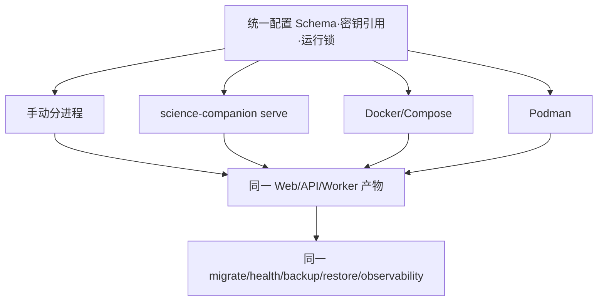

建议 CLI：

```text
science-companion doctor
science-companion migrate
science-companion serve --profile production
science-companion api
science-companion web
science-companion worker --queue interactive
science-companion worker --queue ingestion
science-companion worker --queue media
science-companion worker --queue evaluation
science-companion worker --queue governance
```

`serve` 监管并同时启动前后端，满足单命令启动要求；Web、API 和 worker 仍是独立进程。容器与非容器使用同一 Python wheel/Next.js standalone/配置 Schema/Alembic/领域包注册/健康语义。

### 19.5 配置、健康与恢复

配置优先级：安全默认值 < 版本化配置文件 < 环境变量 < secret/file reference < 白名单启动参数。未知键、弱安全组合和缺密钥使对应能力失败闭锁。

健康分为 live、ready、degraded：存活不等于可接收私人写入；授权/RLS 异常时私人读取和写入闭锁；Qwen 不可用时已保存内容仍可查，生成进入等待或合规降级。

四种路径必须共同验证安装摘要、doctor、单实例迁移、启动、认证/项目/队列/S3 冒烟、优雅关闭、备份恢复、升级与相同观测格式。

### 本章验收

- Qwen 调用均有能力注册与运行锁；
- 生产不依赖 Conda；
- 单个 CLI 命令能同时启动前后端；
- 手动、CLI、Docker、Podman 的权限、迁移、健康、存储和恢复语义一致；
- 模型升级、下架、限流与区域错误有受控降级和复现证据。

来源：[Qwen 与候选技术栈研究](research/07-qwen-and-technology-stack.md)、[系统架构决策](decisions/11-system-architecture-and-governance.md)。

# 第五部：评测、开发路线与成熟交付

## 第 20 章 持续评测、基线对比与消融（P5-C20）

> 黄金路径：全部。输入：版本化套件、案例、候选和基线。输出：运行锁、结果包、发布裁决与事故回归。失败闭锁点：只报平均分、模型自评替代硬门、不同运行条件不可比。

### 20.1 六层证据

#### FIG-21 L0—L5 持续评测证据栈

```mermaid
flowchart TB
  L5["L5 线上影子/灰度/漂移/事故"] --> L4["L4 容量·故障·恢复·部署等价"]
  L4 --> L3["L3 纵向用户轨迹与真实任务"]
  L3 --> L2["L2 端到端工作流、红队与人工评审"]
  L2 --> L1["L1 模块、真实数据库/RLS、Temporal 与沙箱"]
  L1 --> L0["L0 纯规则、Schema、状态机、单位公式"]
```

L0 提供确定性不变量；L1 验证真实基础设施与模块；L2 验证完整路径；L3 证明长期个性化和教学效果；L4 证明可运营；L5 监测现实分布与事故。高层不能替代低层硬门。

### 20.2 评测对象

- `EvaluationSuiteVersion`：数据切片、指标、量表、裁判、基线、消融和门；
- `EvaluationCaseVersion`：用户/租户/项目/领域上下文、输入、授权、预期 Claim、合法状态、断言和预算；
- `EvaluationRunLock`：代码、环境、数据、领域包、模型、提示、Schema、工作流、工具、裁判、种子与次数；
- `EvaluationResultBundle`：逐案例结果、失败分类、统计、样本、成本、签名与发布建议。

数据划分至少有开发、固定回归、隐藏回归、红队、纵向、线上影子和事故集；用户/来源/题目近重复不得跨分区泄漏。

### 20.3 九大评测域

| 域 | 核心指标 | 关键切片/硬门 |
|---|---|---|
| 科学与证据 | Claim 正确率、支持率、引用精确定位、校准 | 高风险、冲突、撤回；关键伪造为零 |
| 教学 | 延迟检索、迁移、误区纠正、认知负荷 | 不同基础与专业、无障碍 |
| 个性化 | 画像精确/校准、切片相关、纵向增益 | 错误画像、过期、删除、跨用户 |
| 有人味表达 | 任务适配、自然度、分寸、事实保持 | 四体裁、受众、事实锁 |
| 多模态 | 跨媒体一致、数值/公式、可编辑、无障碍 | 沙箱、许可、真实性 |
| 风险与隐私 | 越权、泄漏、撤权、删除、注入 | 任一跨账户实例闭锁 |
| 工作流 | 非法转换、重试越界、重复副作用、恢复 | 冲突、取消、人工门 |
| 前端 | 任务到达、状态理解、恢复、辅助技术 | 缓存串户、深链、账户切换 |
| 效率与部署 | P50/P95/P99、吞吐、成本、等价差异 | 四路径语义一致 |

### 20.4 基线与消融

最低基线族：

1. 裸 Qwen 单轮回答；
2. 普通向量 RAG；
3. 无 Claim/事实锁的 RAG；
4. 固定课程目录；
5. 无画像/无记忆；
6. 单提示词表达改写；
7. 直接提示生成多模态成品；
8. 无类型化合同的简化编排。

核心消融分别移除画像切片、证据验证、事实锁、人味诊断、分镜/沙箱、领域包、质量门、人工门或持续评测。每次只改变一个主要因素，使用相同运行锁其余部分，并报告整体与关键切片。

### 20.5 裁判与统计

裁判优先级为：确定性断言 → 可验证外部工具 → 领域专家 → 目标用户/无障碍参与者 → 经校准模型裁判。模型裁判必须冻结版本、量表与提示，测量与人工一致性、位置偏差、长度偏差和自偏好。

统计预先登记主要终点、非劣界值、最小有意义差异、配对单位、多重比较、缺失和停止规则。报告置信区间、效应量、失败分布和受损用户，不只报告均值与显著性。

### 20.6 发布门

#### FIG-22 G0—G5 发布门与职责分离签字

```mermaid
flowchart LR
  G0["G0 构建完整"] --> G1["G1 确定性正确"]
  G1 --> G2["G2 安全/科学硬门"]
  G2 --> G3["G3 质量非劣与改进"]
  G3 --> G4["G4 专家/用户/无障碍有效"]
  G4 --> G5["G5 运营就绪"]
  G5 --> R["成熟发行资格"]
  G2 -->|任一硬失败| B["FAIL_CLOSED"]
  G3 -->|关键切片受损| B
```

签字角色至少包括产品、科学、教学、安全、数据、无障碍、工程和运营；构建团队不能替代全部独立评审。事故、用户纠正和专家否决必须形成新案例，回灌固定回归。

### 本章验收

- 所有质量主张有基线和适当消融；
- 评测运行可由运行锁重放；
- 安全科学硬失败不可被平均；
- 结果同时报告总体、关键切片、成本与失败；
- 模型/领域包/索引/工作流升级经过配对双跑。

来源：[持续评测研究](research/10-continuous-evaluation.md)。

## 第 21 章 成熟开发路线、团队并行与阶段验收（P5-C21）

> 黄金路径：全部。输入：本规划书的稳定合同与覆盖矩阵。输出：R0—R7 成熟度证据、十二责任域协作和 G0—G5 发行候选。失败闭锁点：按日期自动过门、以局部成果代替集成证据或用 MVP 名义删能力。

### 21.1 十二个长期责任域

| ID | 责任域 | 权威所有权 |
|---|---|---|
| D1 | 产品、教学研究与需求治理 | 科学成长循环、学习方法、需求追踪 |
| D2 | 前端体验与无障碍 | 认证、项目主壳、任务舞台、设计系统 |
| D3 | 身份、授权与安全工程 | 账户、会话、RLS、策略、威胁模型 |
| D4 | 协作、保险库与同步 | 三域、设备、密钥时期、撤权删除 |
| D5 | 科学证据与 RAG | Source、Claim、Evidence、Citation、事实锁 |
| D6 | 领域包与专家治理 | Manifest、规则、夹具、签名与失效 |
| D7 | 画像、记忆与学习实验室 | 画像、知识状态、学习记录和路径 |
| D8 | 科学表达引擎 | 契约、论证、体裁和中文表达 |
| D9 | 多模态科学实验室 | 媒体对象、分镜、沙箱和无障碍替代 |
| D10 | 智能体编排与控制平面 | DSL、运行信封、质量门、人工任务 |
| D11 | 平台、数据与可靠性 | PG/S3/Redis、迁移、CLI、部署和 SRE |
| D12 | 持续评测与发行质量 | 套件、运行锁、统计、G0—G5 |

每个权威写模型只有一个责任域；安全、领域包和发行裁决保持职责分离。团队按合同轨、实现轨、夹具轨、集成轨并行。

### 21.2 八阶段成熟度门

#### FIG-23 R0—R7 成熟度门和十二责任域并行泳道

```mermaid
flowchart LR
  R0["R0 规划合同"] --> R1["R1 安全平台底座"]
  R1 --> R2["R2 可信数据/控制内核"]
  R2 --> R3["R3 完整专业能力"]
  R3 --> R4["R4 跨模块成长循环"]
  R4 --> R5["R5 协作/本地优先/治理"]
  R5 --> R6["R6 生产硬化/部署等价"]
  R6 --> R7["R7 成熟发行基线"]
```

| 阶段 | 核心交付 | 通过证据 |
|---|---|---|
| R0 | 需求、术语、对象、合同、风险、评测章程 | 全覆盖、无边界冲突、spike 有裁决标准 |
| R1 | 单仓、认证、RLS、Outbox、Temporal 骨架、四部署骨架 | 两用户/项目/机构隔离；doctor/migrate/health |
| R2 | 证据、画像、领域包、双状态、迁移和评测内核 | Claim 链、候选门、非法状态拒绝、双运行 |
| R3 | 九类能力与异常路径完整 | 各模块 L0/L1、Qwen 运行锁、沙箱与无障碍 |
| R4 | 六条黄金路径跨模块集成 | L2 E2E、L3 纵向、出处/权限/状态/体验门 |
| R5 | 保险库、同步、协作、三签与失效传播 | 离线撤权、墓碑、跨机构和专家治理测试 |
| R6 | 容量、故障、恢复、红队、供应链、四部署等价 | 实测阈值、演练、SBOM、运行手册 |
| R7 | 冻结发行候选并通过 G0—G5 | 独立签字、无关键风险、可复现运行锁 |

阶段没有固定周数；项目开发时间充裕，按证据推进。各域可预研后续工作，但尚未通过上游合同的成果不得标为已集成。

### 21.3 统一完成定义

任何模块/工作流/阶段都必须具备：需求追踪；对象/接口/状态/错误合同；权限与数据分类；正常、边界、失败、撤权、删除、并发和恢复；自动/人工证据；审计与观测；迁移；四部署影响；容量成本；文档；无关键风险；失败回归。

“代码合并”“页面能打开”“模型回答看起来不错”“单次 happy path 成功”均不构成完成。

### 21.4 变更与重取证

#### FIG-24 需求变更、证据失效、迁移和重取证闭环

```mermaid
flowchart LR
  E["问题/新证据"] --> RFC["RFC 与影响集"]
  RFC --> C{"变更等级"}
  C -->|C0/C1| I["实现与兼容测试"]
  C -->|C2/C3| M["迁移/威胁建模/双跑"]
  I --> V["受影响证据失效"]
  M --> V
  V --> R["回归/恢复/红队/独立复核"]
  R --> G["成熟度门重新裁决"]
  G --> D["文档与风险台账更新"]
```

变更分 C0 局部实现、C1 兼容合同、C2 破坏性迁移、C3 安全/科学边界。功能开关只能控制灰度，不能关闭权限、出处、科学、安全和审计门。

### 21.5 四部署阶段验收

从 R1 建立共同骨架，R6 完成全新环境等价验证，R7 固定运行锁。每条路径都执行安装摘要、配置/密钥、doctor、迁移、启动、认证/项目/队列/S3 冒烟、健康、优雅关闭、备份、恢复、升级和观测导出。

### 本章验收

- 路线不存在 MVP、演示、答辩或宣传任务；
- 十二责任域拥有明确写模型和独立门；
- R0—R7 均有进入条件、工作、完成证据；
- 破坏性变更能失效相关证据并触发重取证；
- R7 以前不把内部集成版本包装为成熟发行。

来源：[成熟开发路线决策](decisions/14-development-roadmap-and-stage-acceptance.md)。

## 第 22 章 风险、已知局限与实施结论（P5-C22）

> 黄金路径：全部，重点 GP-6。输入：风险台账、评测结果、时效快照与演练。输出：明确剩余风险、禁止场景、降级和实施接续点。失败闭锁点：以“团队知道”为由关闭风险或作无法兑现的保证。

### 22.1 风险闭环

#### FIG-25 风险—检测—控制—恢复—回归案例链

```mermaid
flowchart LR
  R["风险/事故/用户纠正"] --> D["检测与影响集"]
  D --> C["控制\n等待·隔离·撤权·闭锁"]
  C --> M["修复/迁移/重验证"]
  M --> REC["恢复与透明说明"]
  REC --> T["固定回归案例"]
  T --> G["评测与发布门"]
  G -->|新证据| R
```

### 22.2 主要剩余风险

| 风险 ID | 风险 | 控制与诚实边界 | 关闭证据 |
|---|---|---|---|
| RISK-SCI-01 | 开放科学问题无唯一答案 | 显示分歧、限定条件和人工责任 | 专家评审、冲突案例 |
| RISK-SCI-02 | 来源撤回/版本变化 | 状态刷新、ImpactSet、失效传播 | 撤回演练 |
| RISK-AI-01 | Qwen 型号、价格、限流变化 | 能力注册、运行锁、同区验证替代 | 配对双跑 |
| RISK-PRO-01 | 画像误推断或过度个性化 | 候选门、最小切片、控制权、消融 | 纵向红队 |
| RISK-SEC-01 | 提示注入与恶意材料 | 不可信输入隔离、工具边界、沙箱 | 对抗集与逃逸演练 |
| RISK-SYNC-01 | 离线设备保留明文 | 阻止未来访问，不承诺远程擦除合法导出 | 撤权传播实测 |
| RISK-OPS-01 | 复杂系统运营负担 | 模块化单体、统一合同、SLO/运行手册 | 非作者演练 |
| RISK-EVAL-01 | 裁判偏差/数据污染 | 多裁判、隐藏集、校准、数据卡 | 一致性与污染审计 |
| RISK-SUP-01 | 依赖/模型/领域包供应链 | 摘要、签名、SBOM、撤销 | 供应链红队 |
| RISK-ACC-01 | 复杂界面排斥用户 | 渐进披露、任务舞台、无障碍实测 | 目标用户任务成功 |

### 22.3 禁止场景与人工责任

- 不提供临床诊断、处方或替代专业人员的高风险决定；
- 不把情境信号解释为心理诊断或稳定人格；
- 不为“人味”伪造个人经历、来源、实验或作者身份；
- 不允许无人监督的外部发布、高风险科学建议或跨域数据共享；
- 不对离线设备上的合法导出承诺远程擦除；
- 不把生成媒体、模型评分或专家意见单独视为科学真相。

### 22.4 待实施 spike

以下是 R0/R1 的技术裁决任务，不是未完成的产品规划：

- Qwen 结构化输出、工具调用、视觉/OCR/ASR/TTS、embedding/rerank 的区域与限流实测；
- PostgreSQL RLS + 连接池 + Temporal worker 的作用域传播；
- FTS/pgvector/重排在中文科学语料上的召回—证据支持率；
- Temporal 长等待、版本升级、撤权信号、取消补偿和回放；
- 设备保险库 loopback 配对、密钥包装、离线同步和墓碑；
- Linux 沙箱候选的逃逸、冷启动、资源与媒体渲染兼容；
- Next.js 主壳、任务舞台、出处列表与辅助技术的完整流程；
- 四种部署在 Windows/Linux 新环境的等价性。

每个 spike 必须预先登记问题、代表性数据、通过阈值、失败裁决、替代方案和会失效的决策；不得以“能跑”作为唯一结论。

### 22.5 实施结论

本项目已经具备从产品、教学、科学证据、画像、表达、多模态、智能体编排、领域包、协作、前端、系统架构、安全、部署、评测到成熟开发路线的完整蓝图。实施从 R0 开始，把本规划书转化为版本化合同、ADR、Schema、测试和评测资产；之后按 R0—R7 证据门推进。

首个正式版本必须是成熟发行基线，而不是以日历或局部功能命名的 MVP。后续演进继续使用相同需求追踪、迁移、配对双跑、风险闭环和 G0—G5 门，不退回“上线后补治理”。

### 本章验收

- 风险都有所有者、触发、控制、恢复和回归要求；
- 已知局限不会被产品文案隐藏；
- spike 都有明确裁决标准；
- 规划结论能直接启动 R0，且没有未定义的核心产品决策；
- 实施范围仍排除演示、答辩和宣传工作。

# 附录

## 附录 A：术语表与语言约束

完整规范词汇以根目录 [`CONTEXT.md`](../../CONTEXT.md) 为准。实施文档、接口和测试必须优先使用下列稳定术语：

| 术语 | 精确定义/使用约束 |
|---|---|
| 长期科学学习与表达伙伴 | 产品主轴，不称通用聊天机器人 |
| 科学成长循环 | 目标—证据—解释/创作—校验—反馈 |
| 用户账户 | 画像、学习路径、项目和数据归属边界 |
| 证据化画像 | 带来源、授权、有效期和版本的独立断言 |
| 记忆切片 | 一次任务最小、已授权、可解释的长期信息集合 |
| 学习记录 | 用户展示出的理解证据，不是浏览日志 |
| 事实锁 | 从已验证 Claim 编译的不可越界信息集合 |
| 科学媒体对象 | 来源、科学绑定、可编辑源、成品和验证的整体 |
| 可审计工作流 | 类型化产物与质量门约束的持久流程 |
| 运行上下文信封 | 不可变主体、作用域、版本、预算与追踪集合 |
| 领域包 | 可插拔学科规则、来源、校验器和夹具 |
| 统一运行合同 | 手动/CLI/Docker/Podman 共享语义 |
| 成熟度门 | 由证据控制阶段推进，不是时间节点 |

禁止用“记忆”混称画像、学习记录、会话和项目信息；禁止用“完成”混称运行成功、产物合格、人工批准与发布；禁止把相关性分数称为可信度。

## 附录 B：需求追踪矩阵

| 需求 | 对象/合同 | 正文 | 图 | 测试/评测 | 责任域 | 成熟度门 |
|---|---|---|---|---|---|---|
| REQ-SCI-01 科学准确 | ClaimGraph、FactLock | C11/C20 | 07/08/21 | 关键引用、冲突、校准 | D5/D12 | R2—R7/G2 |
| REQ-SCI-02 清晰解释 | TeachingPlan、ExpressionBrief | C7/C8 | 03/04 | 学习增益、用户盲测 | D1/D7/D8 | R3—R7 |
| REQ-PRO-01 长期画像 | ProfileAssertion、MemorySlice | C12 | 09 | 纵向个性化、删除 | D7/D12 | R2—R7 |
| REQ-EXP-01 有人味 | GenreContract、ReviewReport | C8 | 07 | 四体裁盲测、事实保持 | D8/D12 | R3—R7 |
| REQ-MM-01 多模态 | ScientificMediaObject | C9 | 12 | 一致性、沙箱、无障碍 | D9 | R3—R7 |
| REQ-AI-01 Qwen | CapabilityEntry、ModelRunLock | C19 | 10/18 | 升级双跑、区域故障 | D10/D11/D12 | R1—R7 |
| REQ-ID-01 多用户 | SubjectContext、ScopeEnvelope | C4/C18 | 05/06/19 | 跨账户零泄漏 | D3 | R1—R7/G2 |
| REQ-ID-02 独立路径 | LearningMission、KnowledgeState | C7/C12 | 09 | 两用户差异与隔离 | D7 | R2—R7 |
| REQ-OPS-01 四部署 | CONTRACT-RUN-01 | C19/C21 | 18/23 | 全新环境等价 | D11/D12 | R1/R6/R7 |
| REQ-SCOPE-01 非 MVP | MatureReleaseBaseline | C1/C21/C22 | 22/23 | G0—G5 | 全体 | R7 |

完整十五项已解决决策均已映射到正文：比赛/参考（C2—3）、产品（C4—6）、证据（C11）、画像（C7/C12）、表达（C8）、多模态（C9）、Qwen（C19）、编排（C13）、前端（C10）、评测（C20）、架构（C16—19）、领域包（C14）、协作（C15）、路线（C21）、专家工作台（C14）。

## 附录 C：产品能力与页面目录

| 能力 | 主要页面 | 认证 | 主要角色 | 空/错状态要求 |
|---|---|---:|---|---|
| CAP-01 | 注册、登录、恢复、设备与账户 | 公共入口例外 | 未登录/本人 | 不泄露账户存在性 |
| CAP-02 | 全局科学伙伴 | 是 | 本人 | 无项目时引导创建/选择 |
| CAP-03 | 项目总览、材料、产物、成员 | 是 | 项目成员 | 撤权后关闭正文 |
| CAP-04 | 学习实验室 | 是 | 本人/授权导师 | 无证据时不推断掌握 |
| CAP-05 | 表达工坊 | 是 | 编辑者/审阅者 | 事实锁冲突时闭锁 |
| CAP-06 | 多模态实验室 | 是 | 编辑者 | 沙箱失败保留源、隔离成品 |
| CAP-07 | 证据与校验台 | 是 | 审阅者/专家 | 来源未知显示降级 |
| CAP-08 | 画像与记忆中心 | 是 | 本人 | 候选与稳定记录分开 |
| CAP-09 | 评测与运行中心 | 是 | 本人/治理角色 | 运行与可信状态并列 |

所有页面需完整键盘与屏幕阅读器路径；图谱提供列表替代；手机主流程不横向滚动。

## 附录 D：领域对象与数据字典

| 对象族 | 核心对象 | 权威模块/存储 | 版本/删除 |
|---|---|---|---|
| 身份 | Account、Session、Device | identity/PG | 会话轮换、撤销 |
| 治理 | Project、ObjectRef、Grant、Tombstone | governance/PG | 乐观并发、墓碑 |
| 画像学习 | Observation、Candidate、Assertion、Mission、Record、KnowledgeState | profile/设备保险库 + 控制元数据 | 不可变版本、级联删除 |
| 科学证据 | Source、DocumentVersion、ChunkVersion、Claim、Evidence、Citation、FactLock | science/PG/S3/索引 | 来源状态可使下游失效 |
| 创作 | ExpressionBrief、Draft、Storyboard、MediaObject | creation/PG/S3 | 版本链、保留可编辑源 |
| 工作流 | Definition、Run、NodeAttempt、GateResult、HumanTask、ArtifactRef | workflow/PG + Temporal | 事件追加、可回放 |
| 评测 | Suite、Case、RunLock、ResultBundle、ReleaseDecision | evaluation/PG/S3 | 冻结运行锁 |
| 同步 | Replica、Operation、ConflictBranch、DeviceAck | sync/PG + 设备 | 因果关系、墓碑优先 |

敏感级别、保留期、字段裁剪、对象域和审计策略必须在机器可读数据字典中进一步细化，但不得改写正文边界。

## 附录 E：接口、事件与 Schema 合同索引

核心合同：

- `CONTRACT-ID-01`：认证、会话、主体解析与撤销；
- `CONTRACT-AUTH-01`：`authorize/compile_scope/invalidate`；
- `CONTRACT-OBJ-01`：对象归属、分享副本与成员变化；
- `CONTRACT-PROFILE-01`：观察、候选、确认、切片与学习证据；
- `CONTRACT-SCI-01`：摄入、EvidenceSet、ClaimGraph、FactLock 与发布验证；
- `CONTRACT-CREATE-01`：教学、表达、多模态与修订；
- `CONTRACT-WF-01`：编译、启动、信号、取消与运行投影；
- `CONTRACT-EVAL-01`：套件执行、比较和发行裁决；
- `CONTRACT-RUN-01`：配置、迁移、健康、存储和生命周期统一语义。

事件目录至少包括账户/设备撤销、授权变化、对象版本、墓碑、来源状态、领域包发行/失效、模型路由、工作流节点、质量门、人工决定、工具调用、补偿、索引切换和评测事故。事件与 JSON Schema/OpenAPI 采用语义版本、生产者/消费者合同测试、幂等键和兼容窗口。

## 附录 F：工作流与质量门目录

| 模板 | 必备产物 | 主要门 | 人工门 |
|---|---|---|---|
| 个性化教学 | Mission、MemorySlice、EvidenceSet、TeachingPlan、LearningRecordCandidate | 授权、科学、教学 | 路径重要变化、记录确认 |
| 科学表达 | ExpressionBrief、ClaimGraph、FactLock、Draft、Review | 科学、表达、发布 | 强度升级、公开发布 |
| 多模态创作 | Goal、Storyboard、EditableSource、SandboxReport、MediaObject | 沙箱、科学、无障碍 | L2/L3 成品 |
| 画像治理 | Observation、Candidate、HumanDecision、Assertion | 授权、证据、敏感性 | 稳定画像写入/删除 |
| 领域包发行 | Digest、SemanticDiff、FixtureResults、Attestations | 资质、职责分离、灰度 | 三签/H3 联合门 |
| 失效恢复 | InvalidationEvent、ImpactSet、RevalidationReport | containment、授权、重新取证 | 冲突与恢复决定 |

质量门结果只允许五种结构化值；节点级与运行级重试预算必须同时存在。

## 附录 G：领域包和专家治理手册

每个包至少包含：

- Manifest、适用/排除范围和风险级别；
- 来源策略、状态解析和过期预算；
- Claim/证据/措辞规则、术语、公式与单位；
- 逻辑校验器需求及沙箱级别；
- 正例、反例、边界、冲突、恶意、版本变化和人工门夹具；
- 依赖锁、迁移、语义 Diff、内容/独立/发行签名；
- 灰度、透明记录、失效、撤销、回滚和重验证。

专家工作台操作顺序、职责分离和拒绝场景以 P3-C14 为准；附录只作为执行清单。

## 附录 H：评测矩阵、数据卡与统计计划

每个套件的数据卡至少记录目的、领域、来源与许可、样本单位、用户/风险切片、去重、污染检查、标注流程、局限、更新和失效条件。统计计划在运行前登记主要终点、非劣界、效应量、配对单位、重复次数、多重比较和受损切片。

| 变更 | 必跑 |
|---|---|
| 模型/提示 | 相关 L0—L3、稳定版配对、成本与区域 |
| Claim/检索/embedding | 科学域、引用、索引双读、隔离 |
| 画像/教学 | 纵向 L3、删除/错误画像、教学增益 |
| 表达 | 四体裁、事实保持、人味盲测 |
| 多模态/沙箱 | 跨媒体、无障碍、安全和资源 |
| 权限/同步/删除 | 全量零容忍红队、恢复 |
| 部署/基础设施 | L1/L2、L4 故障/恢复/四路径 |
| 领域包 | 依赖闭包、夹具、灰度、失效传播 |

## 附录 I：安全、隐私、威胁与风险登记

风险条目统一字段：ID、资产、主体、触发、最坏影响、概率、可检测性、所有者、独立监督者、预防、检测、控制、恢复、回归案例、证据、剩余风险和复核日期。

强制红队清单：账户枚举、会话固定、CSRF、深链越权、缓存串户、索引串户、worker 丢主体、邀请劫持、提示注入、恶意 PDF、SSRF、文件炸弹、生成代码逃逸、供应链污染、密钥泄漏、离线撤权、墓碑复活、管理员越权、审计正文泄漏、跨区域模型路由。

## 附录 J：开发、部署与运维手册

### 本地开发

1. 安装 Conda 并创建/激活 `agent`；
2. 按锁文件安装 Python/Node 依赖；
3. 启动本地依赖并运行 `science-companion doctor`；
4. 运行迁移、合成多用户种子和测试；
5. 分别或统一启动 Web/API/worker；
6. 开发环境不得跳过 RLS、授权与失败闭锁。

### 生产

- 手动分进程：显式启动 Web、API 和各 worker，连接受管基础设施；
- 统一 CLI：`science-companion serve --profile production` 监管前后端；
- Docker：固定 OCI digest 和 Compose/编排清单；
- Podman：使用相同 OCI、配置和健康合同。

共同运维步骤：doctor → migrate → start → live/ready/degraded → backup → restore drill → upgrade → rollback/forward-fix → graceful shutdown。秘密只通过 secret/file reference 或密钥服务；配置中禁止明文生产密钥。

## 附录 K：时效性技术与模型注册快照

核验日期：2026-07-24。实施前必须重新核验。

| 项目 | 本规划采用的稳定结论 | 时效字段 |
|---|---|---|
| Qwen | 通过模型网关与能力注册表使用 | 型号、区域、上下文、工具/结构化输出、价格、限流 |
| OCR/ASR/TTS/VL | 作为独立逻辑能力验证 | 接口、语言、文件限制、延迟与成本 |
| embedding/rerank | 索引版本化、可替换 | 维度、最大输入、计费、区域 |
| Next.js/FastAPI/Temporal/PG | 候选主栈，锁定实施版本 | 版本、许可证、兼容矩阵、安全公告 |
| OCI 与依赖 | digest、SBOM、签名 | 镜像/包摘要、CVE 裁决 |

权威入口：[百炼模型列表](https://help.aliyun.com/zh/model-studio/models)、[模型价格](https://help.aliyun.com/zh/model-studio/model-pricing)、[限流说明](https://help.aliyun.com/zh/model-studio/rate-limit)、[Function Calling](https://help.aliyun.com/zh/model-studio/qwen-function-calling)、[Temporal 文档](https://docs.temporal.io/)、[PostgreSQL RLS](https://www.postgresql.org/docs/current/ddl-rowsecurity.html)。

## 附录 L：来源、参考项目与决策记录

### 本地权威资产

- 比赛要求：`C:\Users\33755\Desktop\项目要求.txt`
- 灵感材料：`C:\Users\33755\Desktop\参考资料\灵感\`
- [比赛与参考综合](research/01-competition-and-reference-synthesis.md)
- [科学证据与 RAG](research/03-scientific-trust-system.md)
- [画像与长期记忆](research/04-profile-memory-governance.md)
- [有人味科学表达](research/05-human-scientific-expression.md)
- [多模态科学体系](research/06-multimodal-science-studio.md)
- [Qwen 与技术栈](research/07-qwen-and-technology-stack.md)
- [持续评测](research/10-continuous-evaluation.md)
- [领域包治理](research/12-initial-domain-pack-governance.md)

### 已确认决策

- [产品能力体系](decisions/02-product-capability-system.md)
- [智能体编排合同](decisions/08-agent-orchestration-contracts.md)
- [前端信息架构](decisions/09-frontend-information-architecture.md)
- [系统架构与治理](decisions/11-system-architecture-and-governance.md)
- [协作与同步边界](decisions/13-collaboration-organization-sync-boundaries.md)
- [成熟开发路线](decisions/14-development-roadmap-and-stage-acceptance.md)
- [领域包专家工作台](decisions/15-domain-pack-expert-workbench.md)
- [最终规划书结构](decisions/16-final-plan-document-structure.md)

外部参考项目的直接采用、调整采用和拒绝理由以 P1-C03 及比赛综合研究为准；外部事实优先使用研究文档记录的一手来源与核验日期。

## 附录 M：成熟度门与验收检查表

### 模块完成

- [ ] 需求、对象、接口、状态、错误与版本明确
- [ ] 权限、数据分类、对象域和删除明确
- [ ] 正常/失败/撤权/删除/并发/恢复已实现
- [ ] 自动测试、持续评测、人工证据齐备
- [ ] 审计、指标、追踪、告警与裁剪齐备
- [ ] Schema、索引、工作流和领域包迁移齐备
- [ ] 四部署、容量、成本、降级和文档齐备
- [ ] 无关键安全、科学和完整性风险

### R0—R7

- [ ] R0 规划合同与追踪基线
- [ ] R1 安全平台底座和四部署骨架
- [ ] R2 可信数据与控制内核
- [ ] R3 九类完整专业能力
- [ ] R4 六条黄金路径跨模块闭环
- [ ] R5 保险库、协作、同步和领域包治理
- [ ] R6 容量、故障、恢复、红队和部署等价
- [ ] R7 冻结运行锁并形成成熟发行候选

### G0—G5

- [ ] G0 构建、依赖、数据、模型、包、迁移、镜像和文档完整
- [ ] G1 Schema、状态、权限、引用、单位、幂等、删除和迁移正确
- [ ] G2 跨账户、越权、伪造引用、删除复活、沙箱逃逸和高风险越界为零
- [ ] G3 相对稳定版总体非劣、目标改进且关键切片无不可接受伤害
- [ ] G4 独立专家、目标用户、无障碍实测与模型裁判校准通过
- [ ] G5 容量、成本、尾时延、降级、备份、恢复、监控与事故响应通过

### 四部署等价

- [ ] 手动分进程
- [ ] 统一 CLI 同时启动前后端
- [ ] Docker
- [ ] Podman
- [ ] 四者使用同一配置、迁移、健康、数据、备份、恢复和观测语义

---

本规划书的下一执行入口是 R0：把规范章节转成需求基线、ADR、机器可读 Schema、技术 spike、风险台账、评测章程和责任域工作包。任何后续实现若要改变本文稳定边界，必须按 P5-C21 的变更与重取证流程执行。
