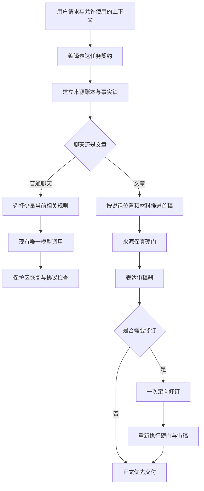

# BridGes 有人味表达改进方案

Decision status: approved

Last updated: 2026-08-12

## 目标

把 BridGes 的普通聊天和文章人味化从“规则已经注入、流程已经跑完”升级为可验证的自然表达能力。系统应以更自然、可信、有分寸、少模板腔的方式回应用户，并在文章场景达到以下结果：

- 明显优于当前 BridGes。
- 与 `Humanizer-zh` 基本持平，预注册非劣效边界为 5 个百分点。
- 不通过虚构个人经历、朋友对话、场景、数据或产品功能换取“人味”。
- 科研、技术和其他高事实密度文本不静默改变数字、术语、引用关系、限定词或结论强度。

本方案的差异化定位是：

> **来源感知的有人味表达**：让文字像一个有判断、有分寸的人在说话，但不靠编故事装真人。

## 用户故事

- `US-01`：作为普通聊天用户，我希望回答直接、自然、克制，不出现客服式尾句、表演式共情或无必要的教学长文。
- `US-02`：作为文章作者，我希望系统保留事实和我的真实立场，同时消除模板腔、PPT 腔和僵硬结构。
- `US-03`：作为材料不足的用户，我希望系统追问最关键的一件事，或交付边界明确的短稿，而不是替我编经历和案例。
- `US-04`：作为科研或技术内容作者，我希望系统提示证据风险；只有我明确授权时，才调整结论强度并展示差异。
- `US-05`：作为文章人味化用户，我希望先看到正文，需要时再展开修改、保真和风险审计。
- `US-06`：作为质量负责人，我希望用可复现的真实模型输出、确定性硬门和隔离的多模型自动盲评，分别验证聊天与文章效果，全程不依赖人工评审。
- `US-07`：作为维护者，我希望每次策略发布都有明确门禁、失败证据、成本与延迟观测以及可操作回滚。

## 已验证现状

### 普通聊天

当前方向并非完全错误：普通回复沿现有唯一模型调用注入轻量策略，文章结果跳过全局二次改写，这符合聊天延迟和确定性文本保护边界。但实现把大块共享方法规则交给所有对话，再叠加模式合同、画像和其他系统消息。模型需要同时遵守大量抽象要求，却没有被告知这一次回答最需要做出的少数表达取舍。

直接后果是：规则里虽然写了“自然、克制”，实际输出仍容易出现编号教学、抽象比喻、客服式承接和固定协作尾句。学习模式的“完整教学”倾向还会与“简单问题简单回答”发生冲突。

主要证据：

- `src/bridges/chat/global_writing_policy.py` 将共享聊天方法块编译进全局策略。
- `src/bridges/chat/turn.py` 同时装配模式合同、历史系统消息和全局写作策略。
- `tests/chat/test_global_writing_policy.py` 只验证策略装配、快照、降级和保护区，没有运行真实模型判断回答是否自然。

### 文章人味化

文章流程已具备路由、表达任务契约、事实锁、体裁合同、结构化模型调用和确定性复核，安全骨架可复用。真正的问题是生成机制仍把“体裁完成”误解为“某类元素必须出现”：科普被要求加入定义、类比和边界提醒，讲稿被要求加入目标、示例、理解检查和练习停顿，科研汇报被要求加入方法、局限和下一步。即使原文不需要，这些元素也会被强行制造。

此外，单次结构化调用同时要求正文、修改明细、事实核查和开放问题，且注入完整规则标签。模型的注意力被审计元数据和模板合同分散，最终常出现“简单来说”“需要注意的是”“从局部迈向全局”等可预测结构。

主要证据：

- `src/bridges/skills/humanizer/genre_rules.py` 用正则检查多个体裁必现元素。
- `src/bridges/skills/humanizer/method_rules.py` 维护并渲染大块带 ID 的方法规则。
- `src/bridges/skills/humanizer/service.py` 在一次结构化生成中同时请求正文和多类审稿字段；自然语言路由不做模型定向修订。
- `src/bridges/skills/humanizer/factlock.py` 能保护部分数字、单位、关系、公式、引用和限定词，但没有可靠保护专名、精确引语、个人经历及“新增但无来源”的事实。

### 评测与发布门

当前评测能证明合同骨架正常，不能证明有人味效果：

- `src/bridges/evaluation/metrics.py` 只统计少量模板短语、AI 客套和机翻短语，无法识别“颗粒度、释放大脑内存、带宽有限、元认知式反思”等抽象包装。
- `src/bridges/skills/humanizer/skill/fixtures/natural_language_eval.md` 已有 30 个原创案例，但测试只检查文件结构和案例数量，没有执行真实模型或盲评。
- 内置人味评测只有少量脚本答案；reference SUT 对人味任务不做真实改写，不能代表 `Humanizer-zh`。
- `fact_invariance` 在部分检查缺失时可以默认通过，没有遵守失败关闭。
- 现有匿名评审对象可能通过 `item_id`、`label_a` 或 `label_b` 泄漏比较映射；评审载荷也缺少原文、任务、受众和事实锁，无法可靠判断可信度。
- 当前发布门没有聊天或文章人味质量阈值。

已有快速测试结果说明旧流程的工程骨架稳定，但不是质量证明：评测盲评与指标 29 项通过，人味化意图与规则一致性 32 项通过，全局聊天策略 7 项通过；包含完整评测运行器的较大组合在 120 秒超时，超时前未出现失败。

## 参考项目结论

| 参考项目 | 值得吸收的方法 | 不应照搬的部分 |
| --- | --- | --- |
| `Humanizer-zh` | 删除填充与模板动作；建立观点、复杂感受、句长变化和具体语境；信任读者 | 示例会凭空添加第一人称经历、朋友对话、数据和产品功能；自评分没有事实保真维度；部分规则并未完成中文适配 |
| `human-writing` | 材料门槛；现实/虚构分流；说话位置；沿读者下一问推进；先成稿再审；静态检查只报警 | 全局禁冒号、破折号及固定材料数量；论坛长帖默认声音；未校准的硬阈值 |
| `scientific-humanization` | 保护数字、单位、术语、引用和证据强度；区分“能说明什么”和“还不能说明什么” | 不是通用人味系统；会改变结论语义；本地快照没有许可证，不能复制文字、结构或示例 |

许可证边界继续遵守 [ADR-0011](../../docs/adr/0011-clean-room-humanizer-and-license-boundary.md)：实现、提示、示例和测试资产保持 BridGes 原创。`Humanizer-zh` 与 `human-writing` 的本地快照包含 MIT 许可，但默认仍零复制；任何实际复用必须保留许可证、署名和来源记录。`scientific-humanization` 本地快照无许可证，只研究通用思想。

## 已冻结的 grilling 决策

1. 普通聊天保持一次模型调用；文章首稿未通过审稿时，允许按需追加一次定向修订，并更新现有单次调用 ADR。
2. 来源保真高于自然度。事实、数字、实体、引语和亲历保真是硬门，不得被风格均分抵消。
3. 聊天和文章分别验收；新版显著优于当前 BridGes，文章相对 `Humanizer-zh` 使用 5 个百分点非劣效边界。质量评价完全由确定性硬门和至少三个隔离的系统裁判自动完成，不设置人工评分、抽查或仲裁。
4. 纯改写不扩张事实范围；扩写或按主题生成材料不足时，只追问一个最高价值问题，否则缩短或留下明确占位。
5. 科研与技术文本默认不静默改变结论；只有“证据安全修订”模式可以降低结论强度，并必须展示前后差异和原因。
6. 普通聊天只有限使用用户明确表达过的称呼、篇幅、专业程度和表达偏好；不推测性格、经历、情绪或亲密关系。
7. 文章提供轻度、标准、深度三级改写，标准为默认；原文已经自然时遵守不伤害原则。
8. 文章交付正文优先，修改、保真和风险审计按需展开；可确定性计算的审计信息不占用模型写作注意力。
9. 普通聊天默认取消礼貌性尾句和表演式共情；只有存在真实下一步时才提问。
10. 取消体裁必现句型，改成按任务需要选择表达手段；体裁检查判断任务是否完成，不搜索指定套话。

## 目标架构

### 深模块与稳定接口

本轮不再增加一套平行“去 AI 味器”。现有 `humanizer` 合同和事实锁应沿以下缝隙加深：

1. **表达任务契约编译器**
   - 输入：用户请求、表面类型、模式、允许使用的画像切片、材料和用户显式选择。
   - 输出：版本化 `ExpressionTaskContract`，包含任务边界、现实承诺、改写强度、说话位置、第一人称权限、受众、渠道、长度、材料充分度和证据修订模式。
   - 调用方不自行拼装体裁必现词或推断用户性格。

2. **来源账本与保真检查器**
   - 输入：原文、用户材料、授权参考来源和表达任务契约。
   - 输出：版本化 `SourceLedger`，记录可用事实、专名、数字、引语、经历、保护区、允许的假设及其来源。
   - 检查器同时验证“原有信息未被破坏”和“新增可核查信息有来源”，缺少检查结果时失败关闭。

3. **表达审稿器**
   - 输入：原文、候选正文、契约、来源账本和场景 profile。
   - 输出：带文本位置、证据、严重度和定向建议的 `ExpressionReviewReport`。
   - 只检查作者新增正文，跳过引语、代码、公式、URL、用户指定措辞和合法术语；只报警，不自动做机械替换。

4. **聊天轻量策略编译器**
   - 输入：当前轮意图、固定对话模式、最小画像切片和回答形态。
   - 输出：少量当前相关的正向行为规则，不输出全量方法 ID 和黑名单。
   - 继续使用现有唯一模型调用、快照重试、确定性文本和保护区恢复边界。

### 文章生成原则

- 先确认“谁在说、凭什么知道、材料支持到哪里、读者下一步会问什么”，再决定句式。
- 每段应增加事实、动作、区别、后果或必要判断，不用同义改写凑长度。
- 具体场景只能消费来源账本中的材料；无来源时只能使用明确标注且有必要的假设。
- 第一人称不是人味指标。只有原文已有、用户明确授权代写，或属于不冒充亲历的当下判断时才使用。
- “颗粒度、带宽、抓手、底层逻辑”等词不做全局禁词；表达审稿器判断它们是在准确指代专业概念，还是用抽象包装代替动作和事实。
- 不全局禁止冒号、破折号、三项列举、设问或总结，只检查它们是否高密度、机械或无助于任务。
- 原文已经自然时，轻度、标准和深度档位都不得强行加场景、故事、比喻、第一人称、金句或升华结尾。

### 普通聊天原则

- 先完成用户此刻的请求，再决定是否需要解释、标题、例子或下一问。
- 简单问题允许简单回答；学习模式也不自动把每次回复扩展为完整课程结构。
- 共情必须承接已出现的具体情绪，并帮助判断或行动；不复述情绪来表演理解。
- 没有真实下一步时直接停下，不固定追加“希望有帮助”或“如果你愿意我还可以”。
- 不同意、失败、拒答和不确定性均直说依据与边界，不用励志话术缓冲。
- 画像只影响称呼、篇幅、专业程度和明确表达偏好，不影响事实判断和证据标准。

## 评测与发布定义

### 两条独立评测路径

- `chat-naturalness`：分别覆盖日常陪伴和学习模式，包括短答、解释、建议、纠错与分歧、多轮承接、工具结果、错误或拒答、代码公式引用保护区。
- `article-humanization`：分别覆盖改写与生成、轻度/标准/深度、邮件、报告、教程、观点、演讲、科普、科研技术、材料不足和原文已自然的不伤害案例。

### 保真硬门

- 数字、单位、日期、专名、公式、精确引语、URL、引用关系、否定、因果方向、限定词和结论强度按契约保留。
- 新增可核查事实必须绑定输入或授权来源。
- 不得编造助手、作者或用户的亲历、朋友对话、情绪、时间地点和具体场景。
- 检查记录缺失时不得默认通过。
- 任一关键保真失败直接阻止发布，不能被自然度高分抵消。

### 自动多裁判匿名盲评

- 每个比较项至少由三个相互隔离、版本固定的系统裁判独立判断；优先使用不同模型家族或提供方。无法满足预注册的裁判多样性时，结果只能是 `inconclusive`。
- 裁判输入展示用户请求、原文、受众、渠道、长度、事实锁和匿名候选；不展示 SUT、策略版本、生成模型身份或可反推映射的 ID。
- 每个裁判都用 A/B 和 B/A 两种顺序评价同一配对；顺序翻转后无合理理由地改变偏好，记为位置偏差并降低该裁决权重或判为无效。
- 主问题为“哪一版更适合直接发送或发布”，支持 A、B、平局和无法判断；分别输出自然度、可信与有根据、具体落地、分寸与非说教、任务与声音适配、可读性和事实忠实的结构化评分及原文证据位置。
- 裁判必须先通过含已知正确答案的中文锚点、事实对抗题、虚构亲历题和位置偏差 canary；版本、提示或参数改变后重新校准。
- 裁判分歧超过预注册阈值时不进行人工仲裁，结果直接为 `inconclusive`。确定性保真硬门始终优先，任何模型多数票都不能放行关键事实或虚构亲历失败。
- 自动结论只表述为“通过冻结的系统裁判体系”，不得表述为“已获真实中文用户认可”或“经人工验证”。

### 预注册门禁

- 先在每个 case 内聚合重复执行，再按 case 做成对差值和固定种子的 cluster bootstrap，避免把 seed 和重复执行当作独立样本。
- 新版相对当前 BridGes：偏好分 `win + 0.5 × tie` 的 95% 置信区间下界必须大于 50%。
- 文章新版相对 `Humanizer-zh`：同一偏好分的 95% 置信区间下界不得低于 45%。
- 聊天和文章分别通过；总体均分不能掩盖任一表面或关键体裁退化。
- 关键事实、保护区和虚构亲历为零严重错误；非关键保真通过率至少 99%。
- 系统裁判数量或多样性不足、顺序一致性/锚点校准不合格、裁判分歧超阈值、运行锁不完整或检查结果缺失时，结论只能是 `inconclusive`。

## Issue 地图

| # | Issue | Priority | Status | Blocked by |
| --- | --- | --- | --- | --- |
| 01 | [跑通真实人味评测 tracer bullet](issues/01-real-humanization-tracer-bullet.md) | P0 | ready-for-agent | None |
| 02 | [建立来源账本与保真硬门](issues/02-source-ledger-fidelity-gate.md) | P0 | ready-for-agent | None |
| 03 | [重构表达任务契约](issues/03-expression-task-contract.md) | P0 | ready-for-agent | None |
| 04 | [重建文章首稿与表达审稿器](issues/04-article-draft-and-style-review.md) | P0 | ready-for-agent | 02, 03 |
| 05 | [增加文章定向二次修订](issues/05-targeted-second-pass.md) | P0 | ready-for-agent | 04 |
| 06 | [实现证据安全修订模式](issues/06-evidence-safe-revision.md) | P0 | ready-for-agent | 02, 03, 04 |
| 07 | [重建普通聊天轻量策略](issues/07-chat-lightweight-policy.md) | P0 | ready-for-agent | 03 |
| 08 | [实现正文优先的文章交付界面](issues/08-article-result-projection.md) | P1 | ready-for-agent | 05, 06 |
| 09 | [建立分层语料与真实对照运行锁](issues/09-benchmark-corpus-and-run-lock.md) | P0 | ready-for-agent | 01 |
| 10 | [建立隔离的多模型自动盲评](issues/10-blind-multidimensional-review.md) | P0 | ready-for-agent | 01, 09 |
| 11 | [建立配对统计与发布质量门](issues/11-paired-statistics-release-gates.md) | P0 | ready-for-agent | 09, 10 |
| 12 | [冻结 holdout 并完成发布验收](issues/12-frozen-holdout-release-acceptance.md) | P0 | ready-for-agent | 05, 06, 07, 08, 11 |

### 推荐执行波次

1. 波次 A：01、02、03 并行，先建立最短真实评测链路和两个核心合同。
2. 波次 B：04、07、09；文章和聊天实现分开推进，同时冻结评测材料。
3. 波次 C：05、06、10；补文章修订、证据模式和可靠盲评。
4. 波次 D：08、11；完成产品交付投影和正式质量门。
5. 波次 E：12；只用冻结 holdout 做发布验收，不再按 holdout 调规则。

## 全局完成定义

- 12 个 Issue 的验收标准与测试计划全部完成，依赖和 ADR 变化有记录。
- 普通聊天继续只发生一次主模型生成；文章最多发生首稿加一次有条件定向修订。
- 所有成功文章都有来源账本和保真检查结果；检查缺失不允许成功。
- 体裁完成不再依赖必现短语；原文已自然的不伤害案例没有强行改写。
- 真实模型 current/candidate/`Humanizer-zh` 输出使用同一运行锁生成并可重放。
- 盲评载荷不泄漏候选身份；至少三个合格系统裁判完成冻结 holdout，且顺序一致性、锚点校准和裁判多样性满足预注册门槛。
- 聊天与文章分别达到预注册门禁，关键事实和虚构亲历零严重失败。
- 发布报告包含成本、延迟、质量分层、失败案例、已知限制和回滚演练；没有通过时保持当前生产策略。

## 风险与处理

- **文章延迟和成本增加**：只在明确问题触发第二次调用；记录触发率、额外 token 和延迟，并设单次上限。
- **风格检查误报**：检查器提供位置和证据，只对来源/合同问题做硬门；标点、词语和节奏默认作为软信号并按场景配置。
- **为了基准过拟合**：开发集和冻结 holdout 分离；holdout 一旦运行，不允许局部调参后只重跑失败项。
- **Humanizer-zh 通过虚构获得偏好**：保真硬门先于盲评，自然度和可信度分开报告。
- **系统裁判偏差与串谋式一致**：隔离裁判上下文，优先使用不同模型家族，执行双向顺序评判、行为锚点、事实对抗题和漂移 canary；分歧或校准失败直接 `inconclusive`，不由另一模型强行拍板。
- **缺少真实用户效度**：发布报告明确这是系统自动基准，不声称代表真实中文用户偏好；上线后只使用用户自然产生的产品反馈作为观测信号，不把它伪装成受控人工评审。
- **许可证污染**：全部实现和语料保持原创；外部参考只记录路径、版本、哈希、许可证和方法层结论。
- **与冻结产品合同冲突**：第二次文章调用必须先更新 ADR；普通聊天仍保持一次调用，确定性文本、引用、代码和公式继续跳过风格改写。

## Comments

- 2026-08-12：基于 BridGes 代码、ADR、评测资产和三个本地参考快照完成只读审计。
- 2026-08-12：通过十轮 grilling 冻结质量、延迟、来源、证据、画像、改写强度、交付和体裁决策。
- 2026-08-12：用户批准按 12 个 tracer-bullet Issue 发布，不合并。
- 2026-08-12：用户覆盖原“至少三名中文人工评审”决策，要求完全取消人工评审；方案改为确定性硬门与隔离多模型自动盲评，系统分歧不做人工仲裁。
