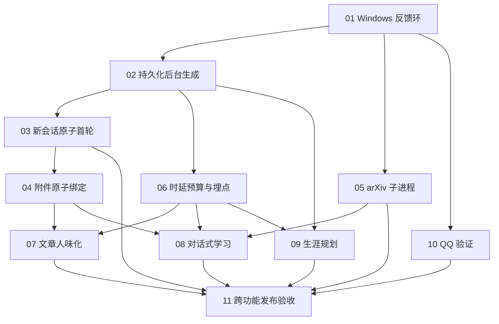

# BridGes 严重问题收尾执行图

Status: completed

11 个 issue 全部完成；跨功能验收报告见
[closeout-acceptance-report.md](closeout-acceptance-report.md)。

## 目标

本目录把 2026-08-08 用户反馈的 9 组严重问题拆成 11 个可执行 issue。每个 issue 都要求先补充可失败的回归测试，再修复，再用同一测试验收；不得以“现有测试为绿”代替真实链路验证。

本次只制作诊断与执行文件，不修改产品代码。问题证据来自用户截图、当前代码、只读数据库投影和本地测试；未读取或记录 QQ 授权码、会话令牌、模型密钥等秘密。

## 根因总览

| 用户问题 | 当前判断 | 证据强度 | 执行 issue |
|---|---|---:|---|
| 1. `+` 菜单无法把文件/图片用于当前会话 | 新会话上传、建会话、跳转、发送分属多个临时状态；文章改写入口还直接丢弃了 `attachmentIds`，导致文件已上传但未绑定消息 | 已确认 | 03、04 |
| 2. 发送后中央空白、最近对话延迟出现、Logo 变蓝 | 空草稿被最近列表过滤；首条消息依赖跳转后的 `sessionStorage` 再发送；开始事件前没有乐观消息；蓝块实为路由后意外获得焦点的“跳转到主内容”链接 | 已确认 | 02、03 |
| 3. arXiv 启动失败 | 子进程继承 Windows GBK 文本管道、丢弃 stderr，并把 EOF/退出/协议错误统一误报为 `arxiv_startup` | 高度可信，需用真实子进程测试锁定 | 01、05 |
| 4. 人味化不展示文章；改写误用知识库图片 | 体裁检查失败会把已生成输出置空；改写入口丢失附件 ID。数据库中目标 DOCX 为 `uploaded` 但 `message_id` 为空，而相关消息附件数为 0 | 已确认 | 04、06、07 |
| 5. 生涯规划“连接中断” | 最近失败记录为约 48 秒/95 秒的 `stream_interrupted`，而非生涯规划领域校验错误；同步模型调用与页面/SSE 生命周期耦合 | 已确认 | 02、06、09 |
| 6. 学习模式证据不足且不教学 | “我想学习 Transformer”被当作事实教学请求，先检索，检索空便直接以证据缺口结束；没有先建立目标、水平和逐步教学状态 | 已确认 | 04、05、08 |
| 7. 等待可达 300 秒 | 检索、公开搜索、结构化生成、质量门及重试缺少统一阶段时限和端到端预算；部分独立步骤串行；前端只有长时间等待 | 已确认，具体耗时占比待埋点 | 02、06、07、09 |
| 8. 离开会话会中断回复 | 页面卸载逻辑主动调用停止接口并中止流；服务端生成又运行在 SSE 请求内，断开后最终写为 `stream_interrupted` | 已确认 | 02 |
| 9. QQ 授权码保存跳转、邮件已收却验证失败 | 403 再认证被前端升级为整页阻断；IMAP 仅轮询约 6 秒；后台验证没有 attempt/version，旧线程还可能覆盖新配置 | 已确认 | 10 |

额外发现两类系统性风险：

1. Windows E2E 启动时曾因 SQLite 路径无法打开而在测试前退出；pytest 默认临时目录也可能无权限。当前反馈环不具备稳定复现能力，见 issue 01。
2. 现有相关测试大量使用假模型、假 SMTP/IMAP、假 arXiv 进程和路由 mock。47 个相关后端测试通过，但没有覆盖本次真实边界，不能证明缺陷不存在。

## 安全与产品决策

- QQ SMTP 授权码属于敏感设置。ADR-0018 要求近期密码确认，因此不能直接删除再认证。
- issue 10 的方案是在原表单内弹出密码确认，成功后自动续交原操作；不跳转、不要求完整重新登录、不丢失已输入授权码。
- 只有 SMTP 发信成功不足以证明邮箱控制权；仍需可靠的收件确认，遵守 ADR-0017。
- 长任务复用仓库现有本地后台执行器，不引入 Redis、云队列或新的远程依赖。

## 依赖与执行顺序

建议批次：

1. 先做 01；它提供其余任务共用的 Windows 可执行反馈环。
2. 并行做 02、05、10。
3. 02 完成后做 03、06；03 完成后做 04。
4. 并行做 07、08、09。
5. 最后做 11，不得在任何前置 issue 未验收时提前关闭。

## 当前基线

- 后端相关测试：arXiv 进程、学习模式、SMTP 适配器/API 共 21 个通过；聊天附件、人味化、生涯规划、arXiv 聊天共 26 个通过。
- 第一次运行时，13 个依赖 `tmp_path` 的测试因系统临时目录拒绝访问而在 setup 阶段失败；显式使用仓库内可写临时目录后 21 个通过。
- 前端新会话 E2E 未进入用例，API webServer 先以 `sqlite3.OperationalError: unable to open database file` 退出。
- 受限 arXiv 子进程在当前 Windows 环境报告 `stdin/stdout=gbk`；相同干净环境输出 GBK 不可编码字符会以 `UnicodeEncodeError` 退出。当前父进程会把这种退出误报为“启动失败”。

## 全局完成定义

- 11 个 issue 的验收项全部通过，且 11 产出跨功能验收报告。
- 用户列出的 9 组场景均有至少一个不依赖线上服务的确定性自动化回归，并有一次 Windows 桌面真实链路人工验证。
- 连续 100 次“新会话首条消息”不出现空白、丢会话或 Logo/跳转链接异常。
- 上传后的附件必须与目标用户消息原子绑定；文章改写不得静默回退到无关知识库材料。
- 离开、刷新或重开会话不会停止后台生成；只有用户明确点击停止才停止。
- 任一交互不再无期限等待：有阶段进度、预算、终态和可恢复路径，不出现 300 秒无反馈。
- 学习模式按“目标澄清 → 单步讲解 → 一题检查 → 根据回答调整”循环，不把学习目标建立阶段卡在证据门外。
- QQ 验证不跳整页；延迟到达的验证邮件能在有效窗口内收敛为“已验证”；敏感操作保护仍然存在。
- 日志、测试产物、报告中不包含用户文档正文、授权码、密码、令牌或模型密钥。

## Issue 清单

- [01-windows-feedback-loop.md](issues/01-windows-feedback-loop.md)
- [02-durable-generation-runtime.md](issues/02-durable-generation-runtime.md)
- [03-atomic-first-turn-shell.md](issues/03-atomic-first-turn-shell.md)
- [04-atomic-attachment-binding.md](issues/04-atomic-attachment-binding.md)
- [05-arxiv-worker-reliability.md](issues/05-arxiv-worker-reliability.md)
- [06-latency-budgets-observability.md](issues/06-latency-budgets-observability.md)
- [07-humanizer-delivery-semantics.md](issues/07-humanizer-delivery-semantics.md)
- [08-conversational-learning-loop.md](issues/08-conversational-learning-loop.md)
- [09-career-planner-resilience.md](issues/09-career-planner-resilience.md)
- [10-qq-verification-state-machine.md](issues/10-qq-verification-state-machine.md)
- [11-closeout-release-acceptance.md](issues/11-closeout-release-acceptance.md)

## Comments

- 2026-08-08：依据用户截图、代码、只读数据库状态和本地回归测试建立初版执行图。
- 2026-08-09（完成）：issue 11 收口 —— 收尾自动化套件（`scripts/closeout_acceptance.sh`）
  Windows 串行连续 3 轮全部通过（每轮 141 pytest + 29 e2e）；新增 50 次随机会话
  切换/刷新压力测试（`tests/closeout/test_closeout_stress_switch.py`）；发现并修复
  两处组合缺陷（issue07 改写路径跳过检索破坏 issue04 附件披露契约、issue03
  skip-link 组合环境时序 flaky）；仓库级 + 产物级秘密扫描 0 命中；验收报告产出。
