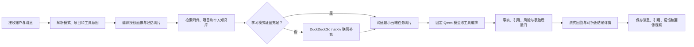

# BridGes 项目改进计划书

> 历史状态：本文件及其产品决策已由 [`.scratch/final/PRD.md`](.scratch/final/PRD.md) 与 [`ADR-0026`](docs/adr/0026-frozen-product-contracts-and-migration-gates.md) 取代。内容保留用于审计，不是当前产品合同、领域词汇或代理执行依据。

> 状态：已完成产品与架构决策确认，作为后续 Issue 拆分与实现验收的主计划。
>
> 项目定位：面向长期科学学习、成长陪伴与科学表达的本地聊天优先 AI 应用。
>
> 历史边界：`.scratch/science-companion-plan/` 与根目录 `tickets.md` 是旧 Wayfinder 规划材料，只读保留，不代表本计划的任务状态。新任务统一发布到 `.scratch/bridges-improvement/`。

## 1. 改造结论

当前项目已经具备 Python/FastAPI、Next.js、基础身份认证、部分 Qwen 适配器、画像治理骨架、设计令牌和自动化测试框架，但产品形态仍是 Science Companion 项目工作台。大量页面只有占位内容，核心聊天、真实模型闭环、持久化知识库、统一搜索、提醒、插件运行时和账户级密钥均未完成，部分已有接口还存在假成功、跨账户读取和重启丢数据风险。

本次改造不从空仓库重写，也不继续修补旧工作台。采用“保留工程骨架、按用户旅程纵向替换”的方式，把默认入口重建为 BridGes 聊天界面，先交付可登录、可配置密钥、可真实对话、可保存恢复的最小完整链路，再依次加入学习、检索、画像、人性化表达、多模态、提醒和扩展生态。

最终产品必须同时体现：

- A 数字分身：在持续交流中形成证据化、分级授权、可撤销的个人画像，并形成“观察—候选—确认或许可写入—调用—反馈—修正”闭环。
- B 有人味表达：通过原创 `bridges-humanizer` SKILL 与智能体编排减少中文模板腔、机翻感和空泛表达，同时以事实锁、来源引用和质量门保持科学可靠性。
- 科教主线：日常陪伴可以自然交流，学习模式必须能够因材施教、检查理解，并在本地材料不足时自动联网补足教学依据。

## 2. 成功标准

改造完成不能以“页面能打开”或“接口返回 200”作为标准，必须满足以下可验证结果。

### 2.1 产品闭环

- 用户使用“用户名 + QQ 邮箱 + 密码”注册，以用户名或 QQ 邮箱登录。
- 用户登录后配置自己的百炼 Key；系统真实探测每类固定模型，只有通过的能力才显示可用。
- 用户能够在日常陪伴或学习模式中连续聊天，看到流式回答、可折叠思考摘要、工具过程、引用和错误状态。
- 对话、模式切换、附件、引用和生成资产持久化，重启后可恢复。
- 用户可以创建学习项目，用它组织对话与项目文件，不进入旧项目制课程工作台。
- 用户能够治理画像、查看何时记录和使用、撤销自动更新、修正错误画像，并观察后续回答发生变化。
- 用户能够使用论文搜索、文章人味化、生涯规划、听写、回答朗读、图片和视频生成等能力；没有真实能力时不得显示成功。
- 用户可以创建 QQ 邮件提醒，并清楚看到已发送、失败、补发或错过状态。
- 同一设备可以保存多个独立账户会话，并在有效会话间切换，数据和密钥绝不混用。

### 2.2 工程闭环

- Conda、`.venv`、Docker/Podman 使用同一配置、迁移、健康检查和数据语义。
- 非容器用户从源码安装前后端锁定依赖后，通过 `BridGes start` 同步启动前端、API、后台执行器和提醒调度器。
- 用户不需要创建 `.env`；百炼 Key 和 QQ SMTP 授权码通过界面按账户配置并受保护保存。
- SQLite、对象库、全文索引和向量索引均有账户隔离、迁移、备份、恢复和故障测试。
- 单元、集成、合同、端到端、无障碍、安全和评测测试在 Conda `agent` 环境中稳定通过，不依赖测试顺序或共享残留数据。

### 2.3 科学与评测闭环

- 教学回答的关键科学主张能够追溯到本地材料、arXiv 或公开网页来源。
- 本地材料不足时，学习模式自动联网；联网仍不足时明确暴露缺口。
- 人性化处理前后的事实、数值、单位、限定条件和引用保持一致。
- 多轮画像修正实验能够证明系统在用户授权范围内更懂用户，同时不把单次情绪或敏感推断写成长期事实。
- 与基础 Qwen 输出及参考实现进行可复现实验，报告画像更新准确性、人味偏好、事实保真和风险识别结果。

## 3. 当前代码基线与主要缺陷

### 3.1 可复用部分

- Next.js 14、React 18、TypeScript 工程与基础 API 客户端。
- Claude 倾向的浅暖色设计令牌、基础无障碍组件和 Playwright 配置。
- FastAPI、Typer CLI、Argon2、HttpOnly Cookie 登录骨架。
- Qwen 文本、视觉、ASR、TTS 适配器的部分代码和能力注册表思路。
- 画像的 observation → candidate → assertion/slice 治理骨架。
- SQLite 持久化、健康检查、审计和隐私清洗的部分测试资产。

这些代码只能在合同与隔离测试通过后复用，不因已有文件名而默认可信。

### 3.2 必须修复或替换的缺陷

- 登录后默认入口仍是项目工作台，不是新聊天；侧边栏信息架构与需求不符。
- 本地知识库、统一搜索、最近对话、任务安排、插件、画像中心和账户设置没有完整页面与真实后端。
- 多个页面仅显示标题和“将在这里呈现”，缺少返回或退出路径。
- 当前身份只支持邮箱与密码，尚无用户名、严格 QQ 邮箱、改名和多账户切换合同。
- Qwen Key 仍依赖全局 `.env`；无 Key 时部分 Stub 以真实模型 ID 伪装成功。
- 工作流把节点 ID 发给模型并丢弃模型正文，未形成真实聊天消息流。
- 检索为单次内存词袋匹配，没有持久索引、分块、版本或引用闭环。
- 多个仓库和服务使用进程内状态，重启后数据丢失。
- 原始会话令牌曾出现在 JSON 响应中，Cookie 安全配置未完整生效。
- 画像候选敏感度传播不完整，画像切片读取存在缺少账户作用域的风险。
- 未授权项目仍可能渲染子组件；导航激活判断可能同时标记多个页面。
- 错误被伪装为空列表、状态与按钮硬编码，桌面端菜单、对话框和侧栏的焦点管理不完整。
- 后端测试在干净临时目录中仍出现注册冲突和共享状态污染；当前基线约为 934 通过、20 失败、48 错误，不能作为发布基线。
- 根目录未跟踪 `.env` 中疑似存在真实百炼 Key。实现开始前必须由密钥持有人轮换或吊销，测试和文档不得读取或回显该值。

## 4. 产品范围与非目标

### 4.1 首版范围

- 仅面向电脑端部署和桌面浏览器使用，不提供手机或平板使用路径。
- 本地多账户 Web 应用与聊天优先界面。
- 日常陪伴、学习模式和对话级模式切换。
- 统一搜索、最近对话、本地知识库、学习项目、任务安排、插件、用户画像和账户菜单。
- Qwen 文本/视觉/ASR/TTS/图片与 Wan 视频能力。
- DuckDuckGo 普通网页搜索与 arXiv 论文搜索。
- 原创人性化表达 SKILL、PDF/Documents 内置能力、声明式用户 SKILL 和显式权限 MCP。
- SQLite、本地加密对象库、全文/向量索引和本地后台任务运行时。
- 源码 Conda/`.venv` 部署与 Docker/Podman 部署。

### 4.2 明确非目标

- 不适配手机、平板、移动浏览器、触屏专用布局、PWA 或原生移动应用。
- 不恢复旧 Science Companion 的项目制教学工作台。
- 不实现 3D 数字人、实时动画、口型同步、声音克隆或虚拟主播。
- 不实现实时语音通话；仅保留听写和单条回答按需朗读。
- 不允许用户选择或切换模型，不实现隐式模型降级。
- 不引入 PostgreSQL、Redis、Temporal、S3、Kubernetes 或多机高可用。
- 不提供 Windows 原生安装包。
- 不支持用户上传任意可执行 SKILL 代码。
- 不迁移旧原型业务数据，不把旧 `.scratch` 状态当作新任务。
- 不以规避 AI 检测、冒充真人或名人作为人性化目标。

## 5. 信息架构与页面规划

### 5.1 全局外壳

桌面端采用 ChatGPT 式可折叠左侧边栏、中央对话区和底部账户菜单；视觉语言借鉴 Claude 的温暖、克制和高可读性，但图标、Logo、版式与组件均为 BridGes 原创。

侧边栏从上到下固定为：

1. BridGes Logo：点击进入新聊天。
2. 统一搜索：搜索对话、图片、文档和学习项目。
3. 收起侧边栏按钮：保留键盘与屏幕阅读器语义。
4. 新聊天。
5. 本地知识库。
6. 学习项目。
7. 任务安排。
8. 插件。
9. 用户画像。
10. 最近对话列表。
11. 底部账户菜单。

产品只提供电脑端布局：桌面侧边栏支持折叠和重新展开，菜单与对话框支持 Esc、焦点圈定和焦点归还。所有功能页必须有稳定返回路径，不得依赖浏览器后退；不设计移动抽屉、底部移动导航或触屏专用交互。

### 5.2 路由建议

| 页面 | 建议路由 | 主要职责 |
| --- | --- | --- |
| 新聊天 | `/` | 登录后默认入口，展示尚未发送首条消息的草稿新聊天；它不是“临时聊天”模式 |
| 对话 | `/chat/[conversationId]` | 两种模式的统一消息流 |
| 统一搜索 | `/search` 或命令面板 | 跨对话、媒体、文档、项目检索与跳转 |
| 本地知识库 | `/knowledge` | 上传、解析、索引、状态、删除与重建 |
| 学习项目 | `/projects` | 对话与项目文件的文件夹式组织 |
| 项目详情 | `/projects/[projectId]` | 项目文件、相关对话、新建学习对话 |
| 任务安排 | `/tasks` | 日程、重复规则、投递状态和手动重试 |
| 插件 | `/plugins` | 内置/用户 SKILL 与 MCP 安装治理 |
| 用户画像 | `/profile` | 分类画像、证据、授权、历史和撤回 |
| 密钥设置 | `/settings/keys` | 百炼能力探测与 QQ SMTP 验证 |
| 个人资料 | `/settings/account` | 静态头像、用户名、QQ 邮箱状态 |
| 登录/注册 | `/login`、`/register` | 本地账户生命周期 |

### 5.3 登录与注册

- 注册字段：用户名、严格数字 QQ 邮箱、密码。
- 用户名规范化后大小写不敏感唯一，可登录后修改；稳定内部账户 ID 永不改变。
- QQ 邮箱全局唯一，注册时只做格式和唯一性检查。
- 登录标识接受当前用户名或 QQ 邮箱，不要求同时填写。
- QQ 邮箱在配置个人 SMTP 授权码并自发自收测试成功后才标记已验证。
- 认证错误统一返回安全、可理解的中文提示，不泄露某个用户名是否存在。

### 5.4 新聊天与消息呈现

- 新聊天是登录后的默认页面，不设置临时聊天。
- 输入区顶部展示五条经过版权和事实核查的简短学习主题名言，按原参考页面机制轮换。
- 顶部模式切换为“日常陪伴 / 学习模式”，每个对话持久化当前模式。
- 生成期间自动展开“思考摘要”；完成后折叠为“已思考（用时 X 秒）”，用户可再次展开。
- 思考摘要只显示步骤、证据、工具调用和质量检查摘要，不显示原始思维链、系统提示或逐令牌内部推理。
- 消息支持复制、重新生成、反馈、单条回答朗读、引用展开和资产下载。
- 流式连接中断后保留已接收内容和可重试状态，不生成重复用户消息。
- 取消模型选择器与实时语音入口；输入区只保留听写和发送。

### 5.5 “+”菜单与建议卡片

两种模式共用以下工具入口，但由当前模式决定回答方式：

- 上传文件/图片。
- 论文搜索。
- 文章人味化。
- 生涯规划助手。
- 选择学习项目。
- 选择已启用插件。

空白对话下方显示“论文搜索、文章人味化、生涯规划助手”三张原创图标建议卡。点击只预填或进入相应工具意图，不绕开正常消息、授权和审计流程。

### 5.6 统一搜索与最近对话

- 搜索范围包含标题、消息正文、文档名称、解析文本、媒体说明和项目名称。
- 提供类型、项目和时间筛选；结果高亮命中片段并支持键盘导航。
- 点击结果跳转到精确对话消息、文档详情、媒体资产或项目。
- 最近列表同时包含两种模式，显示模式标识、项目归属、更新时间，并支持重命名、置顶和删除。
- 搜索或列表加载失败显示可恢复错误，不得伪装为“没有内容”。

### 5.7 底部账户菜单

- 侧边栏底部始终显示当前账户头像与用户名，激活后按参考网页行为向上展开菜单。
- 菜单固定包含“切换账号、密钥设置、个人资料、退出登录”，不得放入含糊的“更多”二级入口。
- 个人资料页只负责静态头像与用户名，不与数字分身画像中心混为同一页面。
- 退出登录只撤销当前账户会话并跳转登录页；退出此设备全部账户是切换账号界面的独立敏感操作。
- 菜单支持桌面键盘导航、Esc、点击外部关闭和焦点归还；未登录用户不能进入任何菜单目标页面。

## 6. 领域模型与持久化边界

### 6.1 权威对象

| 领域 | 核心对象 |
| --- | --- |
| 身份 | Account、LoginIdentifier、DeviceAccountSession、Reauthentication |
| 对话 | Conversation、Message、ModeSwitchEvent、ThinkingSummary、ToolRun |
| 文件 | StoredObject、Attachment、KnowledgeItem、IngestionRun、IndexVersion |
| 项目 | LearningProject、ProjectConversationLink、ProjectFileLink |
| 检索 | RetrievalRun、SourceCandidate、EvidenceCitation、DisclosureRecord |
| 画像 | Observation、ProfileCandidate、ProfileAssertion、ProfilePermission、MemorySlice、ProfileUsage |
| 提醒 | Reminder、ScheduleRule、DeliveryAttempt、MailboxVerification |
| 能力 | CredentialReference、CapabilityBinding、CapabilityProbe、ModelRunLock |
| 扩展 | SkillPackage、McpInstallation、PermissionGrant、ExtensionRun |
| 生成 | AsyncJob、GeneratedAsset、AssetVersion、ArtifactValidation |
| 治理 | AuditEvent、Feedback、EvaluationRun、DeletionTombstone |

所有对象都使用不可变内部 ID 和账户所有者。显示名称、用户名、文件名和项目名不得承担主键或授权作用。

### 6.2 存储布局

- `bridges.db`：SQLite 权威数据库，启用外键、事务、WAL、迁移版本和账户作用域约束。
- 对象库：以应用生成的对象 ID 和内容哈希保存上传与生成文件，按账户加密；原文件名仅作为元数据。
- FTS：SQLite 全文索引，服务于统一搜索与关键词召回。
- 向量索引：绑定 `text-embedding-v4`、1024 维、规范化、分块器和 Schema 的版本化索引。
- 凭据：源码环境使用操作系统凭据库；容器使用自动生成主密钥保护的加密凭据卷。
- 旧数据库：只读封存，不自动迁移到 `bridges.db`。

### 6.3 数据生命周期

- 创建、修改、删除、导出操作均验证当前账户。
- 删除数据库记录时同步调度对象文件、索引条目和派生资产清理，失败进入可重试清理任务。
- 备份必须形成数据库、对象清单、索引合同和版本清单的一致快照；凭据默认不进入普通数据导出。
- 恢复先验证版本和对象哈希，再切换为活动数据；损坏或不兼容时不覆盖当前数据。

## 7. 智能体编排

### 7.1 统一消息流水线



控制平面负责身份、授权、工具许可、预算、Schema、重试和停止规则。模型只能提出工具调用或结构化候选，不能修改权限、凭据或控制规则。

### 7.2 日常陪伴合同

- 语气自然、有分寸，避免每次都强制分点、总结或布置作业。
- 可以识别当前会话的情境信号并调整语气，但不能形成心理诊断。
- 对低风险学习目标、兴趣和表达习惯，仅在用户开启自动更新许可后写入并通知、可撤回。
- 重要经历、正在面对的问题、情绪趋势和敏感推断必须先形成候选并征得确认。
- 生涯规划输出区分事实、假设、选择、风险与下一步，不以单一画像标签决定用户未来。

### 7.3 学习模式合同

- 从用户意图、学习使命、已有知识状态和项目材料确定本轮目标。
- 使用循序解释、例子、类比、提问和适量测验，不强制固定课程目录。
- 每次测验记录可追溯学习证据，只有真实表现才能更新知识状态。
- 本地材料不存在或不足时必须自动联网；模型记忆不得替代教学证据。
- 回答显示关键来源、知识缺口和下一步建议，用户可以继续自由提问或切换模式。

### 7.4 工具执行合同

- 用户明确要求生成图片、视频、语音或发送测试邮件，视为对该次操作的授权。
- 智能体主动建议高成本或外部副作用操作时必须先确认。
- 耗时任务写入持久队列，状态限定为 queued、running、succeeded、failed、cancelled。
- 工具结果以消息内卡片呈现，包含模型/服务、输入摘要、版本、引用、错误和重试入口。
- 生产环境禁止用 Stub 结果注册为可用能力。

## 8. 分层检索与本地知识库

### 8.1 文件摄取

- 支持 PDF、DOCX、TXT、Markdown 和常见图片；扩展格式必须通过能力注册表声明。
- 上传后执行文件类型嗅探、大小限制、哈希去重、恶意路径防护和账户归属检查。
- PDF/Documents 内置能力优先提取原始文本、页码、标题和结构；图片与图表按需交给核心多模态模型理解。
- 分块记录文档、页码/章节、字符范围、解析器版本和内容哈希。
- 解析、Embedding 或索引失败时保留原文件与失败原因，允许重试，不显示为已就绪。

### 8.2 检索顺序

1. 当前对话附件。
2. 当前学习项目文件。
3. 用户已授权的个人知识库。
4. 教学证据门触发的 DuckDuckGo、arXiv 或其他登记公开来源。

本地检索融合 FTS/BM25 与 Embedding 相似度，并按来源设置候选配额。最终回答必须引用到文件页码/章节或网页 URL；找不到充分依据时返回明确缺口。

### 8.3 教学强制联网

- 没有上传材料时，学习模式教学任务自动联网。
- 材料过时、互相冲突、无法覆盖目标或证据强度不足时自动联网补充。
- 查询在本地提炼和脱敏，DuckDuckGo/arXiv 不接收私人原文、QQ 邮箱或画像。
- 搜索进度、来源和引用可见；联网失败或仍不足时不伪造可靠教学结论。

## 9. 数字分身与画像闭环

### 9.1 画像分类

- 基本情况。
- 阶段目标。
- 兴趣偏好。
- 表达习惯。
- 知识状态与学习证据。
- 情绪变化趋势。
- 重要经历。
- 正在面对的问题。
- 授权范围。

分类独立存储，每条记录包含来源证据、适用场景、授权范围、敏感级别、创建/更新时间、有效期和版本历史。

### 9.2 分级写入

- 用户明确要求“记住”：直接写入指定范围的证据化画像。
- 低风险目标、兴趣和表达习惯：只有用户开启自动更新许可才可自动写入；每次提示并支持一键撤回。
- 情绪趋势、重要经历、当前问题和敏感推断：只能进入候选，用户确认后才能跨会话使用。
- 单次情绪：只作为当前会话情境信号，不进入长期画像。
- 授权范围只能由用户设置，不由模型推断。

### 9.3 调用与反馈

- 每次回答只编译当前任务所需的最小画像切片。
- 回答上下文说明显示使用了哪些画像类别、材料和能力。
- 用户反馈可以修正回答，也可以明确修正、冻结或撤回画像。
- 画像更新与使用进入审计记录，并能回放“更新前回答—用户反馈—修正画像—更新后回答”的闭环。

### 9.4 数字分身页面

数字分身是可审计画像中心，不是动画角色。头像可上传或生成，仅作视觉标识；不得用于身份、性格或情绪推断。页面提供分类卡片、证据抽屉、授权开关、历史对比、撤销/冻结/删除/导出及最近使用记录。

## 10. 人性化表达 SKILL

### 10.1 来源与许可

- `bridges-humanizer` 的规则、提示、示例和测试资产采用原创净室实现。
- `scientific-humanization` 没有许可证，只可研究通用方法，不复制文本、结构或示例。
- `Humanizer-zh` 为 MIT 许可；优先不直接复用，确需复用时保留许可证、署名和来源清洁记录。

### 10.2 两条使用路径

- 改写路径：用户上传或粘贴文章，先提取事实锁和任务契约，再进行人性化改写。
- 生成路径：用户给出主题、受众、体裁、渠道和约束，先形成表达任务契约，再生成与复核。

### 10.3 固定输出合同

- 最终文本。
- 修改明细。
- 每项修改原因。
- 事实核查结果。
- 尚未解决的问题或需人工确认项。

人性化步骤不得修改数值、单位、对象关系、限定条件、结论强度、公式或引用。科普文案、课程讲稿、科研汇报和论文写作分别使用独立体裁规则，不用单一“自然一点”提示覆盖全部场景。

## 11. 模型与外部能力矩阵

| 能力 | 唯一绑定 | 运行规则 |
| --- | --- | --- |
| 对话、推理、视觉理解、工具调用 | `qwen3.7-plus-2026-05-26` | 同一模型重试，无隐式备用 |
| 向量化 | `text-embedding-v4`，1024 维 | 非快照例外；合同变化新建索引 |
| 联网搜索 | DuckDuckGo | 无 Key，只发送脱敏查询切片 |
| 论文检索 | arXiv 公开接口/MCP | 返回论文链接、简介、依据与学习建议 |
| 听写 | `qwen3-asr-flash-2025-09-08` | 录音结束后转写，不做实时通话 |
| 回答朗读 | `qwen3-tts-flash-2025-11-27` | 单条回答按需生成与播放 |
| 图片生成/编辑 | `qwen-image-2.0-pro-2026-06-22` | 生成资产进入本地对象库 |
| 文生视频 | `wan2.7-t2v-2026-06-12` | 唯一非 Qwen 模型系列例外 |

首版不单独引入 OCR 或重排模型。用户不能修改任何绑定；升级必须修改 ADR、能力合同并重新评测。

## 12. 账户级密钥与能力探测

- 百炼 Key 只能在登录后的密钥设置页为当前账户配置。
- Key 不进入 `.env`、日志、API 响应、数据导出或账户共享。
- 保存 Key 后使用非用户数据逐项探测文本、Embedding、ASR、TTS、图片和视频能力。
- 能力状态区分未知、探测中、可用和不可用；错误显示可理解原因与重试入口。
- 缺少或无效 Key 只禁用 AI 能力，登录、密钥设置、资料管理和导出仍可使用。
- 所有模型请求记录不可变运行锁：能力、模型、区域、参数、Schema、提示版本和追踪 ID。

## 13. 任务安排与 QQ 邮件

- 用户通过自然语言或表单创建一次性/重复提醒，系统显示解析后的时间、时区、主题和重复规则并要求确认。
- 每个账户配置自己的 QQ SMTP 授权码，发件人与收件人都是注册 QQ 邮箱。
- 自发自收测试成功后启用提醒；不设置应用级公共发件人。
- 提醒内容简练，可使用已授权的最小画像切片，但不暴露敏感画像来源。
- BridGes 关闭时不能发送。恢复运行后，24 小时内错过的一次性任务补发，重复任务最多补发最近一次；更早积压记为已错过。
- 临时 SMTP 错误有限退避重试，授权失效立即停止并提示重新验证。

## 14. 插件、SKILL 与 MCP

### 14.1 内置能力

- PDF、Documents 等必要文档能力。
- 原创 `bridges-humanizer`。
- 经登记的 arXiv 论文搜索能力。
- 内置能力只读、版本固定、可审计，仍不能绕过账户授权。

### 14.2 用户 SKILL

- 仅接受包含 `SKILL.md`、静态参考资料、模板和资源的声明式包。
- 安装前检查 Manifest、路径、大小、哈希和版本。
- 拒绝脚本、二进制文件、符号链接、路径穿越和静默网络引用。
- 按账户安装，支持权限预览、启用、停用、卸载和版本锁定。

### 14.3 MCP

- 默认关闭，固定版本，在独立受限进程运行。
- 安装前声明网络域名、文件读写目录、外部命令和敏感操作。
- 未声明权限默认拒绝，首次敏感操作再次确认。
- MCP 不得直接读取百炼 Key、SMTP 授权码或完整个人保险库，只接收当前任务授权的数据切片。

## 15. 多模态与异步任务

- 听写：浏览器录音 → 本地临时对象 → ASR → 用户可编辑转写 → 发送消息；取消时删除临时录音。
- 回答朗读：点击单条回答 → TTS 后台任务 → 播放/暂停/继续/停止；不自动播放。
- 图片：文本生成或基于用户图片编辑，保存原始输入、提示、模型、参数和生成版本。
- 视频：以异步任务提交、轮询/回调更新、支持取消和失败重试，完成后进入消息卡片和对象库。
- 所有资产提供中文替代文本、生成状态、来源、下载和删除入口。
- 旧多媒体工作台不再作为普通用户入口，能力统一嵌入聊天结果详情。

## 16. 安全、隐私与账户隔离

- 密码使用 Argon2id；会话令牌只存在于安全 HttpOnly Cookie，不出现在 JSON。
- Cookie 的 Secure、SameSite、过期、撤销和 CSRF 合同在源码与容器部署中一致。
- 所有仓库查询和对象访问强制带稳定账户 ID；测试覆盖猜测 ID、并发切换和后台任务串号。
- 同设备账户首次添加必须登录，有效会话间可一键切换；敏感操作要求当前账户近期密码确认。
- Qwen 只接收最小云端任务切片；DuckDuckGo/arXiv 只接收脱敏搜索词。
- 日志使用结构化隐私清洗，禁止密码、Key、SMTP 授权码、Cookie、完整私人文档和敏感提示正文。
- 上传文件校验真实类型、大小、路径和账户；对象下载使用授权接口，不暴露宿主绝对路径。
- 数据导出不包含秘密凭据；账户删除必须覆盖数据库、对象、索引、任务和会话。

## 17. 部署与运行合同

### 17.1 源码 Conda 部署

```powershell
git clone <项目地址>
Set-Location <项目目录>
conda create -n bridges python=3.11 -y
conda activate bridges
python -m pip install --upgrade pip
python -m pip install -e .
npm --prefix apps/web ci
npm --prefix apps/web run build
BridGes start
```

### 17.2 源码 `.venv` 部署

```powershell
git clone <项目地址>
Set-Location <项目目录>
python -m venv .venv
.\.venv\Scripts\Activate.ps1
python -m pip install --upgrade pip
python -m pip install -e .
npm --prefix apps/web ci
npm --prefix apps/web run build
BridGes start
```

项目必须通过锁定文件固定受支持 Python 与 Node 依赖。以上命令是目标用户旅程，具体 Python/Node 版本在实现阶段通过 CI 验证后写入环境与版本文件；不得依赖系统全局未锁定包。

### 17.3 Docker/Podman

- Compose 从同一源码和锁定依赖构建 API、Web 与后台运行时。
- 数据、对象、索引和加密凭据使用明确持久化卷。
- 自动生成容器主密钥，不要求 `.env`。
- 健康检查区分 Web、API、数据库迁移、后台执行器和调度器。

### 17.4 `BridGes start`

统一 CLI 必须：

1. 校验安装依赖和数据目录权限。
2. 获取单实例锁，避免重复启动同一数据目录。
3. 执行数据库迁移和索引合同检查。
4. 启动 API、构建后的 Web、后台执行器和提醒调度器。
5. 等待健康检查通过，输出本地访问地址。
6. 接收 Ctrl+C，按顺序停止服务并释放锁。
7. 任一关键服务启动失败时返回非零退出码和可操作中文错误。

## 18. 视觉与无障碍标准

- 设计原创 BridGes Logo，表达“用户与知识之间的桥梁”，提供完整、图标、单色和深浅背景版本。
- 为侧边栏全部模块、论文搜索、文章人味化、生涯规划、上传、项目选择、插件选择、消息操作、媒体状态和账户菜单分别设计语义一致的原创图标；不得用同一通用图标重复代替不同能力。
- Claude 风格仅作为色彩、留白、圆角和排版参考，不复制品牌图形或组件细节。
- [`https://chatgpt.com/`](https://chatgpt.com/) 的电脑端网页作为整体页面结构与交互模板：验收时逐项核对可折叠侧边栏、Logo 回到新聊天、统一搜索、新聊天、最近列表、底部账户菜单、中央消息流、固定输入区和消息操作；允许形成 BridGes 自己的视觉语言，但不得退回旧项目工作台布局，也不得复制 ChatGPT 的商标和品牌图形。
- 登录页、注册页以及新聊天、对话、搜索、本地知识库、学习项目、任务安排、插件、用户画像、密钥设置和个人资料等全部内容页面都必须完成正式视觉设计、加载态、空态、错误态、权限态和返回路径；禁止遗留“将在这里呈现”、只有标题的空壳或无功能按钮。
- 建立颜色、字体、间距、圆角、阴影、动效和状态令牌；支持浅色和深色。
- 所有电脑端交互控件具备一致尺寸与足够间距，键盘焦点清晰，表单错误与状态不只依赖颜色。
- 侧边栏、菜单、对话框和思考摘要具备正确 ARIA、焦点圈定、Esc 关闭和焦点归还。
- 流式回答尊重 `prefers-reduced-motion`，屏幕阅读器不会重复朗读每个 token。
- 桌面验收覆盖 1280×720、1440×900 和 1920×1080，并验证浏览器 100%、125%、150% 与 200% 缩放；长公式、代码、表格、引用和文件名不得遮挡关键操作。

## 19. 测试与评测计划

### 19.1 工程测试层级

- 单元测试：领域状态机、授权、时间规则、检索融合、分块、画像更新、事实锁。
- 仓库测试：SQLite 持久化、账户隔离、事务、并发、删除与迁移。
- 合同测试：OpenAPI、模型适配器、MCP 权限、对象存储和 CLI 生命周期。
- 集成测试：真实纵向切片、后台任务恢复、SMTP 假服务器、搜索和能力探测。
- E2E：注册、登录、Key 配置、聊天、模式切换、上传、检索、画像修正、提醒、插件和账户切换。
- Playwright 只保留电脑端浏览器项目与三档桌面分辨率；删除现有 375px 移动项目，不新增手机或平板测试矩阵。
- 无障碍：桌面键盘、屏幕阅读器语义、缩放、对比度和减少动态效果。
- 安全：跨账户 ID、Cookie/CSRF、路径穿越、日志泄密、恶意 SKILL、权限升级和删除完整性。

### 19.2 测试基线修复

- 每个测试使用独立临时数据库、对象目录、能力注册表和时钟。
- 禁止模块级可变单例在测试间泄漏。
- 先建立当前失败分类与稳定复现，再修复，不通过放宽断言掩盖问题。
- 网络适配器默认使用确定性假服务；真实 Qwen、DuckDuckGo、arXiv 冒烟测试显式启用且不保存密钥。

### 19.3 A/B 方向评测

| 维度 | 建议指标 | 验证方式 |
| --- | --- | --- |
| 画像写入 | 低风险自动写入准确率、敏感信息误写率、撤回成功率 | 标注多轮对话集 |
| 画像调用 | 相关切片召回率、无关画像注入率、授权违规率 | 固定任务与权限矩阵 |
| 越来越懂用户 | 修正前后偏好、目标和知识水平适配提升 | 多轮闭环盲评 |
| 人味表达 | 模板腔、机翻感、冗余、语气适配的成对偏好率 | 人工盲评 + 规则诊断 |
| 事实保真 | 事实锁保持率、引用覆盖率、数值单位错误率 | 自动比较 + 专家复核 |
| 低幻觉 | 无来源强主张率、证据冲突识别率、缺口披露率 | 反事实与不足证据集 |
| 教学效果 | 理解检查增益、下一步适配率、材料不足自动联网率 | 前后测和轨迹回放 |
| 风险识别 | 情绪/高风险信号召回与误报、越界诊断率 | 安全场景集 |

对比至少包含：基础 Qwen 直接回答、只使用提示词的人性化、BridGes 完整画像 + SKILL + 事实门。报告平均结果、失败案例、置信区间或一致性，不只展示成功示例。

## 20. 分阶段交付

### 阶段 0：安全与可重复基线

- 轮换疑似泄露 Key。
- 隔离测试状态并建立稳定基线。
- 建立 `bridges.db`、迁移、对象库、配置和审计骨架。
- 重命名包、CLI 和品牌，不破坏开发测试入口。

退出条件：干净环境测试可重复；源码与容器健康检查有统一合同；无生产 Stub 假成功。

### 阶段 1：聊天纵向切片

- 完成新身份模型、账户级 Key、能力探测、多账户会话。
- 完成聊天壳、流式消息、思考摘要、持久化、恢复和错误重试。
- 新聊天成为默认入口，旧工作台退出主导航。

退出条件：注册 → 登录 → 配 Key → 真实聊天 → 重启恢复的 E2E 通过。

### 阶段 2：文件、项目与分层检索

- 本地知识库摄取、全文/向量索引、统一搜索。
- 学习项目作为对话/文件夹。
- DuckDuckGo/arXiv 与教学证据充足性门。

退出条件：本地充分、本地不足自动联网、联网失败三类教学路径均有引用和测试。

### 阶段 3：数字分身闭环

- 画像分类、候选、自动许可、确认、撤回、冻结、删除、导出。
- 最小画像切片与回答上下文说明。
- 反馈修正和多轮评测。

退出条件：画像闭环演示与授权违规测试通过，单次情绪不进入长期画像。

### 阶段 4：有人味表达与专业助手

- 原创 `bridges-humanizer`、体裁合同、事实锁和差异说明。
- 论文搜索结果卡、生涯规划输出合同和建议卡片。

退出条件：人味盲评优于基础线且事实保真不劣；许可证与来源记录完整。

### 阶段 5：多模态、提醒与扩展生态

- 听写、回答朗读、图片/视频异步生成。
- QQ SMTP 验证、提醒、有限补发。
- 内置 SKILL、声明式用户 SKILL、权限 MCP。

退出条件：能力缺失、失败、取消、重启恢复和跨账户攻击路径全部有验证。

### 阶段 6：视觉收敛与正式验收

- 完整 BridGes 品牌、响应式和无障碍收敛。
- 源码 Conda/`.venv`、Docker/Podman 安装文档与冒烟测试。
- 完整评测套件、对比报告、演示数据和恢复演练。

退出条件：功能、科学、安全、人味、部署和文档门全部通过。

## 21. 风险与控制

| 风险 | 控制 |
| --- | --- |
| 旧模块过多导致继续修补错误产品 | 以纵向替换切片和旧产品退出门控制 |
| 模型别名漂移 | 固定快照；Embedding 以合同锁与重建索引控制 |
| 账户 Key/SMTP 泄露 | 凭据库、响应/日志清洗、再认证与攻击测试 |
| 画像越界或情绪过度推断 | 分级写入、敏感候选确认、情境信号会话化 |
| 教学无依据 | 教学证据充足性门和自动联网 |
| 人味化篡改事实 | 事实锁、前后差异和独立质量门 |
| MCP/Skill 执行恶意代码 | 声明式 SKILL、权限 Manifest、受限进程、默认拒绝 |
| 本地关闭错过提醒 | 明确运行边界、24 小时有限补发和投递记录 |
| Docker 与源码行为分叉 | 统一运行合同和双路径 E2E |
| 测试数量多但不稳定 | 独立状态、固定时钟、按层验证和零顺序依赖 |

## 22. Issue 发布与执行规则

- 新 Issue 统一放在 `.scratch/bridges-improvement/issues/<NN>-<slug>.md`。
- 每个 Issue 必须是一个可演示的纵向结果，包含背景、范围、非范围、依赖、实现提示、验收标准和测试命令。
- 每个 Issue 必须列出其覆盖的 `1.txt`/`项目要求.txt` 原始需求编号；根目录 Issue 索引维护反向覆盖矩阵，任何原始要求没有唯一落点时不得发布。
- 前端 Issue 必须在验收中明确其 ChatGPT 电脑端结构参考项、Claude 风格参考项、三档桌面分辨率截图以及加载、空、错、无权限状态，不能只写“参考原网页”或“优化 UI”。
- 默认状态使用 `ready-for-agent`；需要用户视觉选择或真实 QQ/百炼账户验证的任务标为 `ready-for-human`。
- Issue 之间使用 `Blocked by:` 明确依赖，不以文档排列顺序代替依赖。
- 根目录 `BridGes执行Issue清单.md` 仅作为索引和执行顺序，不复制 Issue 正文。
- 旧 `.scratch/science-companion-plan/` 与旧 `tickets.md` 不修改、不认领、不更新状态。

## 23. 完成定义

只有同时满足以下条件，才能称为 BridGes 改造完成：

- 所有新 Issue 达到验收标准并附有实际测试证据。
- 登录后默认进入新聊天，旧工作台不再出现在普通用户路径。
- 所有展示为可用的外部能力都经过真实账户级探测，不存在生产 Stub 假成功。
- 所有用户数据、后台任务、索引、密钥和审计都按稳定账户 ID 隔离。
- 源码 Conda、源码 `.venv` 和容器路径均能按文档从空环境启动。
- A 数字分身闭环、B 人味表达与科学事实门均有可复现评测和失败案例。
- 用户能理解并控制画像、联网、插件、凭据、导出和删除行为。
- 所有关键失败状态在界面可见、可恢复，不再以空页面、硬编码成功或占位内容掩盖。

## 24. 决策记录

已确认的难逆决策存放于 [`docs/adr/`](docs/adr/)，当前覆盖聊天优先、画像边界、身份、QQ 提醒、账户密钥、固定模型、Wan/Embedding 例外、完整能力矩阵、扩展安全、净室人性化、源码部署、单机存储、旧库封存、云端最小披露、渐进替换、QQ 邮箱验证、多账户切换、提醒补发、分层检索、数字分身和对话模式。实现若要偏离这些决策，必须先更新对应 ADR 并重新获得确认。
