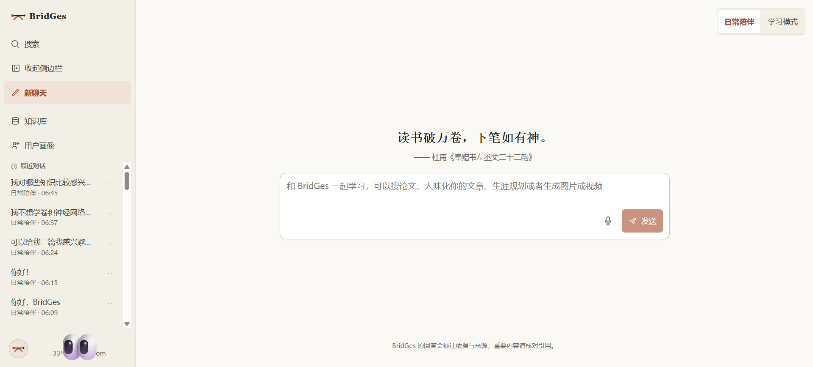

<div align="center">
  

  <h3>面向长期科学学习、科学表达与成长陪伴的聊天优先应用</h3>

  
</div>

## 产品特性

- **双模式陪伴**：日常陪伴 / 学习模式，首条消息提交前选择，提交后锁定
- **自然语言能力路由**：内置论文搜索、人味化写作、生涯规划、图片/视频生成等能力，无需安装插件
- **全局知识库**：唯一的上传与本地检索来源
- **自动用户画像**：学业情况、兴趣与阶段目标自动提取，支持修改与撤回
- **诚实联网**：证据不足时自动联网搜索；外网失败不伪造资料、引用或教学计划

产品合同与迁移顺序详见 [`ADR-0026`](docs/adr/0026-frozen-product-contracts-and-migration-gates.md)。

面向华东交通大学学生的 [V2 设计文档](docs/v2/README.md)及[桌面交互原型](apps/web/prototypes/v2-desktop/README.md)已获认可，生产功能仍按后续 tickets 实施；本页「产品特性」描述当前版本。

## 快速开始

需要 **Python 3.11+** 与 **Node.js 20+**。支持 Windows、Linux、macOS 桌面浏览器。

```bash
# 任选其一：Conda 或 .venv
conda env create -f environment.yml && conda activate agent
# 或
python -m venv .venv && source .venv/bin/activate  # Windows: .venv\Scripts\activate

pip install -e ".[dev]"
BridGes start
```

首次启动自动创建本机配置与数据目录，并隐藏询问一次 **Qwen API Key** 与 **Tavily API Key**（保存到操作系统凭据库，不写入仓库；缺 Tavily Key 不阻断启动）。无需创建 `.env`。

启动后访问：

- Web：<http://127.0.0.1:3000>
- API 就绪检查：<http://127.0.0.1:8000/health/ready>（`pass` 才可接受业务流量）

## Docker / Podman

```bash
BRIDGES_QWEN_API_KEY=sk-... docker compose -f infra/compose/docker-compose.yml up --build
# 或 podman-compose -f infra/compose/docker-compose.yml up --build
```

API、Web、后台执行器三个服务共享 `bridges-data` 卷，容器重建不丢数据。

## 常用命令

```bash
BridGes start      # 一键启动 Web + API + 后台执行器
BridGes api        # 仅 API
BridGes web        # 仅 Web（--dev 开发服务器）
BridGes worker     # 仅后台执行器
BridGes doctor     # 配置诊断
BridGes evaluate run  # A/B 评测套件（另有 replay / blind-review / report / gates）
```

显式 profile 用于 CI / 服务器部署（`BridGes start --profile production`），需预先通过 `BRIDGES_*` 环境变量或 `<NAME>_FILE` 文件引用提供密钥与数据库地址。配置细节见 [`infra/manual/README.md`](infra/manual/README.md)。

## 测试

```bash
pytest -q
mypy src
cd apps/web && npm run typecheck
```

## 数据与隐私

- 数据保存在本地数据目录（`bridges.db` + 加密对象库），密钥不进入配置文件、日志或 API 响应
- 账户设置 →「数据与隐私」支持导出、备份与删除
- 仅面向桌面浏览器，不承诺移动端适配

## 文档

- 架构决策：[`docs/adr/`](docs/adr/)
- 运维手册：[`infra/manual/README.md`](infra/manual/README.md)
- 安全报告：[`docs/security/issue39-security-report.md`](docs/security/issue39-security-report.md)
