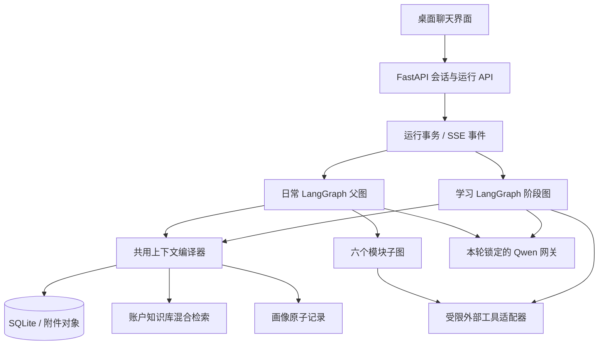

# V2 技术架构与数据合同

> 状态：桌面原型已获认可的实施设计。本文描述实施目标和迁移边界，不宣称仓库当前已具备这些能力。实施前在 conda `agent` 环境复核第三方接口、模型能力与校园路线。

## 1. 现状与目标接缝

现有 FastAPI 后端、Next.js 桌面前端、`bridges.db` 版本化 SQLite、账户隔离仓库、对象存储、SSE 运行事件、系统凭据库、知识库混合检索与模型调用记录可继续承担底座。现有 `chat/service.py`／`turn.py` 中的自然语言能力路由、固定模型矩阵、四类画像、聊天附件 410 写入端点及旧模块编排，与 V2 合同冲突，应在纵向切片内逐步替换。不得一次性删除历史消息解析字段和旧附件下载能力。

新入口分为日常图与学习图。API 层只接收、校验并持久化用户的显式模式与模块选择；工作流层处理状态与工具；模型网关提供一份锁定的本轮模型配置；上下文编译器只负责为某次模型调用选择材料。这些边界使同一日常对话切换模块时保留前文，又不会让某个子图暗中改变模块。



## 2. LangGraph 图与执行语义

### 2.1 日常父图

固定节点：`validate_turn → compile_context → select_explicit_module → invoke_subgraph_or_chat → verify_output → persist_result`。`select_explicit_module` 根据请求中的 `module_id` 映射，不允许 LLM 改写。允许值为 `paper`、`commute`、`resources`、`tieba`、`career`、`github`，或 `null`。六个子图的详细节点、澄清与证据门见[工作流](workflows.md)。普通对话只能建议模块，须用户明确点击才以原文进入模块图。

### 2.2 学习阶段图

阶段持久状态为 `awaiting_pages`、`recognizing`、`preview`、`tutoring`、`review`、`summary`。阶段转移由已验证事件触发：首轮合格照片、识别成功、预习问题已发、用户明示学完、逐题回答、全部题完成。`review → tutoring → review` 是合法暂停路径，`summary → tutoring` 支持同节追问。学习图不接收日常模块 ID。题库记录 `coverage_units`、`asked`、`answer`、`judgement`、`canonical_answer`，追加同节书页后只重排 `asked=false` 的题。

### 2.3 检查点、幂等与并发

LangGraph 检查点以 `(account_id, conversation_id, run_id)` 关联现有 SQLite 运行、消息和 SSE 事件。实现时优先为现有事务仓库提供持久化检查点适配器，避免图自身写入与消息事务互相失配；LangGraph 的 `thread_id` 固定映射会话 ID，不能让前端任意指定其他账户线程。每轮接收时生成或复用请求幂等键与 `run_id`，锁定模型、模块和附件顺序。节点副作用必须可安全重试：外部查询可再次执行，写消息／画像／题目判定不能重复。会话内同一时刻仅一个可写运行；用户停止时记录停止请求，并在下一可取消节点终止。

澄清问题和学习复盘各题是持久化等待状态，不用内存里的 Python 协程跨请求等待。恢复时读取权威检查点和实际用户回复。每次状态进展写入现有单调序号 SSE 事件流；断线从游标重放。进度词只映射已开始的真实节点，失败保留节点名与可重试原因，不显示模型思维链。

## 3. 一轮消息的数据合同

建议 API 输入的逻辑字段如下，正式请求模型按现有 API 命名惯例落地：

```json
{
  "conversation_id": "仅已有对话传入",
  "mode": "仅新对话首轮传 companion 或 study",
  "module_id": "日常模式某个模块 ID 或 null",
  "content": "用户原文",
  "attachment_ids": ["按书页顺序排列的会话附件 ID"],
  "idempotency_key": "客户端稳定请求键"
}
```

首轮事务同时创建对话并锁定 `mode`，后续请求不接收模式变更；服务端按持久化模式校验 `module_id`。`module_id` 随**该条用户消息**持久化，而不是只存当前会话的 UI chip；重开时历史每轮按原值呈现。附件先上传到隔离的临时草稿对象并校验类型、尺寸、账户和令牌，发送成功后原子绑定会话及消息；失败保留草稿供重试，过期草稿清理。学习模式首轮至少一个可处理的图片 ID；普通聊天附件可用于上下文但不自动进入知识库。附件顺序用消息到附件的 `ordinal` 存储。

执行状态要可重建：图名称／版本、当前节点、等待原因、已取证据引用、阶段、问题游标、模型运行锁、SSE 游标。外部工具原始响应只保存必要的脱敏摘要与来源定位；结果消息保存可展示证据。所有对象和查询按 `account_id` 限定；跨账户 ID 对客户端表现为不存在。

## 4. 会话上下文工程

原始消息是长期权威源，摘要是派生缓存。模块切换不清空前文；但每次调用不会把整段历史不加选择地塞入模型。编译步骤：

1. 从本轮锁定模型的已验证 `context_window` 与最大输入限制取上界，预留输出、工具调用、系统规则和图片成本；按调用类型计算动态输入预算。
2. 固定纳入产品安全／证据规则、会话模式与学习阶段、当前用户原文、当前选定模块和本轮附件。学习辅导优先纳入本节原始书页的相关页及 OCR 位置。
3. 纳入最近消息的原文，再用带消息 ID 和范围的摘要覆盖较早片段。若本轮语义涉及更早的实体或约定，按账户／会话检索原始消息补回原文，而不是只依赖摘要。
4. 依据任务检索最少的知识库片段与逐条画像；对当前问题无关的画像、KB 材料不注入。外部工具输出仅在实际成功且经过核对后进入证据块，并带来源及取得时间。
5. 统计实际 token 与图片预算；超限时先删低相关检索材料，再缩较旧原文，最后重做摘要。不得删当前请求和工具证据来维持一个看似完整但无法核实的回答。无法找到旧话原文时明确表示不确定。

模型切换会改变上下文预算；每轮重新编译，旧摘要可重建。每个消息记录实际模型 ID、预算版本、用到的摘要版本与原文消息 ID，以便审计“依据哪段前文”。私人资料不能整体发送到 Tavily、高德、arXiv 或公开搜索服务；这些服务只取得最小必要查询参数。上下文与证据在本地组合后发给 Qwen。

## 5. 附件、OCR 与知识库

账户知识库与会话附件是两个数据域。前者由侧栏主动上传并索引，后者绑定消息、仅在所属会话可引用。保留知识库已有上传、对象存储、索引状态、关键词＋向量召回、删除与导出底座；检索门从“包含科学词”改为按模式、任务及用户请求判断。知识库引用须保留文档／页码／片段 ID。向量模型与索引版本单独固定，不随主模型手填 ID 改变；换 embedding 需重建索引而非直接复用。

学习 OCR 对每页提取段落、公式、图表描述与位置，保留图片 ID、页序、片段坐标、识别置信与模型版本。关键公式或定义低置信时先要求指向性的补拍；用户提供文字补录时标为用户补充，不能冒充照片识别结果。普通图片也不能套用当前“科学图片”提示词。文件允许类型与最大体积需基于现有 10 MB 上限、OCR 成本和代表材料压测后确定；实施前不能写死更高承诺。对象路径、缓存与 OCR 结果都继承账户和会话删除语义。

## 6. 用户画像

画像改为原子记录：`profile_item_id`、`account_id`、`text`、`source_message_ids`、`status`、`updated_at`、`user_edited_at`。页面不存固定类别。每轮回答完成后，提取器可从用户原文提出 0～若干候选，只写明确、相对稳定且可复用的信息；去重、冲突和敏感推断门先于写库。普通异步提取从下一轮生效；“记住／忘掉”在本轮提交前同步处理。编辑是用户权威版本，自动提取不得覆盖。删除生成墓碑或抑制键，旧消息重放不会自动复活；用户再次明确要求记住时才可新建。画像检索按当前任务少量注入，普通“会话记忆”仍以消息原文为准。

## 7. 模型与密钥

终端首启继续采集 Qwen 与 Tavily Key，并存现有系统凭据库。设置页更换时输入框始终为空，只读状态来自后端布尔值和末次验证时间；API 从不返回旧明文。更换 Qwen／Tavily／高德凭据要先以候选密钥执行最小只读探测，成功后原子切换引用；失败保留旧凭据。高德路线 Web Service Key 和浏览器地图 JavaScript Key／安全密钥是不同用途的字段。浏览器安全密钥若需动态地图，应按高德官方代理方案由后端保护，不能直接内嵌到静态 JS。

主模型只有手填 ID。提交时：精确查询百炼模型元数据；核对文本、图片、工具调用、结构化输出、上下文窗口和实际输入额度；再用候选模型与现有／候选 Qwen Key 做最小真实能力探测。元数据缺失或探测不通过都不能保存。模型配置和元数据版本在一次事务中激活；活跃运行保留旧模型锁，新消息取新配置。若实际服务提供的能力清单与探测冲突，按失败处理并给出具体原因。对旧会话同样从下一轮生效，历史消息保持原模型标识。

当前 `fixed_models.py` 同时承担多种能力，迁移时先把主对话／视觉／OCR 的引用改成可验证的运行配置，再移除已退役的语音、图片和视频能力。Embedding 保持独立固定并管理索引兼容。不能仅替换一个常量而留隐藏调用走旧模型。

## 8. 外部工具边界

所有外部适配器都提供 `query`、`evidence`、`retrieved_at`、`error` 的统一记录，但各来源的含义不被抹平。论文使用 arXiv 学术标识，通勤使用高德路线与地点，Bilibili／贴吧／岗位用公开直达链接，GitHub 用仓库元数据和明确取得的文件。模型生成只能基于实际返回的证据作断言。超时、限流、反爬或登录墙只造成局部不可用，不能从模型记忆填空。

关键供应商实施参考：[LangGraph 持久化](https://docs.langchain.com/oss/python/langgraph/persistence)、[子图](https://docs.langchain.com/oss/python/langgraph/use-subgraphs)、[百炼模型列表查询](https://help.aliyun.com/zh/model-studio/list-models)、[高德路线规划 2.0](https://lbs.amap.com/api/webservice/guide/api/newroute)、[高德 JavaScript 安全方案](https://lbs.amap.com/api/javascript-api-v2/guide/abc/jscode)。

## 9. 迁移和可回滚边界

数据库只能追加版本化迁移；不原位改写旧消息和附件。新旧渲染通过消息 schema 版本区分，旧模式事件和旧功能结果保持只读。新图按纵向切片放量，每个切片先有契约测试和端到端验收，再替换对应 UI 入口。旧功能写入和重试先关入口与 API，再做依赖删除，避免旧链接误触发生成。新正式 ADR 在原型获批后记录与旧 ADR-0026 的替代关系；回滚仅回到可读旧数据与前一稳定写路径，不承诺回滚数据库 schema 或丢弃新数据。
