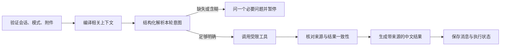
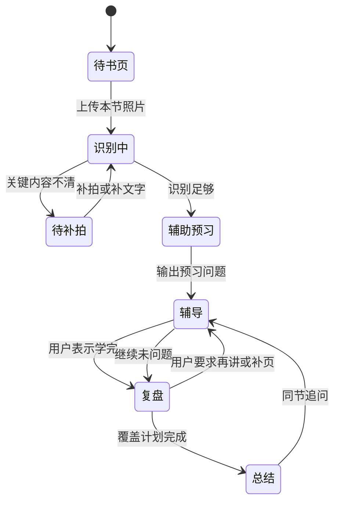

# V2 智能体工作流规格

> 目标是让用户选择的模块稳定完成任务。模型负责理解与解释，模块路由、权限、工具调用边界、证据校验和停止条件由代码控制。任何节点失败都不得用模型记忆伪装成已执行的工具结果。

## 1. 共用运行合同

日常陪伴每条消息的 `module_id` 是明确的界面选择；服务端验证其属于六个允许值，不能由模型从正文擅自改写。无模块时进入普通对话；可给出一键模块建议。学习模式完全走学习图，拒绝日常模块 ID。

所有模块采用以下公共步骤，模块内部再细化：

`解析结果` 要记录原文短语、规范化值、扩展同义词、置信度和用于检索的最终 query。词义不明且上下文不能消歧时先问用户，不能偷偷替换原词。调用外部服务时只发送完成任务所需的查询词；用户私有材料留在本地，工具返回后再与私有上下文组合。外部调用设定超时、有限重试、限流冷却和取消；每次任务有稳定运行 ID，重试不重复写用户消息或附件。

结果核验包括链接可定位、来源类型、时间、标题／主体是否匹配、原始检索词是否仍被覆盖、数据是否确实可读。用户看到使用的查询词并可在后续消息纠正。工具不可用时返回明确的缺口和可重试状态；聊天继续可用。

## 2. 论文搜索

**输入**：研究主题或具体名词、可选的学习阶段、时间偏好与论文类型。

| 节点 | 责任与输出 |
| --- | --- |
| `paper.parse` | 提取实体、学科语境、原始词组及限制。例如「Transformer」原样保留，识别它可能指机器学习结构或电力变压器；无语境时询问。 |
| `paper.plan` | 生成精确词优先的 arXiv 查询；译名／同义词只作为扩展，不能替掉原词。按「最新／经典／入门」意图设置排序。 |
| `paper.search` | 调用 arXiv API 获取论文标识、标题、作者、摘要、年份、类别与链接；去重与分页有上限。 |
| `paper.enrich` | 可取 Semantic Scholar 等公开学术元数据核对引用、发表信息；引用量只作辅助，不能直接等同论文质量。 |
| `paper.rank` | 检查主题匹配、摘要与学习难度；默认选 3–5 篇，适度搭配综述／教程、奠基与较新研究。记录每篇选择理由。 |
| `paper.present` | 展示实际查询词、可点开来源、入门阅读顺序、摘要级概述；未取得全文时明确未通读全文。 |

arXiv 对某些学科覆盖不足时，有限尝试 Crossref／OpenAlex 等学术元数据来源，标注不同来源和全文可得性。若搜索结果与用户原名词不匹配，停止推荐并请用户澄清，不凑满篇数。验收例：输入「Transformer 的注意力机制入门」命中机器学习，输入孤立「Transformer」时先消歧。

## 3. 校园通勤

**输入**：起点、终点、出行方式三项，方式仅步行、自行车、电动车。地点范围是华东交通大学校内以及校门与校内地点之间，不规划校外路线。

| 节点 | 责任与输出 |
| --- | --- |
| `route.parse` | 从用户消息和相关前文结构化提取三项，保留原话；缺哪项就只问哪项。对「从我这里」等无法定位的起点追问。 |
| `route.resolve` | 在校内地点别名表与高德 POI 中解析地点；候选重复时让用户选择，找不到时请用户补建筑名／入口，不自造坐标。 |
| `route.request` | 按出行方式调用高德对应路线能力，保存原始距离、基础耗时、路径点和步骤。某方式无可用路线时如实报错，不拿其他方式耗时冒充。 |
| `route.buffer` | 用 `Asia/Shanghai` 当前时间判断距 07:50、09:30、10:00、12:00、14:20、16:00、16:30、18:10 是否在前后 10 分钟内；命中则提示「可能人多」，建议时间在高德耗时之外增加 5 分钟。此规则不是实时人流数据。 |
| `route.present` | 给起终点、方式、距离、基础时间、缓冲、建议总时间、文字路段和可缩放地图；地图卡适合桌面截图。 |

高德校园内道路与建筑入口可用性须在实施期用代表性地点逐一实测。若地图底图未覆盖可通行路径，结果必须标注局限，并给可核验的最近可定位点；不能画出臆测路线。验收例：同起终点的三种方式分别取对应耗时；缺方式只追问方式；高峰 ±10 分钟边界前后计算一致。

## 4. 学习资料推荐

**输入**：本轮消息明确提到想学习的方向；可选基础、目的、时间预算。画像和对话只用于补足可信的学习阶段，不能反向把用户要学的主题改成旧兴趣。

`resources.parse` 提取专业名词及学习目的。若用户说「想学 Python 数据分析」但没有基础说明，先参考可靠上下文；仍缺影响推荐的层次时问一个问题。`resources.search_books` 从出版社、图书馆书目、ISBN／出版信息等可定位页面找书。`resources.search_videos` 用 Tavily 发现公开的哔哩哔哩视频直达页，再核对可取得的标题、作者、时间、简介。`resources.rank` 按主题、先修要求、版本时效、口碑证据和互补性排序，默认 2 本书与 3 条视频，形成由浅入深的学习路径。`resources.present` 逐项写推荐理由、适合阶段、可核验链接；未观看或无法读取完整视频内容时不描述具体讲授质量。

验收例：用户说「我想学 Transformer」时，检索主题保持 Transformer；用户说「强化 Python 基础，准备课程考试」时给与备考目标相符的资料。书或视频不足时实际返回可核验的数量并说明，不虚构补足 2+3。

## 5. 华东交通大学吧信息搜集

`tieba.parse` 将用户问题拆成原始名词、事件／地点与时间要求。`tieba.search` 使用允许的搜索服务发现公开帖子，按贴吧名称、标题、链接和正文证据确认确属「华东交通大学吧」。`tieba.read` 只读取实际可访问的公开主帖和回复，记录读取成功的回复范围、时间与楼层；无法取得回复时仅保留帖子标题与链接。`tieba.summarize` 分开呈现可核验的个人经历、不同看法与不确定点。涉及校规、费用、开放时间或办事流程时，`tieba.verify_official` 再核对学校官方页面，并把官方规定与吧友经历分开写。

不承诺完整抓取某帖全部回复，也不绕过登录或访问限制。没有真实回复文本就不能编写「吧友普遍认为」。验收例：只有搜索结果摘要时输出帖子链接并明确未获取回复；来自其他贴吧的同名帖子被过滤。

## 6. 职业规划

**输入**：目标岗位／职业方向、毕业阶段、期望城市和其他用户提出的约束。岗位名是检索锚点；相邻岗位只能单列建议。

| 节点 | 责任与输出 |
| --- | --- |
| `career.parse` | 提取原始岗位词、真实同义名、阶段、地点与限制；例如「算法工程师」不能自动换成「数据分析师」。若岗位意图含糊先追问。 |
| `career.plan` | 生成并展示实际查询词与筛选条件，分别搜索公开 BOSS 岗位链接、企业招聘页和校招页。 |
| `career.collect` | 只读取可公开访问的职位卡与详情；保存原链接、抓取时间、发布日期、岗位名、城市、薪资原文、能力要求。不可访问字段留空。 |
| `career.filter` | 去重、去过期或不相干职位、核对经验要求；仅精确目标岗位及真正同义名进入主样本。 |
| `career.analyze` | 从实际样本归纳能力关键词、岗位分布和薪资区间，展示样本量、日期、城市构成与计薪单位。薪资格式不可比较时不混算。 |
| `career.advise` | 将岗位要求与用户已明确的背景联系起来，给可执行的学习或项目建议，标出推断与证据限制。 |

任何「全国平均薪资」之类总体结论必须有独立代表性报告支持；公开职位样本仅代表该轮检索所得。无法检索到相关岗位时说明查询词并请用户校正，不改搜其他岗位来凑结果。验收例：目标是「Java 后端实习」时，不把前端／测试岗位纳入薪资样本；城市条件被逐条核对。

## 7. GitHub 优质项目推荐

`github.parse` 抽取 idea 的核心用户场景、必要功能和可选技术词，保留原意。`github.search` 先查整体功能相近的公开仓库；整体项目不足时查关键组件并记录它覆盖 idea 的哪一部分。`github.inspect` 取 API 元数据、README、许可、活跃度；需要断言实现细节时再读取相关目录或关键文件。`github.rank` 以功能匹配优先，随后看文档可读性、运行可行性、维护与许可；stars 只是辅助。`github.present` 默认 2–3 个仓库，给链接、内容介绍、可借鉴设计、优点与局限，明确整体项目还是组件。

公开 API 限流时使用有限缓存与退避，达到额度则提示稍后重试。README 只说明项目自称的能力；未查实现文件时不能断言内部架构。未见许可文件时不得称可自由复用代码。验收例：「校园二手书交换平台」优先返回相关完整应用；推荐登录组件时明确只覆盖认证，不把组件说成完整平台。

## 8. 学习模式状态图

学习图的持久状态包含 `section_id`、有序页 ID 与识别片段、知识点覆盖矩阵、预习问题、当前阶段、辅导问答引用、复盘题计划、已问／未问题 ID、每题判定和总结依据。原始照片存于对话附件库，图状态只存引用。用户重新打开对话后从已保存阶段恢复。

`study.recognize` 先检查页序、清晰度与内容归属，OCR 与视觉模型双路径解析文字、公式、图表；不可信的关键符号请用户补充。`study.map` 将每个知识点绑定页码与原文片段，并标核心概念、关系、应用与易错处。`study.preview` 根据密度生成数个能引导阅读的问题，不要求当场回答。`study.tutor` 从页级证据回答；知识库 RAG、Tavily 和模型知识仅作明确标注的补充。`study.plan_review` 先建立覆盖矩阵，保证本节主要概念被问到，数量随知识密度浮动；问题只能考当前上传材料。`study.grade` 对用户答案按关键点判断正确／不完整／错误，立即给答案与简短解释；不重试原题。`study.summarize` 以实际题目和作答为证据，说明已学内容与漏洞。

追加同节照片触发重新识别和知识点合并；已问过的题及原判定不可修改，未问题可重新规划。若用户从复盘回辅导而没有新照片，则继续未问题计划；若有新照片，先重建未问题以覆盖新增范围。错误、超时或模型输出不符合题目／判定结构时停在原阶段，保留状态并允许重试，不推进题号。

## 9. 来源与实施期复核

- [arXiv API 文档](https://github.com/arXiv/arxiv-docs/blob/develop/source/help/api/user-manual.md)、[类别体系](https://arxiv.org/category_taxonomy)、[Semantic Scholar API](https://api.semanticscholar.org/api-docs)、[Crossref REST API](https://www.crossref.org/documentation/retrieve-metadata/rest-api/)：论文数据、分类与跨学科补充。
- [高德路径规划 2.0](https://lbs.amap.com/api/webservice/guide/api/newroute)：步行、自行车和电动车路线能力；校园内部覆盖实施时实测。
- [哔哩哔哩开放平台](https://open.bilibili.com/sys)、[哔哩哔哩用户协议](https://www.bilibili.com/blackboard/protocal/licence.html)：不能把未验证的公开搜索结果写成已经观看的视频内容。
- [百度贴吧开放 API 历史页](https://tieba.baidu.com/tb/zt/tiebaapi/index.html)：公开接口存在准入与能力边界，回复读取按实际可得性处理。
- [GitHub REST API 速率限制](https://docs.github.com/en/rest/using-the-rest-api/rate-limits-for-the-rest-api)、[仓库内容 API](https://docs.github.com/en/rest/repos/contents)：公开仓库的元数据、README 和文件核验。
- BOSS 等招聘站点的公开页面与访问规则在实施时重新核对；本方案使用公开可访问岗位链接，并以企业招聘和校招页补充。
