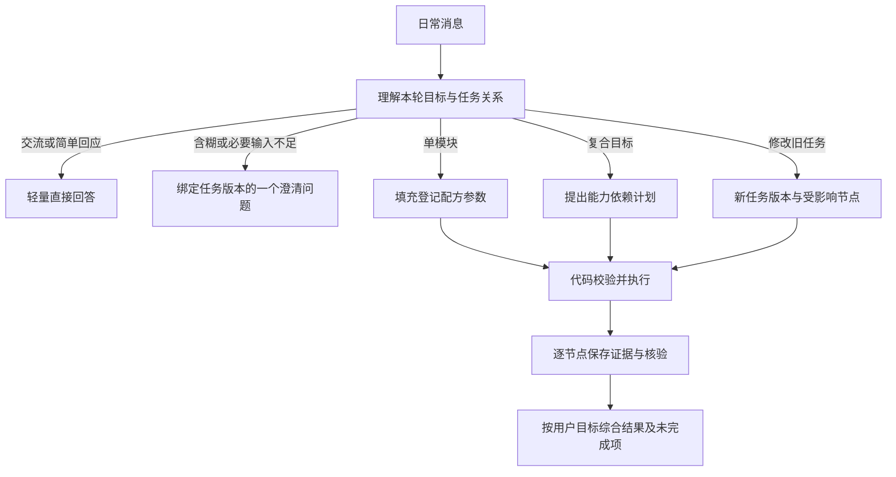

# 日常陪伴与六个模块工作流

状态：已确认定稿。依赖 [公共编排合同](orchestration.md)。D01、D03、D04、D10—D16 及本文件的具体节点和质量门已确认，实施效果按验收方案验证。

## 1. 日常入口与跨轮延续

日常陪伴以自然交流为默认路径。明确的论文、通勤、资料、贴吧、求职或项目需求可自动启动；模块菜单保留为输入提示。用户正文明确时优先按正文路由，明确禁止的来源、方式和范围始终是硬条件。

多轮任务不靠各模块回扫消息寻找等待状态。「换成杭州」「第二篇有没有代码」等先定位已有任务/产物，再修改条件或组合能力。找不到唯一对应对象时追问。换话题后旧任务暂停，旧澄清不自动吃掉新的消息。

日常任务的通用输入包含用户原话、任务目标、明确条件、允许来源、与本轮相关的已确认背景和产物引用。职业背景、学习基础等只有在影响本次建议且允许使用时纳入。缺少可选背景时先做有依据的部分，不为填写表单阻断全部工作。

## 2. 专业调用与共同质量要求

| 能力 | 模型的主要职责 | 确定性服务的主要职责 |
| --- | --- | --- |
| 论文 | 研究意图、语义相关性、证据约束的概述与比较 | 学术检索、标识去重、年份/来源校验、引用定位 |
| 通勤 | 理解起终点与方式、解释歧义、组织简短说明 | POI 候选、路线请求、时间和缓冲计算、地图投影 |
| 资料 | 学习目标、内容/先修匹配、路径组织 | 书目与视频发现、元数据核对、版本和重复处理 |
| 贴吧 | 问题分类、经历归纳、冲突识别 | 目标贴吧确认、公开读取、日期与范围记录 |
| 职业 | 岗位语义与个人差距、行动优先级 | 样本获取、硬条件、去重、薪资单位与统计 |
| GitHub | 场景/功能匹配、重点文件选择、借鉴说明 | API 与文件读取、版本/许可/维护元数据、限流 |

确定性结果能够直接呈现时不增加总结模型。需要专业判断时输出结构化证据与结论，不由模块直接写助手终态。

各模块共同检查：目标没有被替换；硬条件满足；实际查询可追溯；来源可定位；读取范围与断言强度一致；不把未知写成确定结论。质量问题使用登记分支和一次有界补证，必要条件不足则阻塞相关结论。

## 3. 论文搜索

### 目标与输入

先识别研究主题、问题或具体论文，并区分找候选、解释选定论文、比较方法等用户已表达的目标。主题/实体是必要输入；领域歧义影响检索时先消歧。学习基础、年份和论文类型来自原话或允许使用的可靠上下文，不能用旧兴趣改写主题。

### 节点

| 节点 | 输出与执行责任 |
| --- | --- |
| `paper.parse` | 主题、领域、研究问题、原话锚点、硬条件、阅读目的及缺口 |
| `paper.plan` | 精确查询与受约束扩展、登记来源、筛选要求、读取预算 |
| `paper.search` | 实际候选及学术标识、查询记录、时间和来源；去重 |
| `paper.screen` | 将摘要/标题证据对应研究问题；代码过滤年份等条件，专业角色判断语义相关性 |
| `paper.read` | 对重点候选按目标读取摘要或相关全文段落，记录真正取得的范围 |
| `paper.enrich` | 必要时补发表、版本或引用信息；通常为可选分支 |
| `paper.evaluate` | 依据相关性、阅读目的和证据完整度组织选择与顺序；生成受支持的解释 |
| `paper.verify` | 核对主题、方法断言、引用和未读部分，必要时独立复核 |

arXiv、Crossref、OpenAlex 等仅在相应适配器已经登记且可用时使用。跨学科补充仍受任务范围约束；新全文读取能力未接入时只交付摘要级结果，不宣称精读已支持。

### 分支与交付

普通查找默认保留 3—5 篇的推荐习惯，实际不足则如实说明。候选空或相关性不足时，依据具体缺口修改同义术语、研究问题表述或已登记来源一次；不静默放宽年份、领域或指定论文条件。

摘要能支持的是摘要级概述与初步阅读理由。比较方法、实验细节、局限或复现建议必须有对应正文依据；全文不可得时交付可支持的部分及缺口。引用量是辅助信息，不直接等同质量、难度或奠基地位。

输出论文标识/链接、选择依据、阅读范围、顺序和未确认项。只有题目或搜索线索的候选单列，不伪装成已读推荐。选定论文产物供 GitHub 等节点引用，不靠下一模块从自然语言摘要猜论文身份。

## 4. 校园通勤

### 范围与角色

保留华东交通大学校内及校门与校内地点之间的范围，方式仅步行、自行车、电动车。该流程不需要另设自主路线智能体；主智能体负责输入理解与歧义，实际定位和计算由代码控制。

### 节点

| 节点 | 输出与执行责任 |
| --- | --- |
| `route.parse` | 起点、终点、方式及各自原话来源，缺项保留已知条件 |
| `route.resolve` | 校内地点别名和真实 POI 候选；歧义形成等待，确认后保存地点标识 |
| `route.validate` | 检查校内范围、可用方式和必要地点；不自造坐标 |
| `route.request` | 调用登记且已实测支持该方式的路线适配器，保存距离、基础耗时、路径点和步骤 |
| `route.buffer` | 使用本次求解的 `Asia/Shanghai` 时间快照计算约定高峰缓冲 |
| `route.verify` | 核对方式、单位、路段来源、总耗时及地图与文字一致性 |
| `route.present` | 确定性结果投影，可由主回答加简短解释 |

缺必要字段时只追问当前最关键的一项；「从我这里」未提供位置时询问起点。用户明确输入的条件不重复询问。地点已确认后，方式改变只使路线和时间产物失效；地点版本不变时复用定位。

### 质量门与失败

保留现有时间规则：距 07:50、09:30、10:00、12:00、14:20、16:00、16:30、18:10 前后 10 分钟命中时，在基础时间外增加 5 分钟，标明这是约定缓冲而非实时人流数据。

某方式没有路线时说明该方式不可用，不拿其他方式耗时替代。地图覆盖不足时可给最近真实可定位点和局限，不生成臆测路径。只有 POI 成功而路线失败时，不能交付确定的行程耗时。

输出起终点、方式、距离、基础耗时、缓冲、建议总时间、实际文字路段和地图。必要门是地点/范围/方式/真实路线与计算一致性，地图展示可按现有可得性降级为文字。

## 5. 学习资料推荐

### 输入与目标

主题和学习目的优先；基础、时间、语言和媒介偏好作为与本次选择相关的条件。只有缺失会改变推荐方向时才追问；低影响缺口可以用明确标注的有限假设处理。资料结果不自动创建教学计划或切换会话模式。

### 节点

| 节点 | 输出与执行责任 |
| --- | --- |
| `resources.parse` | 主题、目标、基础证据、时间/语言/媒介条件及缺口 |
| `resources.plan` | 所需内容与先修要求、主线/补充角色、来源和预算 |
| `resources.search_books`、`resources.search_videos` | 两路独立检索，共用预算，可并行；记录各自失败和结果 |
| `resources.read` | 核对书目、版本、可访问目录/简介、视频页面及实际取得的内容 |
| `resources.match` | 用证据评价内容覆盖和先修要求，未知保持未知 |
| `resources.organize` | 去除冗余，安排主线和补充用途，组织精简顺序 |
| `resources.verify` | 核对路径与目标、硬条件、链接及内容断言 |

### 选择与降级

书名“入门”、视频长短和点赞只作为弱信号。适用基础、知识覆盖和教学质量的断言应有目录、介绍或实际读取内容支持；未读取视频内容时不能描述具体讲授风格或效果。

数量及书/视频比例按目标变化，不再默认凑 2+3。用户指定数量或媒介时遵守，证据不足则给真实数量。书或视频一路失败，另一路仍能满足部分目标时照常交付，列出缺口；主线所需先修/内容无法确认时标为候选，不能称完整路径已核实。

输出主线材料、补充材料、用途、顺序、适用基础的依据、可核验链接与读取范围。实践项目仅在用户目标需要时组合 GitHub；不默认给所有推荐追加项目搜索。

## 6. 华东交通大学吧信息搜集

### 问题驱动取证

`tieba.parse` 识别事件、地点、日期/时效要求及问题类型。规定类先核对任务相关官方规定；体验类以目标贴吧实际帖子和回复为主；混合类两路取证，再综合。两路无前置依赖时可在预算内并行。

| 节点 | 输出与执行责任 |
| --- | --- |
| `tieba.parse` | 原始问题、对象、时间要求及规定/体验/混合分类 |
| `tieba.plan` | 要核实的事项、来源优先级、查询与读取范围 |
| `tieba.search` | 发现公开帖子，确认属于目标贴吧 |
| `tieba.read` | 实际读取主帖/回复，记录时间、楼层及缺失范围 |
| `tieba.verify_official` | 对规定和流程取得适用主体、校区、日期及版本依据 |
| `tieba.synthesize` | 分别组织规定、个人经历、不同看法和冲突 |
| `tieba.verify` | 检查来源归属、实际读取范围、时效与总体措辞 |

### 来源冲突与交付

学校网页必须与问题的主体、校区、用途和有效期对应，不能只因为域名像官方就认定适用。官方材料描述规定，帖子描述个人经历；后者不能自动推翻规定，前者也不能证明所有实际体验一致。

冲突先检查时间与适用范围；有明确替代关系才采用新规定。仍无法确定时分别引用、保留冲突，不强行平均或多数表决。用户明确限制只查贴吧时遵守，规定真实性因缺官方证据而保持未核实。

没有真实回复文本时只给帖子线索与链接，标明未读取回复。不称“吧友普遍认为”，不承诺完整楼层抓取，不绕过登录或访问限制。输出查询范围、规定、经历、冲突、时间和阅读限制。

## 7. 职业规划

### 两条目的分支

只查岗位：解析目标、检索、过滤、样本分析后交付。个人准备：在此基础上取得最小相关背景，建立差距依据与行动优先级。背景不足不阻断公开岗位分析，也不把未知能力判为不足。

| 节点 | 输出与执行责任 |
| --- | --- |
| `career.parse` | 原始岗位词、职责意图、阶段、城市与硬条件；区分情报/个人规划 |
| `career.plan` | 已登记公开招聘来源、实际查询、样本要求与预算 |
| `career.collect` | 实际可访问的岗位详情、公司、城市、日期、薪资原文、能力要求 |
| `career.filter` | 去重、过期/城市/岗位约束核对；岗位职责不确定者单列 |
| `career.analyze` | 样本范围内的能力分布及可比较薪资统计，保留缺失字段 |
| `career.background` | 仅个人规划需要；读取允许的明确陈述、原子画像或简历切片 |
| `career.gap` | 将岗位要求与背景证据逐项对照：已有依据、明确待提升、待确认 |
| `career.advise` | 在用户目标和时间约束下给优先行动，标明推断和依据 |
| `career.verify` | 检查样本口径、个人判断与建议的支持关系，按风险复核 |

### 必要门与组合

岗位目标不自动换成相邻岗位。真正同类职责可以用语义证据说明，前端、测试等相邻角色不能并入后端样本。城市和经验条件逐条核对，无法确认者不进入相应统计。

薪资保留原文、币种、时间单位和月数；不可比较的计薪格式不混算。检索样本不代表全国市场，不承诺就业或薪资结果。只有链接而无详情时返回来源线索，不生成虚构样本分析。

个人差距必须由用户明确背景与岗位证据共同支持。行动建议区分直接证据与推断；不知道用户是否掌握某技能时提出待确认项。用户只要岗位清单时不强制画像/简历流程。

用户目标包含学习资料或实践项目时，可将需求产物传给资料/GitHub 节点；无需把简历原文发给公网搜索。输出岗位样本与范围、能力要求、已知背景、差距/待确认项及优先行动。

## 8. GitHub 优质项目推荐

### 输入与证据矩阵

`github.parse` 提取核心场景、必要功能、可选功能、技术/许可/运行条件及整体或组件目标；可以直接接收选定论文或岗位需求的类型化产物。目的不明时追问，必要功能不能被大量可选项命中抵消。

| 节点 | 输出与执行责任 |
| --- | --- |
| `github.parse` | 原始 idea 或来源产物、必要/可选需求与硬条件 |
| `github.plan` | 整体优先或组件策略、登记查询、重点核查要求 |
| `github.search` | 仓库候选、API 元数据、来源记录 |
| `github.read` | README/目录，按结论需要读取相关入口和实现文件；记录提交版本或取得时间 |
| `github.match` | 每项需求映射证据：文档自述、静态实现依据、未确认或未支持 |
| `github.evaluate` | 按必要功能、场景、文档、维护、许可和运行条件排序 |
| `github.verify` | 核对覆盖分类、实现/运行断言、来源定位和缺口 |

### 分类与读取深度

整体候选要逐项说明必要功能的依据和缺口。用户需要实际实现证据时，README 自述不满足该项门；必要功能未确认者不能因星数或可选功能多而认定整体适配。

组件候选明确只覆盖哪些功能和还需集成什么。优先提供符合整体目标的候选，缺少时交付有用组件和缺口，不把组件说成完整平台。

静态读取实现文件只支持静态实现判断，不等于程序已经运行验证。没有实际运行证据时不称“已经验证能跑”。读取许可文件后说明复用条件；未取得许可时保留未知，不称可自由复用。stars 与活跃度是辅助信息。

普通推荐保留默认 2—3 个，少于目标时如实交付。限流时保留已完成的检查，未读候选标为未完成；上游有恢复时刻才按用户时区显示。输出覆盖矩阵、证据层次、链接、借鉴点、局限及运行/许可未确认项。

## 9. 跨模块组合示例

| 用户目标 | 合法计划 | 关键约束 |
| --- | --- | --- |
| 注意力机制入门论文和学习资料 | 共同任务理解后，论文与资料独立检索，统一组织阅读顺序 | 两路共享主题与基础；单路失败不伪造结果 |
| 找第二篇论文对应实现 | 定位论文产物，提取可核实标识，再查 GitHub | 没确定论文身份不能宣称实现对应 |
| 准备 Java 后端实习，给学习资料和练手项目 | 岗位样本/最小背景 → 需求与差距 → 资料/GitHub → 综合建议 | 不发简历原文到公网，不把未知技能作为缺点 |
| 换杭州，资料暂时不改 | 新城市版本重查岗位分析；保留仍适用的公共材料，检查建议依赖 | 旧城市薪资/岗位不能直接复用 |

组合需要服务于原始目标，不因某模块“可以调用”就追加。最终回答围绕一个用户目标组织，说明所用模块与未完成项，避免拼接六段独立长回答。所有模块产物继续可按需展开查看具体来源。
