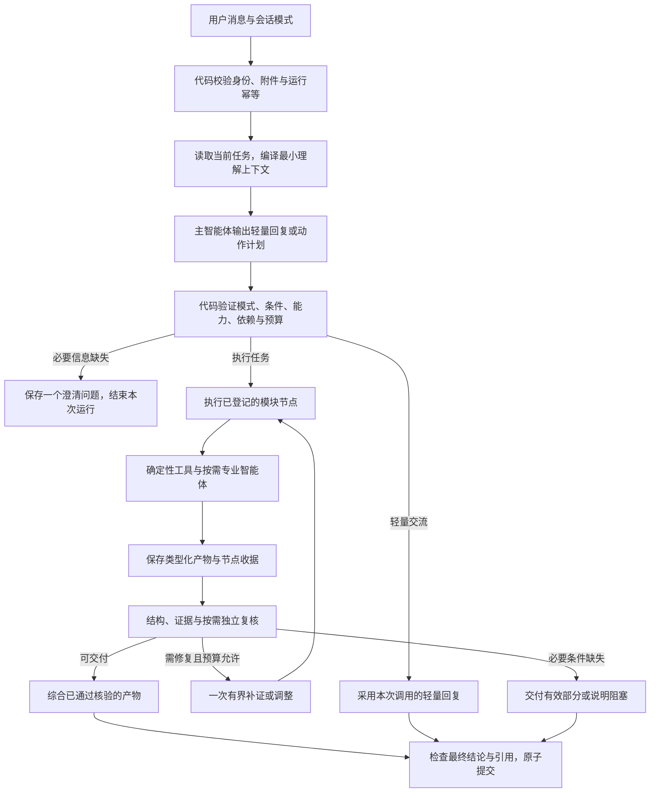

# 公共编排与状态合同

状态：已确认定稿。产品选择来自 [D01—D17](discussion.md)，本文件的状态、字段和预算初值方案已随完整方案确认；初值仍需实施校准。

## 1. 执行结构与职责

| 角色/组件 | 拥有的职责 | 边界 |
| --- | --- | --- |
| 主智能体 | 理解意图、识别任务关系、提出有限计划、组织最终解释 | 不授予权限、不直接改业务状态、不自由发起未登记工具 |
| 专业智能体 | 在必要步骤做相关性分析、需求覆盖、个人差距分析、教学出题和判定 | 输入限于当前子任务；输出带证据的结构化产物；不互相自主委派 |
| 独立核验角色 | 在触发条件下复核关键结论、冲突或教学判定 | 基于同一可核验证据独立调用；不把生成者自评当作复核结论 |
| 执行内核 | 校验计划、调度节点、控制预算、重试和停止、持久化事件及终态 | 只有它能接受模型建议并改变执行状态 |
| 领域服务 | 拥有跨轮任务、书页、复盘题目和判定等写模型 | 通过版本检查提交；节点和模型不直接互相改表 |
| 工具适配器 | 搜索、读取、定位、路线请求和确定性计算 | 接收最小必要参数，返回真实响应、来源和失败类型 |

这些是逻辑职责，不要求每个角色成为独立进程或微服务。复用现有 Python 模块化单体、LangGraph、SQLite、队列、模型网关、SSE 和终态服务。专业角色可以是具有不同输入合同的模型调用。

## 2. 模式策略与轻量路径

日常策略允许当前六个模块及其必要检索/读取/核验节点，支持有限动态组合。学习策略读取权威教学状态，只接受当前教材小节与阶段内的动作；可以复用通用检索、读取和证据节点，但不自动启动无关日常模块任务。

模式在服务端读取并校验，主智能体不能修改。普通聊天不创建教学状态；学习会话的问候、阶段询问等可以简短回应而保持阶段不变。

问候、普通陪伴等轻量任务直接使用一次主生成调用和最小上下文，不创建长期复杂任务，不经过额外规划模型或统一模型裁判。已识别的单模块任务使用登记配方，理解调用只填参数与任务关系；复合任务才需要提出跨模块依赖。路由与参数理解尽量合为同一次结构化调用。

需要结构化理解时，该调用也可直接返回轻量回复；采用它即可，不为同一句交流再调用一个生成智能体。已知轻量路径可以沿用现有文本流式生成。

## 3. 会话、跨轮任务、单次运行

`Task` 指内部跨轮任务，不是退役的任务安排、提醒或项目工作台。

| 对象 | 逻辑内容 | 权威归属 |
| --- | --- | --- |
| 会话 | 账户、固定模式、原始消息、当前任务指针 | 现有会话仓库 |
| 跨轮任务 | 目标、明确条件、来源范围、相关背景引用、状态、待回答问题、当前版本 | 任务领域仓库 |
| 任务版本 | 本次确定的目标和条件、原话来源、上下文快照引用 | 不可变；修改条件生成新版本 |
| 计划版本 | 登记节点、参数、依赖、必要/可选属性、质量门与预算 | 经代码验证后冻结，绑定任务版本 |
| 单次运行 | 本条消息触发的执行、版本锁、截止时间、节点尝试、事件和输出 | 复用现有 generation run 底座 |
| 节点产物 | 内容、证据、输入依赖、质量裁决、实际能力/模型版本 | 产物仓库；新版本不覆盖旧版本 |

初期同一会话只保留一个前台可写运行；多个模块在该运行内部并行。等待澄清或暂停任务不占用工作线程或租约。任务可以跨轮延续，普通聊天历史仍完整保留。

### 任务关系与等待

每轮理解输出 `new`、`continue`、`revise`、`pause` 或 `cancel` 等有限关系，并携带用户原话及目标任务引用。代码核对引用归属和任务版本。定位顺序是明确任务/产物指代、当前任务，再依据相关前文消歧；多个候选同样合理时问一个问题，不用“最近一个模块”强行归属。

澄清记录包含任务 ID、预期版本、缺失字段、问题及来源消息。用户答复只填充匹配的等待项。新话题暂停旧任务并使旧问题失去当前激活状态；普通消息、画像命令或学习阶段请求不能被当作旧字段答案。

模式策略先区分领域动作与整个任务操作：「暂停复盘」改变教学阶段并允许本节辅导，不等同于取消整个学习任务。

客户端仍保存原请求中的模块选择；新运行另外记录实际路由来源、能力列表及简短理由。用户点击明确的模块建议属于绑定任务的意图澄清事件，不用改写原消息再冒充首次选择。

### 生命周期建议

| 事件 | 任务状态/效果 | 单次运行效果 |
| --- | --- | --- |
| 明确任务且输入够用 | 就绪后执行 | 创建或幂等复用运行 |
| 缺少必要输入 | 等待输入，保存问题 | 输出澄清后结束，不持续占用执行器 |
| 有效答复或明确继续 | 更新版本或继续当前版本 | 创建新运行，复用仍有效产物 |
| 条件改变 | 新任务版本，受影响产物失效 | 执行受影响步骤 |
| 换话题或明确先暂停 | 旧任务暂停 | 新消息按自己的意图处理 |
| 用户停止当前生成 | 当前任务暂停 | 运行取消；无自动续跑 |
| 用户明确取消任务 | 任务取消，等待项失效 | 取消相关运行，保留历史 |
| 已满足全部必要要求 | 完成 | 结束并交付 |
| 已核实部分可独立使用 | 部分完成，列出缺口 | 交付有效部分 |
| 必要证据/输入不可得 | 阻塞或等待输入 | 说明原因与恢复方式 |

完成后的同一目标仍可修改，通过新版本再执行；已取消目标的重新发起创建新任务或明确的新版本，不偷偷复活旧等待。

## 4. 运行状态与可信状态分离

执行成功只表示本轮得到可提交的结果；澄清问题也可以作为成功提交的消息，但对应任务仍等待输入。消息 `DONE` 不等于任务完成，更不等于所有候选和结论通过核验。

建议本轮输出分类为完整结果、有效部分、待输入、阻塞、取消。运行排队、执行和终态继续与现有状态兼容映射；不把等待任务重新当成活跃生成运行。

产物分别记录草稿、证据已绑定、合格、冲突或失效。质量门返回通过、待输入、可修复失败、阻塞或失效；代码按其结构化结果裁决，模型不能自行宣布产物“已核实”。旧审批/发布状态不作为这六个只读推荐模块的额外用户审批流程。

## 5. 主智能体与节点合同

字段是逻辑合同，正式命名沿用项目惯例，不预先规定数据库表布局。

### 主智能体提出的计划

计划包含：任务关系、目标及其原话、硬条件、缺失字段、节点与能力 ID、参数来源、依赖、交付要求和调整原因。节点必须来自服务端登记表。

登记配方定义允许输入、输出 Schema、工具、模式范围、必经步骤、质量门、恢复方式和有界调整分支。跨模块计划可以变化，通勤先确认地点再请求路线、评分先核验要点再出题等顺序由配方强制。

代码拒绝循环依赖、越界参数、未登记能力、无输入依据的扩权、跳过必要步骤、放宽用户硬条件及超预算计划。调整只作用于当前目标的实际缺口；产生新目标需要用户意图支持。

### 工作节点输入

最小输入包含账户/会话/任务/版本/运行/节点标识、该子任务目标、适用条件、已确认参数、所需证据和背景引用、能力版本与本次剩余预算。执行依赖对象通过运行依赖容器提供，不写进检查点。

工作节点取得的是目的相关切片，不是全部历史或其他专业角色的内部推理。角色使用同一个任务事实快照，输入内容则按职责裁剪。

### 工作节点输出

输出包含类型与版本、输入依赖、实际来源和读取范围、需求覆盖关系、结论、未确认项、工具结果/错误、质量裁决及下一步建议。自由文本可以是字段，不能替代出处、状态或关系。

专业角色给出补证建议，由主智能体/内核接受或拒绝；不能直接调用其他角色。通勤计算、书目去重、薪资单位核对等直接输出确定性结果，不强制调用专业模型。

## 6. 上下文与长期信息

理解前只编译当前原文、固定模式、当前任务快照和少量消歧前文。确定动作后，才按目的检索材料和编译工作节点上下文，避免先做一套最终回答上下文却被模块丢弃。

当前消息与用户明确条件优先；任务已确认参数保留来源消息 ID。相关原文是权威，历史摘要是可重建派生物。找不到指代原文或有冲突时，补回原文或追问。模型置信度不直接当作校准后的正确概率。

同一次运行锁定必要的模型、能力、提示词、Schema、配方、上下文编译及质量策略版本。每次模型调用记录自己的实际运行锁，不能用最后一个模型锁代表整个工作流。

画像只使用允许且相关的最小原子切片；普通自动提取仍在回答后异步执行，下一轮生效。「记住/忘掉」与显式修改先由既有画像服务处理，再编译上下文。工作节点不能直接更新画像。学业信息可以明确陈述，敏感人格、心理等推断不进入长期记录。

会话附件、全局知识库、画像与公开来源保持不同对象域。公网工具只接收必要查询参数，书页、简历、知识库原文和完整历史不作为搜索查询发送。材料中的文字只作为数据，不能改写工具权限或控制规则。

## 7. 产物复用与失效

复用前检查输入条件、对象权限、内容版本、能力/Schema 兼容和任务要求的时效性。以输入依赖及内容哈希定位完成收据，避免仅凭节点名或消息 `DONE` 复用。

| 变化 | 应失效/重算的部分 | 可保留的部分 |
| --- | --- | --- |
| 求职城市变化 | 城市约束下的检索、样本、薪资分析及相关建议 | 原始岗位目标、未变化的明确背景 |
| 通勤方式变化 | 路线与耗时、缓冲呈现 | 仍有效的已确认起终点 |
| 用户换研究问题 | 相关性、筛选、排名和最终结论 | 原始来源可作为新候选，须重新判断相关性 |
| 新增书页 | 新范围映射、预习适用性、未问题计划、当前总结 | 原页识别、已问题与原判定历史 |
| 画像编辑或删除 | 依赖该画像的个性化结论与后续切片 | 无此依赖的公开证据 |
| 材料撤回或访问权限失效 | 新调用中的读取与依赖产物 | 历史消息按现有保留/删除合同处理 |
| 时效性目标要求最新 | 过期岗位、路线时间或官方规定等适用性判断 | 来源定位与历史审计 |

失效沿产物依赖传播；没有依赖的节点不重跑。新模型配置用于新调用，仍适用的证据可以继续使用，但不冒充由新模型重新核验。

## 8. 节点恢复与提交顺序

LangGraph 继续承担执行，模块步骤必须成为显式可持久节点，不能只在一个黑盒函数内发“节点开始”事件。检查点由账户绑定保存器隔离，谱系进一步区分任务、运行和子流程；版本变化后不盲目恢复不兼容节点。

节点局部事务提交产物、完成收据和待投递事件。图检查点可能在后一个边界保存，因此恢复时先检查完成收据：已完成且有效则回填产物引用，尚未完成则安全重试。无需假设外部响应、应用事务和图检查点可以跨系统原子提交。

工具调用与模型调用的响应尚未落收据时可能重复发生，采用至少一次执行语义；不承诺外部请求恰好一次。用户消息、附件绑定、题目判定、最终消息等本地效果通过唯一键、预期版本和终态守卫确保不重复。

提交前再次检查租约/尝试归属、任务预期版本、停止状态和对象访问。失去执行权、旧版本或取消后的迟到节点结果不得覆盖新状态。停止后不发起新调用；已发请求尽力中断，晚到结果不推进业务。

领域状态只由领域仓库更新；检查点保存当前引用与版本，不再依赖跨请求内存闭包作为真相源。最终消息与相应业务提交通过现有终态服务收敛。SSE 只报告实际节点，断线按游标重放，终态事件保持一致。

## 9. 质量门与交付

所有任务执行权限、输入/输出结构、硬条件及引用可定位性检查。生成的关键结论须绑定支持它的证据；引用存在、标题命中或模型自评不是语义支持的充分条件。

独立复核的建议触发条件：多来源冲突、关键公式/数值与解释不一致、复杂比较产生的新结论、岗位个人差距依据不足、代码实现断言证据不足、评分存在等价答案争议。纯工具计算先用代码核对，不强制附加模型裁判。

核验角色只看待核结论、原始证据和规则，不依赖生成者的自我辩护；同一模型的独立调用不等于独立事实来源。核验输出也要检查其引用和裁决结构。

结构和节点门通过后，主智能体综合结果，最终门再检查综合有没有引入新事实、丢失限定条件或错连引用。模块不自行终结助手消息。

进度、真实已核实数据和通过门的结果块可以逐步呈现。事实性生成内容在所需门通过后显示；待核验草稿只作为内部产物。普通轻量交流可沿用流式正文。最终“完成”仅在提交后发出，失败不能靠替换最后几句掩盖已交付的未经核验结论。

## 10. 预算建议与终止

以下为已确认采用的技术初值方案，具体数值仍需实施实测校准，不是响应时间承诺。

| 项目 | 建议初值/规则 |
| --- | --- |
| 普通检索运行 | 总预算 60 秒；沿用当前 120 秒作为前台硬上限基础 |
| 明确深入分析、书页处理运行 | 总预算最多 120 秒；超出部分保存有效进度，等待用户继续 |
| 普通/深入的核验与交付预留 | 分别先按 15/30 秒试行，结合实际必要门耗时调整 |
| 工具并行 | 初期最多 2 个独立外部调用，所有分支共享总预算 |
| 候选与深读 | 初筛最多 20 个候选；普通任务优先深读 3 个重点候选，深入任务先以 5 个为上限试行；用户需求与来源实际限制共同裁决 |
| 自动补证/调整 | 整次运行最多一轮，补证与结构/内容修复共享该轮；明确深入任务也不由模型无限追加 |
| 临时传输失败 | 每个已登记调用最多重试 1 次，须符合错误类型、剩余预算和上游冷却 |
| 结构/内容修复 | 在同一轮自动调整内处理已知问题，计入调用和时间预算；不为每个节点分别重置修复轮次 |
| 模型/外部调用次数和 token | 由配方的必要节点、候选读取上限和有限修复在代码侧计算并冻结；模型不能新增无预算调用 |

普通闲聊沿用已验证模型的调用超时，核心是少调用而非占满任务预算。书页批量识别按页预算和模型输入限制分批，保存已识别页；未处理页仍是待处理，不说整节已读完。

一轮自动调整指针对已发现缺口形成的一次受控计划修订，可包含多个已登记补证/修复节点并共享预算；执行后不得再启动第二轮。不是允许每个模块独立重复检索一轮。

跨进程恢复保留原运行的截止时间与已消耗次数。用户明确继续或修改时创建新运行并重新分配预算，复用有效产物；不把租约恢复当成新的免费预算。限流等待超过剩余预算就结束，真实恢复时刻按用户时区显示。

达到必要交付条件、缺少必要输入、补证次数耗尽、预算耗尽、取消或无法恢复的冲突，都是明确终止条件。失败节点只阻塞它的依赖；可独立使用的合格结果继续交付。具体模块必要门见 [日常流程](daily-workflows.md)与 [学习流程](study-workflow.md)。
