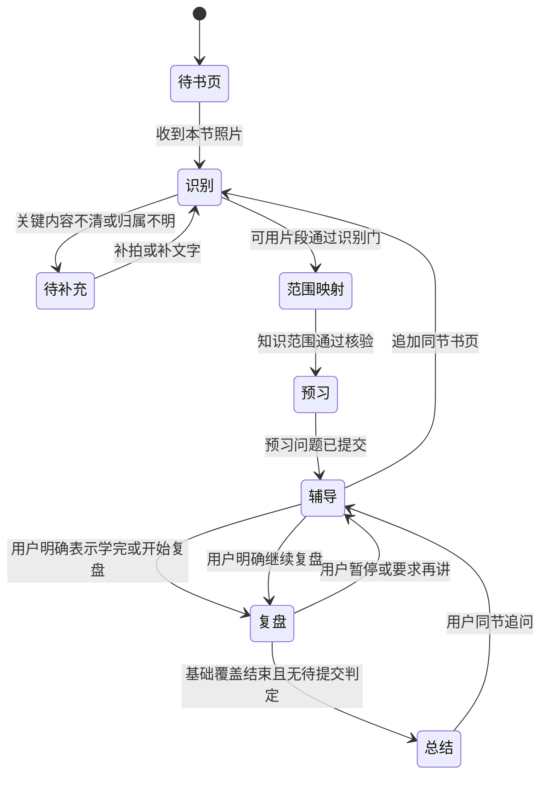
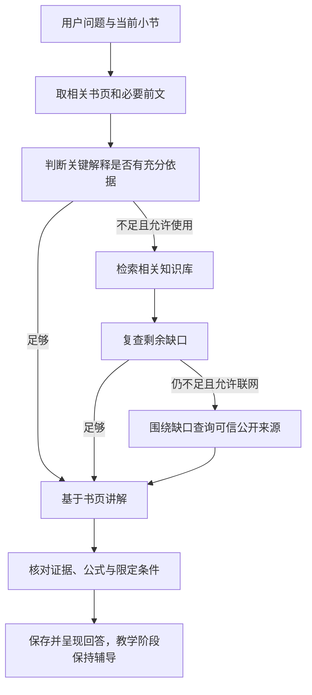

# 学习模式工作流

状态：已确认定稿。D07—D09、D17 及具体版本、覆盖和提交合同已确认。执行遵守 [公共编排](orchestration.md)，核心产品仍是一个教材小节的预习、辅导、一次复盘和总结。

## 1. 教学状态与运行状态

教学状态由领域仓库持久化，主智能体提出具有用户原话依据的动作，代码验证当前阶段与合法迁移。识别中、等待补拍、辅导中和复盘中不由模型自由重命名；内部运行失败也不直接改为“学生未掌握”。

图中识别、映射和预习既有教学含义，也对应可恢复执行节点；正式存储可沿用现有阶段枚举并用待处理动作表达内部节点，避免创建重复的权威状态机。

首轮书页照片输入要求保留；纯文本/PDF 不单独启动本版学习流程。已建小节可用文字补录照片的关键不清位置。另一节另开学习会话，阶段引用、否定句和普通作答不触发模式或阶段切换。

## 2. 最小领域对象

| 对象 | 核心内容 |
| --- | --- |
| 小节版本 | 书/小节身份、页序与内容版本、知识范围和当前阶段 |
| 书页与片段 | 附件引用、页序、位置、文字/公式/图表、识别路径、原文来源与质量问题 |
| 知识点 | 稳定 ID、标题、概念/关系/应用/易错点、支持片段及核心属性 |
| 覆盖矩阵 | 知识点与片段、预习问题、复盘题目之间的关系 |
| 复盘题目与评分要点 | 题目 ID、范围版本、题干、核心要点、允许等价答案、误解、证据和质量裁决 |
| 呈现/作答/判定记录 | 是否已呈现、是否收到答案、是否已核验判定、未作答原因、来源消息 |
| 总结 | 本次覆盖、答对内容、漏洞、未作答/未判定项及题目证据 |

知识点用稳定 ID 关联，标题不作为唯一键；同名概念不会串用评分依据。原始照片保持在会话附件域，图状态保存引用，不重复存原始照片。题目与评分依据绑定具体小节版本和片段，不随后续摘要漂移。

## 3. 识别与材料质量门

流程：验证页序/归属 → 按页识别 → 核对关键内容 → 提交片段产物 → 进入范围映射。

| 节点 | 输出与规则 |
| --- | --- |
| `study.validate_pages` | 去重、页序、同节归属、账户/会话和附件处理状态 |
| `study.recognize_page` | 文字、公式、图表及位置；每页单独保存可恢复产物 |
| `study.verify_recognition` | 检查缺页、断句、关键符号、单位和图文对应的疑点 |
| `study.request_page_fix` | 仅在关键证据不足时提出具体位置的补拍/补录问题 |

OCR 与视觉路径按材料风险选择：普通清晰文字可以先走文本识别；公式、图表、复杂排版或疑点使用视觉核对。该优化需用代表性样本验证后启用，未验证时沿用现有双路径。两个模型一致也不是独立事实来源，更不是识别必然正确的保证。

模型自报置信只作信号。涉及负号、上下标、分子分母、单位或核心定义的疑点不能仅用数字阈值放行。关键内容无法确认时保持材料待补充，不建立依赖它的出题依据。

用户文字补录标为用户补充，记录页号/位置，不冒充照片识别。书页原文与模型解释分字段，模型对图表的推断不能当作图表原文。多页超过输入或运行预算时分批保存，未处理页仍待处理；必要页未完成时不宣布整节已识别。

## 4. 范围映射与辅助预习

`study.map` 建立核心概念、关系、应用与易错点，并逐项绑定书页片段；`study.verify_scope` 检查绑定合法性和覆盖完整性。每个实质教学片段应有知识点关系或有依据的排除理由，避免“每页只引用一处”被误当作全节覆盖。

结构完整不等于科学正确。关键定义、公式和关系仍需与原图/原文核对，存在矛盾或识别问题时修复相应片段与映射，不能靠生成更多知识点凑覆盖。

`study.preview` 根据通过核验的范围生成阅读引导问题，问题数量随密度变化，每个核心知识点有适当覆盖，引用知识点 ID。预习问题不要求学生当场作答。提交成功后进入辅导，不用“模型已经生成”代替“问题已保存并可恢复”。

## 5. 辅导与补证

`study.assess_evidence` 输出要解释的关键点、已支持点、缺口和所需补证类型。时间性或明确要求外部核验也可触发补证；不因模型“知道答案”而认定关键事实已获得来源支持。

用户禁用知识库或明确不联网时跳过该层，必要缺口保持未核实，不覆盖用户限制。网页查询仅包含缺口所需公开术语，不发送书页、完整历史或私人材料原文。

讲解先给本节内容，再标明知识库/联网补充。模型可用于组织解释、比喻和推导，新增关键科学事实要有相应依据；模型知识不能冒充书页或已检索来源。推导显示假设和适用条件，错误或存疑的教材/补充来源分别说明，无法裁决时保留冲突。

外部来源失败时，已有书页足够支持的部分正常交付；依赖失败来源的结论保持缺口。问题实际需要补拍关键书页时询问该位置，外部材料不能替代本节识别质量门或自动改变考查范围。

专业教学角色按问题选择必要的解释和例子，用户仍可直接追问；系统不把每次辅导变成测验或自动推进复盘。

## 6. 复盘计划与出题前核验

只有用户明确表示学完、开始或继续复盘，且材料范围有效时，才进入复盘。主智能体提出阶段事件，代码检查上下文；不用关键词子串把“我还没学完”“如果开始复盘”等当作开始。

流程：冻结考查范围 → 生成覆盖计划、题目和评分要点 → 核验范围/题目/答案 → 保存计划 → 呈现第一道未问题。

题目必须覆盖本节主要知识点，数量随密度变化。每个题目包含：

- 题干、知识点 ID、支持片段、小节版本。
- 必须命中的核心要点、允许的等价表述或推导。
- 标准答案、关键误解，以及不完整/错误的判定依据。
- 是否通过范围、内容和评分依据核验。

评分要点在用户作答前冻结，仅保存在内部，不提前暴露答案或未问题。外部补充知识不自动进入题目范围。生成例题若有自设条件，应明确为题目条件，解法只考材料支持的知识，不能冒充教材原例。

题目呈现记录与可恢复的对话内容在同一事务中提交；只选中下一题尚不算已经呈现。读取会话或 SSE 重放不重复记录呈现，也不提前暴露评分要点和标准答案。

核验不仅检查知识点和片段 ID，还检查题干是否实际测试对应知识、评分要点是否由书页支持、答案是否一致，以及不同合理表述是否会误判。概念解释由模型核对；可确定计算用登记工具校验，不要求通用模型自行保证所有公式。

计划核验失败时在预算内修复一次，仍失败则保留原阶段与有效材料，不提前发不合格题。全部题目可内部保存，用户只看到已呈现题和当前反馈。

## 7. 作答、判定与一次覆盖

| 环节 | 合同 |
| --- | --- |
| 识别输入 | 区分当前题作答、请求解释、暂停、补页和其他阶段事件 |
| 评分 | 逐项核对预先要点，区分正确、不完整、错误；表达不同不扣分 |
| 判定证据 | 记录命中、缺失、矛盾和对应书页要点；判定与当前题 ID 匹配 |
| 复核 | 等价答案争议、核心证据冲突或计算疑点触发独立复核；不强行判错推进 |
| 提交 | 按预期小节/题目版本提交，作答消息和判定幂等关联 |
| 反馈 | 正确时肯定并给必要反馈；不完整、错误或不知道时给答案和简短解释 |
| 下一题 | 有效判定提交后呈现下一道未问题；不自动追加补救题、不要求补答原题 |

某次模型调用失败、格式错误或必要复核失败时保留当前题，不将系统失败作为学生错误，不推进游标。已经通过核验并提交的判定不得因重试重新生成。

呈现、收到答案、完成判定是三个不同事实。暂停时的已呈现未作答题单独记录，不能当作答对；继续复盘默认从未问题开始，保持现有 V2 行为。用户自愿讨论原题可以解释已有记录，系统不主动要求再答。

覆盖结束后生成总结。最后一题判定与总结是两个提交边界：判定成功先保存反馈与判定，再生成总结；总结失败只保留待总结状态，重试总结，不重判最后一题或重复要求作答。

内核提交通过门的判定、反馈产物和可重放事件，整体运行仍可继续生成总结。停止或中断发生在该提交之后时保留合法判定，恢复时重放已有反馈；迟到或未通过提交守卫的批改结果不能改状态。下一题的呈现仍有自己的提交边界。

## 8. 暂停、追加书页与版本

暂停回辅导时，已问题、已判定和来源保留；清除当前激活的答题等待，辅导消息不进入批改。没有新书页时恢复未问题计划。

追加同节书页先建立待提交的小节更新版本，复用未变化页的识别产物，再识别新增页、合并范围并核验。全部必要步骤通过后提交新版本，失败不覆盖原有效教学范围。

已问题及其原判定保持原版本历史；尚未问题和新范围需要重新规划。新范围不能用旧总结概括，旧总结保留历史并标明对应版本。原预习问题保留版本关系，不静默声称覆盖新增书页。

新页若与原文/用户补录冲突，保留来源与版本，先解决影响未问题和当前讲解的关键冲突。旧题原判定不被改写；受影响的历史观察在新总结中标明范围/依据变化，不继续当作当前无争议掌握证据。

## 9. 总结与记忆边界

总结节点只使用实际书页范围、已发生辅导和复盘记录。结果分为本次学过/覆盖内容、本次答对内容、暴露的漏洞、未作答或尚未判定内容，以及可由用户主动继续讨论的要点。

每个答对或漏洞结论绑定实际题目与评分记录；只有书页片段而无用户表现时只能说学过/涉及，不能说已掌握。不把未答当错答，不输出无依据的掌握百分比，也不从单次答对自动建立长期“已掌握”画像。

总结不自动追加问题、补救课程或下一节任务。用户后续要求再讲时回到本节辅导；用户另学一节时沿用新建学习会话的产品边界。

## 10. 关键质量门与停止条件

| 门 | 必须满足 | 未满足 |
| --- | --- | --- |
| 材料门 | 页序/归属可用，关键符号与片段足够明确 | 补拍/补录或重试相应识别节点 |
| 范围门 | 实质知识覆盖有依据，关键定义和关系一致 | 修复识别/映射，不进入不可信出题 |
| 预习门 | 问题对应有效范围、核心点有适当覆盖 | 有限修复，保持前一有效状态 |
| 辅导门 | 关键解释有证据，补充标注清楚、冲突未掩盖 | 交付可支持部分，保留必要缺口 |
| 题目门 | 仅考本节、题干与评分依据一致、覆盖合法 | 不呈现不合格题 |
| 判定门 | 题目/版本匹配，评分证据成立，无重复提交 | 保留当前题或独立复核 |
| 总结门 | 本次表现与实际记录一致，范围和来源有效 | 保存已有判定，重试总结 |

每次运行遵守总预算与一次有界修复。等待书页/作答释放执行资源；用户停止不自动续跑。结构化结果失败、证据缺口和用户操作均通过共享内核留下可恢复记录。
