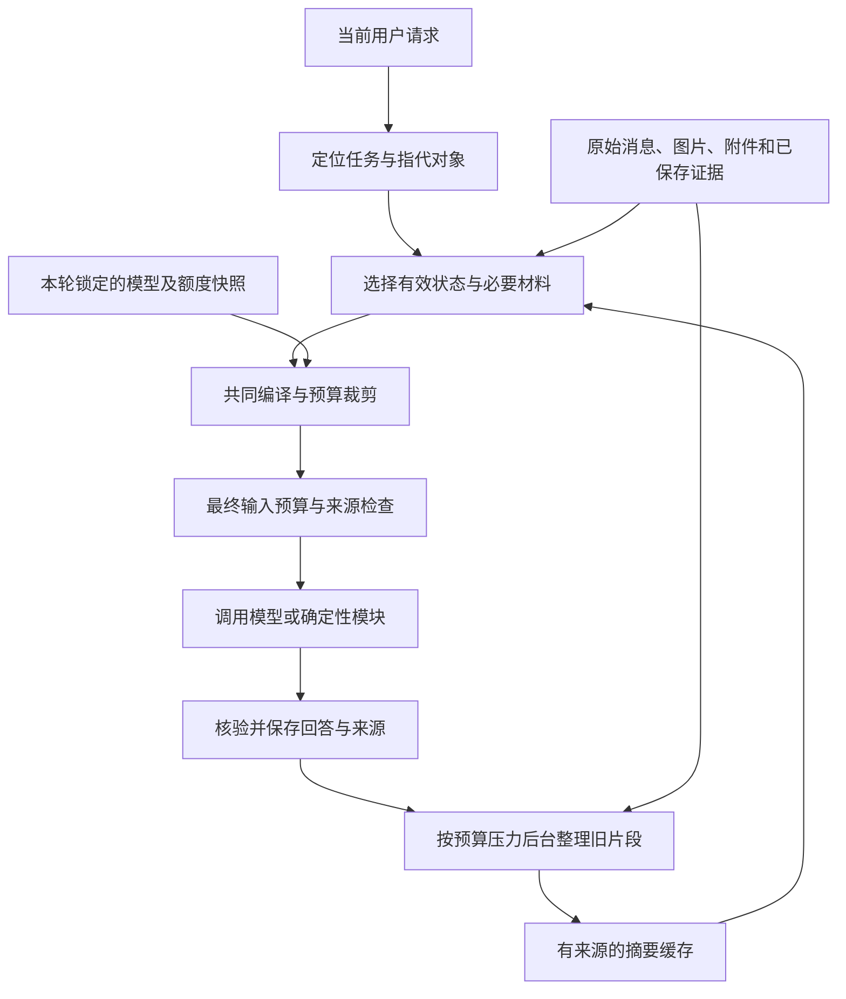

# 对话上下文工程改进方案

日期：2026-09-30。状态：**九项行为原则与验收方式已获用户逐项确认；业务实现尚未修改。**

本文件是本次讨论的最终结论。代码事实、缺陷证据和本地复核见[审查与改进建议](审查与改进建议.md)，用户逐项选择见[讨论记录](讨论记录.md)，合成边界案例见[复核脚本](复核脚本.py)。下文分别标明已确认行为和建议工程实现，不能把文档当作已上线能力。

## 目标与范围

完成同一会话中的连续性改进：关键约束不丢失，用户纠正及时生效，话题往返和模块切换能够续接正确对象，照片／附件／检索材料进入共同的预算与来源边界。

保留原始消息和既有账户隔离、SQLite、图检查点、SSE、知识库与原子画像底座。日常模式仍由用户显式选择模块，学习模式保留既有阶段和书页证据合同。会话状态不会自动升级为跨会话画像；全局知识库仍沿用既有账户作用域。本次没有引入跨会话记忆扩展或新的前端工作台。

## 已确认的九项行为原则

| 决策 | 共同结论 | 具体行为 |
| --- | --- | --- |
| 1. 改进范围 | 完成同会话连续性改进 | 先修可靠性，再改善状态、摘要、召回、模块和检索续接 |
| 2. 状态权威 | 用户明示直接生效，模型推测仅作线索 | 用户目标、约束和纠正不需重复确认；助手未获接受的方案保持草案身份 |
| 3. 有效范围 | 约束默认绑定原任务 | 无关话题不采用；返回原任务恢复仍有效条件；用户明示时才扩大到整个会话；模块切换不等于换任务 |
| 4. 摘要方式 | 按需调用模型生成结构化摘要并缓存 | 近期消息保留原文，关键约束与纠正保留来源；摘要定位原文和解释背景，不形成用户事实 |
| 5. 摘要执行 | 后台准备为主，必要时限时补齐 | 按预算压力整理较早历史，复用有效缓存；当前请求和最新纠正不等待摘要更新 |
| 6. 指代处理 | 明确就续接，实质歧义才澄清 | 多个合理对象会改变结果时简短追问；查找失败不声称用户从未讲过 |
| 7. 超限处理 | 关键条件完整优先 | 删不相关材料、压缩背景；可保持任务含义时有界分批，否则说明需要缩小的范围 |
| 8. 旧材料读取 | 按问题需要读取对应原始材料 | 图像细节依据原图，文件细节依据原文片段，模块细节依据实际已保存证据；不可用时说明缺口 |
| 9. 验收 | 可靠性硬门、多轮效果与成本共同验证 | 固定案例、相同模型与预算前后比较；记录额外调用和等待，具体限额由实测确定 |

“用户明示具有约束力”不表示每条工具事实都要用户确认。工具实际观测和检索证据保留自己的来源和读取范围；任务授权与用户约束不能由工具正文或模型摘要替代。

## 建议的执行链路

下面是落实共识的工程建议，不是要求一次性大规模重构。



每次模型调用都有自己的最终检查，包括普通回答、摘要、论文摘要和学习阶段中的结构化调用。确定性模块不需要为了统一而改用模型，但仍共享任务对象与来源选择的语义。图中的核验不能只判断生成状态为完成，还要执行既有证据和任务质量规则。

### 1. 有效会话状态

建议在现有持久化底座保存一份小规模、可重建的有效状态，按任务组织当前目标、明确约束、已确认决策、待解决问题和相关结果对象。

每条有效状态至少能定位原始来源，说明有效范围，以及被哪次纠正或撤销取代。已确认状态、助手草案和模型推测不能混在同一组确定事实中；无来源推测不晋升为硬约束。学习阶段、题目判定等确定性业务状态继续由现有学习服务维护，摘要不能自行修改它们。

恢复旧任务时先判断其条件是否仍有效。例如原预算 5,000 元后来改为 3,000 元，话题往返后应恢复 3,000 元，不能从旧摘要复活 5,000 元。当前用户消息和最新纠正优先，后台缓存更新速度不影响它们本轮生效。

任务识别依据目标与对象，而非仅依据模块名。推荐同一主题的论文后找实现仓库可以续接原任务；新话题无关约束不携带。含混且会影响结果时使用已确认的澄清规则。

### 2. 有界摘要和原文召回

建议将历史分成近期原文、较早片段摘要和按需补回的原文。摘要有总长度上限，按来源片段缓存，不能要求每条旧消息永远占一行。

摘要可包含背景、讨论过的对象、已确认结果和开放问题的定位线索，附消息范围、具体来源 ID、实例版本与覆盖边界。模型概括不直接写成有效事实；数值、否定条件和纠正关系须能核对原文。新增历史只整理需要压缩的片段，既有有效缓存复用；需要重建时回到原始消息，避免只反复压缩上一版摘要而积累偏差。

召回先利用近期上下文、有效状态和结构化结果对象，解析“它／第二个／继续／按照之前的要求”。再在同一会话原文中搜索相关片段，并补充必要的相邻轮次以保留纠正关系。先复用确定性定位和现有检索能力，评测证明不足后再增加语义召回或重排，避免预先建设新的复杂检索系统。

摘要生成、校验或召回失败时，不把猜测写入状态。能依据保留材料完成任务就继续；必要信息缺失则明确说明本轮未能定位并按决策 6、7 处理。

### 3. 模型额度快照和最终预算

建议入队时保存本轮模型的完整已验证额度快照：模型 ID、上下文窗口、最大输入额度、配置 revision 和元数据版本。每次调用按实际输出参数预留空间；不同调用的输出额度不能共享一个写死的 1,024 token 假设。运行恢复使用原快照，不重新用当前激活模型的元数据猜测旧模型额度。

可用输入上界的建议计算方式为：

```text
输入硬上界 = min(已验证最大输入额度,
                 已验证上下文窗口 - 本次输出预留 - 安全余量)
实际任务输入预算 <= 输入硬上界
```

最终消息、角色封装、图片部件、工具声明与已取得工具结果都计入本次实际输入。后续取得新结果时重新编译，不能只检查历史文本后再无限追加。模型硬窗口是上界，不是每轮都要填满的目标；实际任务预算与估算安全余量通过基线测量确定。

估算不是供应商真实分词计数。工程验证要覆盖中文、英文、代码、公式、长 URL 和图片，利用可取得的实际用量校准；未经验证的缺省窗口不能代替自定义模型真实额度。图片数量与输入方式都进入预算，照片轮不再绕过编译。

先删除与本任务无关的材料，再削减可选材料和背景。必要性由任务决定：某条画像的排除项、历史纠正或工具证据也可能不可省略。画像整条纳入或不采用，不允许剩余 1 token 时强行加入首条，也不通过截断关键条件制造表面合规。

自动分批仅适用于可拆且能核验原请求完整性的任务，受次数和耗时限制，中间结果保留来源。不能证明完整满足时说明实际缺口和可缩小范围，不把有缺口结果当作完整回答。

### 4. 模块、检索、附件和照片

建议让各模块声明需要的任务信息与证据，复用共同选择入口，不再各自把“最近 6 条用户消息”当成全部上下文。仍使用显式 `module_id` 派发，普通聊天不会暗中重新执行模块。

知识库、附件和画像检索使用解析后的任务主题及对象构造最小查询，而不只依赖“第二个有什么区别”这一句。模块选择和材料查询相互独立：材料进入上下文不等于获得新工具执行授权。

旧图追问若涉及视觉细节，选择性读取该会话原图；已解析文件按需读取对应页码／章节片段。模块结果保留具体结果对象、版本、来源时间和实际读取范围。只有摘要或未获得全文时，不能声称已读原图细节或论文全文。已有来源失效、删除或不可读时，相关派生缓存不能继续作为当前依据。

重新读取已保存材料与刷新外部来源分开。需要最新外部事实时遵循现行显式模块合同；公开服务只取得必要查询参数，原始历史和私人画像在本地选择组合。

### 5. 来源、指令和诊断

建议把系统规则与来源正文分开封装，并明确历史原文、文档、图片、检索和工具结果属于数据。它们可以提供事实依据，但不能覆盖权限规则、当前用户已确认决定或模块派发。模型推测不能因进入摘要或 `system` 角色而获得更高权威。

每次实际调用形成采用材料清单，记录消息／片段／对象 ID、来源版本、摘要实例、采用与排除原因、预算检查结果，以及估算和可取得的实际用量。诊断默认不记录完整私人正文。沿用现有渐进披露界面呈现必要来源与缺口；本次不新增上下文调试工作台。

## 建议实施顺序与代码接入点

以下顺序用于后续拆分本地工单，属于工程建议；本次没有创建实施工单或改动业务代码。

| 阶段 | 最小交付 | 主要接入点 | 验证 |
| --- | --- | --- | --- |
| 1. 共同边界 | 最终输入硬门、完整模型额度快照、照片预算、画像整条裁剪、材料数据封装 | `chat/service.py`、`chat/context_compiler.py`、`chat/turn.py`、`ai/model_gateway.py` | 混合输入不超限；旧运行不随新配置漂移；必要材料触底有明确结果 |
| 2. 状态与续接 | 有来源的任务状态、纠正覆盖、话题往返、指代与原文定位 | `chat/repository.py`、`chat/service.py`、现有模块状态投影 | 末尾约束不丢；新纠正取代旧值；无关话题不污染；歧义按规则澄清 |
| 3. 摘要缓存 | 有界结构化摘要、片段来源、后台准备、限时补齐与失效处理 | `chat/context_compiler.py`、`chat/checkpoints.py`、现有后台运行底座 | 不每轮重做整段历史；缓存覆盖范围明确；失败不阻塞到无限等待 |
| 4. 贯通材料 | 模块声明任务需要；解析后的知识库／附件／画像查询；旧图和原文读取 | `paper/`、`github/`、`resources/`、`commute/`、`tieba/`、`career_plan/`、`retrieval/`、`profiles/`、`study/` | 普通聊天和各模块复用正确对象与约束，来源及读取范围不漂移 |
| 全程评测 | 最终载荷检查、固定多轮案例、配对比较和成本报告 | `tests/chat/`、相关模块测试、`evaluation/` | 修复复核边界，并证明同模型同预算下的连续性收益 |

每阶段仅修改实现该交付所需的接缝，保留既有有效模块行为和数据兼容。无需先迁移数据库架构、替换工作流框架或拆出新服务。

## 验收矩阵

| 场景 | 必须达到的行为 |
| --- | --- |
| 约束在长消息末尾，多轮后“继续推荐” | 采用仍有效的预算、排除项等条件，并能定位来源 |
| 先说 5,000 元，后改为 3,000 元 | 本轮及后续续接都采用 3,000 元，旧摘要不能复活旧值 |
| 选购 → 通勤 → 返回选购 | 通勤不受选购预算干扰，返回时恢复最新有效条件 |
| 同时出现论文和仓库两张列表 | 指代明确则续接，实质歧义时只问必要对象 |
| 普通聊天 → 论文 → GitHub | 同一目标与有效约束正确续接，模块选择仍由用户控制 |
| 长对话中添加照片 | 文本与图片共同接受预算检查，不回退为无界完整历史 |
| 下一轮问旧图局部文字 | 有实际原图依据；不可用时明确说明缺口 |
| 追问附件中的末尾限定条件 | 按来源读取必要原文，避免用不完整摘要作精确断言 |
| 历史、画像、知识库、照片和工具接近预算 | 最终输入硬门通过；必要条件超限时按已确认方式处理 |
| 旧模型运行排队后切换配置 | 续跑仍使用旧运行完整额度快照 |
| 摘要任务超时或返回不可靠内容 | 新请求和纠正仍即时生效，不写入无依据状态，不无限等待 |
| 文档或工具正文含指令 | 仅作材料；权限、当前任务与模块派发不被改写 |
| 跨账户对象或失效来源 | 不取得越权材料，不复用失效派生依据 |
| 常规短对话与长会话配对比较 | 短对话无不必要摘要调用；长会话报告连续性结果、额外调用和耗时 |

预算、隔离、来源和运行快照等确定性检查必须全部通过。真实模型案例检查答案是否沿用正确约束，或是否按规则澄清／说明缺口；不能仅以最终状态为 `done` 判定成功。使用相同模型、任务、输入预算上界与输出额度比较改进前后，必要时重复以检查模型波动。

成本报告至少包含输入／输出用量、额外模型调用量、首字等待、总耗时及触发原因。先测基线，再确定可检查的质量门槛和限额；本方案不宣称已经完成这些测量。

## 按实测确定的工程参数

用户已同意以实测基线决定以下数值，不需要在讨论阶段猜固定百分比：实际任务输入预算、估算余量、近期原文保留量、摘要触发阈值与长度、同步补齐超时、后台重试及分批次数上限、历史召回量、真实模型案例重复次数与质量／耗时门槛。

画像撤回与原始聊天删除仍遵守各自现有产品规则。不能从本次共识推导出“删除画像等于删除聊天原文”等新语义；若后续希望改变这种产品行为，需要单独明确需求。

## 本次交付状态

- 代码审查与合成边界复核已完成，证据与限制已记录。
- 现有上下文测试在 Conda `agent` 环境下为 **14 passed**；这是审查基线。
- 九项决策已经用户逐项确认，最终方案与实施建议已保存。
- 业务代码尚未实施，真实模型配对评测和数值限额测量尚未执行。
