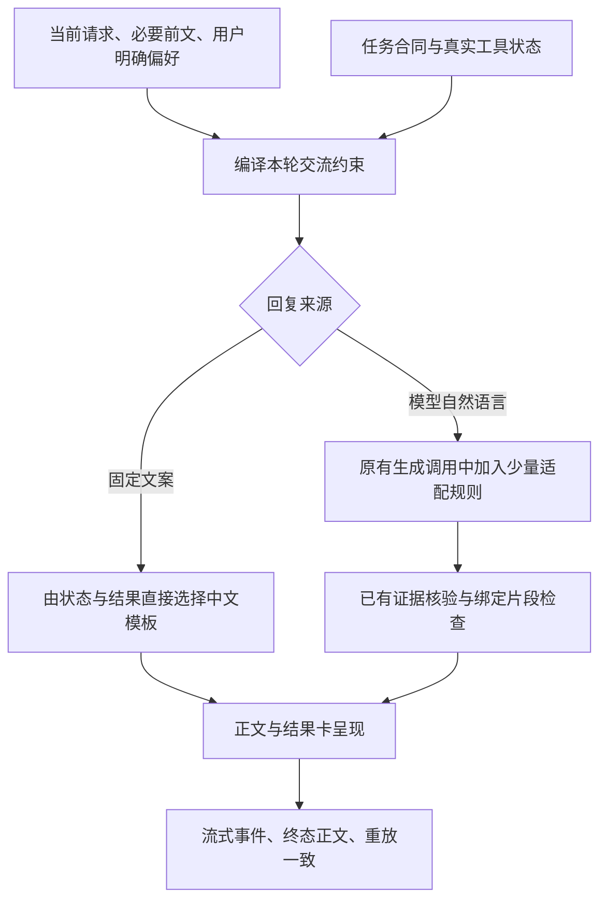

# 人味化表达改进实施方案

状态：2026-09-30 用户确认整体方案，已定稿。方向为有分寸的伙伴、全自然语言覆盖、保留单次生成、相关时自然使用明确偏好与背景、倾诉时不强制建议，以及任务帮助与分寸不退化后再验证自然度。本文为实施建议，既有 ADR 的生效状态保持原合同。

依据：[审查与改进建议](审查与改进建议.md)、[讨论记录](讨论记录.md)。

## 目标与成功标准

让用户感到智能体听懂了这次请求、知道对话进行到哪里、回应有分寸且确实有帮助。自然度来自合适的交流行为与表达，而不是每句加温暖词、口语词或“我理解你”。

成功标准分开检查：

1. 正式回复路径都采用一致的表达边界；固定文案的状态含义、工具结果和引用数据不变。
2. 已复现的盲替换、流式重复、原子画像矛盾得到回归验证。
3. 用户显式表达的语气、长度、建议与追问边界得到尊重；多轮的“继续”“不是这个意思”能接回真实任务。
4. 真实模型生成样本经盲评确认体验收益；不能以规则命中或测试通过替代用户体验证据。
5. 不增加专用于人味化的模型调用；原任务本来需要的多步模型调用与供应商重试保持原合同。

## 最小实现结构

沿用现有轻量策略、运行快照、上下文编译器、模块生成与模板呈现接口。先完善这些接缝，不建立新人格服务、独立人味智能体或新的自由编排层。

所有输入沿用账户隔离、现有任务上下文预算和画像撤回规则。引用材料、书页原文与工具返回数据不能成为新的系统指令。

### 1. 用少量基础原则定义伙伴声音

建议基础规则只承担这些职责：

- 回应当前请求和真实语境，不把所有输入都当作问答题。
- 用自然中文说清必要信息，篇幅和结构随任务而定。
- 具体回应已知处境；不编造共同经历、人格判断或亲密关系。
- 可以表达有依据的不同意见；承接感受不等于认同错误事实或自我贬低。
- 未被要求时，不把每轮变成建议、教育或追问；必要澄清只问最有价值的信息。
- 当前明确要求优先于长期默认偏好；事实、证据、任务合同与工具状态必须准确。

这些是候选规则，要经过样本对比后定稿。不要添加全局禁词词库；“首先”“建议”“理解”等词是否合适由语境判断。

### 2. 避免让弱分类强制规定交流方式

保留已有 `ChatResponseForm` 作为审计和粗粒度默认，但不让一个关键词决定全部规则。至少处理：

- **用户显式限制**：不想要建议、不要安慰、只给答案、请详细讲、别追问等。
- **材料边界**：引语、待翻译文本、待分析文章的情绪用语不是用户状态。
- **必要前文**：当前未完成任务、用户刚指出的误解、上一轮正在讲解的对象。
- **实际工具状态**：成功、部分结果、失败或不可核实；不能从用户说法假定工具成功。
- **主要任务与可选承接**：焦虑但正在请求排查时，既可具体承接，也应完成排查；不能二选一丢掉需求。

实现先使用已有上下文与确定性强信号；对无法可靠判断的细微语气，把必要前文交给原有生成模型适配，不为分类额外调用模型。弱分类选中某形态后也不注入“必须安慰”“必须建议”或“必须提问”。

复用现有上下文编译器，不额外把完整历史复制到一个新的“情绪分析”块。可先传入当前任务状态及最近相关对话；具体裁剪仍由现有预算控制，不引入无依据的固定长历史。

候选行为示例（用于评测，不是已经执行的真实模型输出，也不是所有场景必用的模板）：

| 场景 | 希望看到的行为 | 不希望看到的行为 |
| --- | --- | --- |
| 只问“5 公里是多少米” | 直接回答“5000 米” | 安慰、长讲解、固定继续邀请 |
| “不想听建议，就想吐槽” | 承接具体事情，允许继续聊 | 给计划、步骤，强制用户做选择 |
| 讨论焦虑的机制 | 解释机制与证据边界 | 推断用户焦虑，先进行情绪辅导 |
| 当前任务已解决，用户表达感谢 | 自然简短回应完成感 | 再问一轮需求，重复功能推销 |
| 用户纠正“你没回答我问的部分” | 接回被漏掉的请求并给答案 | 重复原解释，机械道歉或责怪用户描述不清 |
| 工具确认超时、支持重试 | 如实说明未拿到结果与可用恢复方式 | 泛泛安抚、声称已经检索成功 |
| 用户希望详细推导 | 按需求讲清楚、保留必要步骤 | 因默认简短而省略关键推导 |

同一情绪场景可以有多种合适措辞；评测以理解与分寸判断，不能把示例文本当作字符串金标准。

### 3. 画像采用用途适配，保持原子列表合同

表达策略不再用旧维度白名单直接判断无类别原子条目。内部需要识别用户明确说过的交流偏好，例如“回答直接一点”“技术问题可以专业些”“别每次问我是否需要更多帮助”。

相关学业背景和兴趣可以用来选择例子、解释深度与词汇；例如用户已明确正在学线性代数，讲模型变换时可用矩阵例子。自然使用即可，无须在每轮开头声明“根据你的画像”。

实现约束：

- 明确偏好与任务背景采用不同的相关性判据；前者可跨学科问题适用，后者必须与任务有关。
- 从现有有效原子记录编译少量表达约束，保留来源和撤回能力，不新增用户可见分组。
- 不把所有无类别条目直接注入表达策略；不让偏好文本变成无边界系统指令。
- 同一轮只使用一个一致的采用结果，消除“已注入画像，却声称没有画像”的提示冲突。
- 当轮纠正优先，普通异步提取依照当前合同下一轮生效；不把短暂情绪晋升为长期画像。

### 4. 按回复来源覆盖正式路径

| 路径 | 应改接缝 | 验证重点 |
| --- | --- | --- |
| 日常聊天 | `chat/lightweight_policy.py`、`turn.py` | 普通问答、闲聊、情绪、混合意图、工具状态、跨轮纠正 |
| 学习辅导 | `study/tutoring.py` 与现有上下文编译 | 共用运行快照与表达约束，教材来源不变 |
| 复盘出题与判定 | `study/review.py` | 表达只作用于题目和解释；正确性判定与覆盖游标不变 |
| 学习总结 | `study/summary.py` | 表达不改写掌握证据、题目状态和缺口 |
| 论文概述 | `paper/presenting.py` | 在既有概述调用中接入；论文标识、引文和来源仍受原核验 |
| GitHub 解读 | `github/presenting.py` | 在既有解读调用中接入；项目字段与链接仍由真实结果控制 |
| 通勤、资料、贴吧、职业规划结果 | 各模块 `presenting.py` | 优化说明与模板结构；路线、价格、时间、职位证据与引用不变 |
| 路由澄清、错误与空结果 | 路由/状态对应文案及结果模板 | 清楚说明发生什么、对用户的影响及真实恢复方式 |
| 进度、停止与降级提示 | 状态模板 | 自然但不伪装成功、隐藏失败或承诺不存在的恢复能力 |

通过 `chat/graph.py` 的正式分派路径验证，不能只调用旧 `TurnOrchestrator` 证明现行模块已覆盖。内部分析、排名、证据分类等不面向用户的调用，无须为了覆盖率注入聊天人格。

结果呈现先让正文承担用户最需要的结论与解释，细节利用已有卡片/展开能力。若现有产品合同要求固定字段或流程，不在本任务中擅自隐藏；扩大交互改动另行讨论。

### 5. 把保护机制绑定到保留意图与具体对象

先修复以下已知错误，不同时大改科学验证体系：

1. 一个候选片段不能被多次拿来恢复不同源片段。精确保留项采用稳定 ID/位置和来源哈希，或明确的逐一配对；位置不可靠时不猜测替换。
2. 用户要求纠错、计算或改代码时，不把待修改的旧输入当成不可更改的事实锁。区分“原样保留”和“允许修改”。
3. 可用来源清单只规定可引用对象，不能要求候选按清单顺序替换链接；已合法选中的来源无需恢复成另一个来源。
4. 遗漏的原片段不能无条件追加到回答末尾。是否必须出现由当前任务决定，缺失和错误分别处理。
5. 纯数字、否定、条件、因果与结论强度的保护能力单列验证；片段相等不是语义正确的充分条件。

优先在明确保留请求中使用精确绑定，在生成与纠错任务中依靠对应任务合同和已有核验。不要新增一个声称通用事实正确的正则系统。遇到无法修复的关键不一致时，采用现有任务的失败/降级语义，不将不可信正文包装成成功。

### 6. 流式输出保持协议一致

选定一种最小实现，不同时构建两个重写通道：

- 若只需恢复显式绑定的片段，可在片段闭合前暂缓该片段输出，确认后再追加。
- 若业务确实需要改变已发送正文，增加明确的正文替换语义；前端、持久事件、重放和重连都必须采用同一规则。

无论采用哪种方式，`delta` 必须表示可追加的新内容；终态用户看到的正文、落库正文和重放正文必须一致。用户停止后不得在后台继续润色或重新获得生成额度。

## 建议的实施顺序

实施时将下面的工作拆成本地 `.scratch/` 任务，依照仓库 issue tracker 流程执行；本次未创建实施票或改产品代码。

| 阶段 | 最小工作 | 验收标准 |
| --- | --- | --- |
| P0：可靠性 | 修复盲替换、授权纠错被覆盖、流式整段伪增量；修正学习测试夹具 | 每个反例有真实回归；合法学习阶段能走到被测生成；三种正文一致 |
| P1：覆盖与画像 | 接入正式路径；适配无类别偏好；统一采用结果、策略快照与元数据 | 当前图分派的路径逐项验证；删除偏好后不再生效；没有矛盾提示 |
| P2：交流适配 | 显式限制、引语、必要前文、混合任务；移除强制行动与固定收尾 | 任务完成且尊重边界；解释不必固定追问；倾诉不必强制建议 |
| P3：真实模型评测 | 新旧策略和简洁基线配对生成、多轮盲评、消融与预算测量 | 通过约定质量门后采用新策略；证据不足则继续小范围改进 |

版本建议：新增策略版本，旧任务重试沿用原快照，新任务采用新版本。对于新发现的保护错误和协议缺陷，兼容修复的范围需要单独验证，不能用“旧快照不变”来保留确定性代码缺陷。提示策略回滚与保护错误修复应解耦。

## 评测方案建议

### 工程验证

- 路由/适配反例：情绪话题、引语、否定建议、混合意图、长内容、仅说“继续”、纠正上轮误解。
- 保真：多个同类片段、顺序变化、仅使用一个合法来源、授权纠错、裸数字、中文单位、否定与限定条件。语义案例需要明确参考判断，不能仅做字面包含断言。
- 流式：改变已发前缀、保护片段跨 chunk、取消、断线重放、终态重新加载；检查 UI、事件拼接与存储。
- 画像：真实原子切片、明确偏好和不相关背景、撤回/修改、当轮明确限制、两账户隔离。
- 覆盖：真实模块分派、合法书页阶段、成功/部分成功/失败/空结果；不能只检查编译器函数支持某参数。
- 调用预算：不增加人味专属模型调用；策略异常使用基线；重试保留提示版本和采用结果。

### 真实体验验证

已确认的放行原则：任务帮助与交流分寸不退化，再验证自然度收益。不能用亲切感抵消任务失败、事实漂移或对明确边界的违反。

先准备覆盖主要场景的原创评测材料。可从 40—60 组场景起步，其中包含连续多轮对话；这只是启动规模建议，不能当成足够统计证据的承诺。

同一主模型与任务证据下比较：

- 现行 `global-chat-lightweight-v4`。
- 新策略。
- 保留事实与任务合同、仅用简洁表达的基线。

记录实际模型配置、策略版本、上下文、证据和预算。盲评隐藏方案身份，随机交换呈现顺序；多轮样本保留前文，不能让评审只看最后一句。

分别评价：是否听懂请求、是否有帮助、自然度、交流分寸、连续性。记录平局与“不愿选择任何一个”，避免强迫偏好。事实漂移、伪造经历、越过用户明确边界、错误状态伪装成功分别检查。

用户偏好报告包含胜/平/负、参与人数、场景分布和不确定性。样本不足或差异不明确时，不宣称提升。对“使用前文”“使用明确偏好”“条件式承接”逐项消融，验证复杂度是否有实际收益。

首字延迟、总时长、输出长度和 token 成本使用真实调用测量，再设定适合现有部署的允许范围；目前没有生产基线，本文不编造百分比门槛。用户个人聊天不进入普通日志；真实评测使用明确授权的数据或原创场景。

## 定稿与实施边界

六项产品选择与整体方案均已确认。本次交付为审查和实施建议；具体工程接口、发布阈值与改动粒度在后续实施中依据当前代码和真实基线收敛，真实模型体验收益仍待评测。
