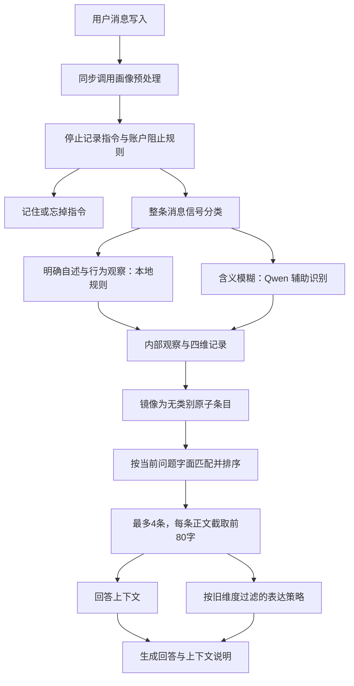

# 用户画像模块：现状审查与改进建议

审查日期：2026-09-30。代码基线：`7818c34`。范围：当前仓库中的提取、保存、纠正、删除、切片、回答使用、用户界面与评测；使用合成数据，不读取真实账户画像，不调用外部模型。

本文是审查结论与设计建议，不是已批准的实施规格。逐项问答的选择单独记录在[讨论记录](讨论记录.md)；用户在整体共识确认时表示“还有原则需要调整”，正在进一步讨论时序与应用方式。本文尚未定稿，业务代码未修改。

用户随后要求进一步解释提取、上下文注入和回答应用时机，新增建议见[提取时机与回答应用流程](提取时机与回答应用流程.md)；此前逐项选择尚未被明确撤销，整体共识仍待讨论。

## 1. 核心判断

现有模块已经有账户隔离、原话来源、用户编辑优先、删除墓碑、幂等处理、失败重试和最小切片这些必要基础。需要保留，不能为“更智能”而绕开。

但它当前更擅长记录兴趣或目标词语，对“了解用户并改变回答方式”的支持不足。问题集中在三个环节：抽取时丢失事实关系与适用条件；保存时按过粗的维度覆盖；使用时按字面重合筛选，且表达策略仍依赖已退出的类别。最终可能出现“收集了很多信息，回答却没有更合适”，也可能出现“用到了旧信息，回答反而更差”。

建议成功标准是：**正确记住必要、有效且可撤回的信息，在相关任务中产生可验证的回答改善。** 画像条数、召回次数、回答中提到用户的次数都不能直接代表成功。

## 2. 当前实际链路

现行产品依据为 [ADR-0030](../adr/0030-v2-campus-assistant-and-approved-desktop-interaction.md)、[V2 产品契约](../v2/product-contract.md)和[V2 技术架构](../v2/architecture.md)。ADR-0002、ADR-0021 中的复杂授权与画像中心是历史合同，不应据此恢复逐条确认弹窗或固定分类页面。



控制指令会先处理；普通自动条目通过来源消息 ID 在本轮切片中排除，下一轮可用。**“下一轮生效”已实现，但不等于“回答后异步提取”已实现。** 当前初次与续轮聊天提交都在返回前调用预处理，普通提取也在此发生；后台队列主要承担失败重试。

主要证据位置：

| 环节 | 代码位置 |
| --- | --- |
| 初次与续轮聊天提交时处理画像 | `src/bridges/chat/service.py:890`、`:1431`、`:1129` |
| 整消息分类和禁止条件 | `src/bridges/profiles/signals.py:151`、`:233` |
| 本地提取与模型提取 | `src/bridges/profiles/automatic.py:451`、`:564`、`:1952` |
| 观察晋升与四维提交 | `src/bridges/profiles/automatic.py:2387` |
| 同维度更新 | `src/bridges/profiles/four_dimensions.py:966` |
| 原子条目、用户操作、镜像 | `src/bridges/profiles/atomic.py:869`、`:908`、`:932`、`:1070` |
| 原子切片与回答接线 | `src/bridges/profiles/atomic.py:1144`、`src/bridges/chat/turn.py:5131` |
| 表达策略筛选 | `src/bridges/chat/lightweight_policy.py:351` |
| 用户页面 | `apps/web/src/components/account/profile/AtomicProfileCenter.tsx:39` |
| 个性化评测 | `src/bridges/evaluation/metrics.py:110` |

## 3. 已复核的缺点

优先级含义：P0 为控制边界错误；P1 为直接影响信息准确性或个性化效果；P2 为下一阶段需要解决的质量与体验缺口。这里的优先级是审查建议，不是已确认排期。

### 3.1 提取范围与用户意图不匹配（P1）

内部仍限制为学业、知识兴趣、爱好、阶段目标。`请以后先给结论，再给解释` 被判为无画像信号；`我不喜欢长篇回答` 被整句判为禁止信息。回答篇幅、先结论后解释、例子形式、时间或资源约束往往比一般爱好更能改变回答质量。

仅取消页面分类不能解决内部提取范围问题。`我喜欢用图示解释复杂概念` 也可能被装进“知识兴趣”，而不是保留为回答偏好。

建议：以可复用的明确事实、回答偏好、目标和现实约束为提取边界，保留否定偏好的含义；不要把拒绝记录、第三方描述和“我不喜欢某种回答”当成同一种禁止信号。该范围已经用户确认，具体字段与提取实现仍待讨论。

### 3.2 整消息过滤与单次正则匹配太粗（P1）

`我喜欢跑步，我的朋友喜欢摄影` 因第三方内容整句被排除；`我喜欢跑步，但今天有点焦虑` 因敏感内容整句被排除。即使只允许记录明确的低风险自述，也可以只保留其中合规的事实片段。

`我喜欢跑步，也喜欢游泳` 只提取出“跑步”。本地提取每个维度主要取第一项匹配，不能等价于每条消息识别所有可复用信息。增加更多正则可以补个别说法，但不能充分解决主体、关系、否定、引用与多个事实的组合。

建议：先定位语句和原文片段，再逐条判断主体、事实关系、否定、时间、复用性及敏感边界；最后才决定是否写入。片段切分本身不能证明安全，仍须核实引用、第三方和否定范围。

### 3.3 保存的是词语，容易丢失“用户与它的关系”（P1）

`我喜欢Python` 与 `我正在学习Python` 最终都成为 `Python`，并合为一条。模型只看无类别正文时，无法可靠区分兴趣、正在学习、掌握能力或未来目标。`我对这个专业的研究很感兴趣` 则保留回指词；提取器只看到当前消息，不能可靠知道“这个专业”指什么。

建议：每条正文表达一个完整可理解的事实，例如“用户正在学习 Python，尚未说明掌握程度”；同时保留精确原话出处。只在必要时补回邻近用户消息以解析回指，不让助手自己的猜测成为用户事实。页面继续呈现逐条自然语言信息。

### 3.4 以维度代替具体事实的冲突身份（P1）

依次说 `我是大二学生`、`我是软件工程专业`，最终只留下“软件工程专业”。依次说 `我计划考研`、`我计划通过英语六级`，最终只留下“通过英语六级”。这些信息可以同时成立，却因同维度最近记录更新而互相覆盖。

建议：只在同一个具体属性发生明确变化时更新，例如年级“大二→大三”。专业与年级、考研与六级是不同事实或目标。用户已确认默认并存，明确取消、替代或同一具体事实变化时才更新；普通追加不逐条询问。

### 3.5 去重与删除边界依赖正文，缺少语义身份（P1，边界需讨论）

去重键主要为账户加空白折叠、大小写规范化后的正文。`我喜欢跑步` 与 `我爱慢跑` 可以并存。删除自动条目“跑步”后，再以新消息说 `我喜欢慢跑`，会产生新的“慢跑”条目。

这项探针验证的是**近义的新表述能再次出现**，没有证明既有“同键旧消息重放防复活”保护失效。跑步与慢跑是否视为同一删除对象、新自述是否足以重新授权记录，属于必须明确的产品边界。

建议：同一主体、关系、对象与适用范围生成事实身份，正文只是展示；同义词只用于提出合并候选，不能见到相似度就覆盖。删除和编辑抑制应绑定事实身份与旧证据。用户已确认：确定为同一事实的普通提及不恢复，明确要求重新记住才恢复；不确定同一性时不自动合并或恢复。

### 3.6 字面召回漏掉最有价值的背景与偏好（P1）

保存 `我是计算机专业的大二学生`、`我喜欢简短回答` 后，问 `解释贝叶斯定理`，切片为空。相关性主要依据互含、中文二元组重合或英文词命中；“怎样解释”所需的用户背景与问题主题并不一定共享词语。

切片只接收当前问题，不能充分利用当前任务、前文回指、工作模块与学习阶段。排序主要按把握度和更新时间，没有按本任务的实际作用排序。最多四条本身是合理约束，但固定四条并不能保证取到必要信息。

建议：明确且适用的回答偏好按范围取得，背景、目标、约束按任务召回；使用当前请求、会话主题和必要前文构造查询。先过滤状态、有效期和权限，再做语义或规则召回与去重排序，并允许零条。是否需要向量索引应由漏召回评测与数据规模决定。

### 3.7 原子层未延续低把握度的召回门禁（P1）

直接通过四维记录创建 LOW 把握度的“概率统计”并镜像，原子切片仍会召回。旧四维切片会过滤不应召回的把握度；原子切片主要将把握度用于排序。

普通明确自述通常从 MEDIUM 起步，因此该复核不能解释为“正常提取的所有信息都没有可靠度控制”。它证明迁移、镜像等来源可以绕过原子层的使用门禁；还需检查后续纠错降级是否同步至镜像。

建议：召回前统一检查可信状态，避免每个投影各自定义。用户明确编辑的权威性与自动提取可靠度分开管理；用户改了内容不等于用户提供的信息更不可信。

### 3.8 缺少有效期与语义完整的预算处理（P1）

把 `我计划下周通过英语六级考试` 的创建与更新时间模拟为一年前，今天仍可召回原文中的“下周”。条目有记录时间，但没有事实有效区间或目标完成状态；切片也不携带这些时间。

每条正文机械截取前 80 字，复核中的尾部限制“但考试冲刺时不要使用这种方式”被丢弃。这样的预算处理可能把有条件偏好变成无条件规则。

建议：相对时间以来源消息时间为锚，不能编造未给出的具体日期；记录范围与期限，到期后停止注入。用户已确认按适用范围与有效期管理；具体期限如何解析和续期仍待细化。按完整事实预算选择条目，放不下就整体省略，或使用可核对且保留否定与条件的短句，不硬切正文。

### 3.9 原子画像与表达策略的接口脱节（P1）

原子切片的 `dimension` 是空串，而表达策略只接受旧的 `basic_information`、`academic_status`、`expression_habit`。探针中“我喜欢简短回答”成功进入切片，但表达策略中的画像值为空。

这不代表模型绝对无法个性化：通用画像上下文仍可传给模型。它说明负责表达偏好的专门策略链没有正确接收新原子合同，效果容易依赖模型临场理解。

建议：页面无固定类别与内部知道“这条信息能影响什么”可以同时成立。编译器以适用用途接收篇幅、结构、例子与基础等信息；优先解决新旧接口脱节，不恢复固定类别 UI。

### 3.10 普通提取仍位于前台，且模型调用在提交事务中（P1，代码审查）

聊天提交在返回前调用 `preprocess_message`。该方法的提交事务包含 `_extract_once`，模糊信号可调用模型。这与 V2“回答后异步完成”合同不一致；网络调用放在数据库事务中还存在延长事务占用的风险。

建议：普通自动提取在回答完成后进入可恢复队列，模型识别在写事务外完成；最终核实来源、用户编辑、墓碑和版本后，以短事务提交。记住、忘掉及明确纠错使用受控同步路径。用户已确认本地控制指令与模型事实提取的分工，以及普通提取的异步时机。保留已有重试和幂等设施。此处未测真实网络延迟，不宣称已有具体性能损失。

### 3.11 停止自动记录会挡住后续忘掉指令（P0）

依次执行 `记住我喜欢跑步`、`不要记录`、`忘掉跑步`，最后一次预处理不产生记忆指令结果，原有条目仍存在。原因是账户级阻止检查先于显式记忆指令解析。用户停止自动提取后，仍应能撤回已保存信息。

页面逐条删除是另一条路径，本复核没有发现其被同样阻止。问题限定为聊天中的显式忘掉指令。

建议：关闭自动提取与用户主动管理画像分离；忘掉和删除始终可执行。用户已确认记录与使用分别控制，主动记住和修改可单独执行。还需在文案中明确“本轮不使用”“停止自动记录”“忘掉指定信息”“删除历史消息”的不同语义。

## 4. 代码审查发现的质量与体验缺口

以下是依据代码得出的设计风险或覆盖不足，没有通过真实模型或用户实验验证效果大小。

- **证据引用不等于事实成立。** 提取合同有消息 ID，但没有精确证据区间、主体和关系。`_validate_item` 核对 ID、禁止类别及自述边界，没有验证每个规范化值是否真的被原文支持；`_evidence_quote` 最多留 240 字，也可能没有覆盖实际依据。建议校验证据片段确实来自原消息，且支持该主体、关系、否定和时间，不只要求字符串相等或存在消息 ID。
- **模糊识别的写入路径需要澄清。** AMBIGUOUS 可以调用 Qwen，但非观察动作又要求确定性分类为自述；模糊消息的 CREATE/UPDATE 可能被拒绝。不能只换更强模型就期待记录质量改善。既然已确认行为与模糊线索不直接成事实，可先保留观察，后续明确自述再验证，避免无收益调用。
- **页面只能看来源数量。** 原子页面展示“来自 N 条对话记录”，没有直接查看原话或跳转来源的操作。用户能修改文字，却不易判断系统为什么这么记。建议按需展开原话和发生时间，继续保持简洁列表；用户已确认该扩展，以及展示适用范围与有效期。它改变 ADR-0030 的“每行仅修改与删除”交互，实施时须补新决策与交互规格。
- **当前评测把提示语当收益。** `profile_metrics` 通过“结合你的学习目标”等固定短语判断个性化，并以同一维度至多一条判断稳定性。前者会把空泛套话判高分，后者会奖励错误覆盖并行目标。仓库已经有基线与消融能力，应改造和复用，而不是再建一套评测平台。

## 5. 提取与更新的建议流程

以下是建议流程。已确认范围、时效、并存更新、删除恢复、使用优先级、控制分离及提取分工，详见讨论记录；具体实现尚未冻结。

1. **先执行用户控制意图。** 识别忘掉、停止记录、仅本次使用、明确记住和纠正；对目标不清晰的删除先定位对象，不能靠模糊匹配批量误删。
2. **逐条识别可复用信息。** 自然表达由模型提出有原话依据的候选，从用户原文形成完整事实，保留否定、条件与时间；一次消息可以零条或多条，不为了“每轮收集”强行产生画像。
3. **核实证据与边界。** 确认主体是当前用户，排除助手生成、引用、第三方、假设和敏感推断；使用必要邻近原文解析回指。没有支持依据就不写入。
4. **区分事实、观察与当前情境。** 明确事实可以保存；重复提问只能作为观察；困惑或情绪只影响当前交互。答题表现留在可追溯的知识状态中，不凭一次提问写“数学差”等全局结论。
5. **以具体事实合并与解决冲突。** 同事实补充证据，不同事实并存；同属性明确变化后标记旧版本被替代。用户编辑和删除的优先级在提交前再次检查。
6. **短事务提交与后续可撤回。** 原子条目和必要来源保持一致；失败重试不重复计数，旧证据不能提高可靠度或恢复已撤回事实。

可先保留现有原子页面和存储底座，只补足以下内部语义：完整事实正文、事实身份、证据片段、用户声明或自动来源、适用范围、明确有效期限、活动或被替代状态。具体 Schema 不在本轮冻结，不建议直接引入人格画像、完整知识图谱或复杂多智能体提取。

## 6. 信息怎样用于回答

先明确每类信息允许改变的内容，再选择本轮切片。

| 信息 | 允许改变的回答行为 | 不应据此推出的结论 |
| --- | --- | --- |
| 明确学业背景 | 术语密度、例子、先修说明 | 某专业或某年级必然掌握某知识 |
| 用户声明的基础或有证据的知识状态 | 解释起点、是否补先修、后续验证问题 | 一次不会回答就形成永久能力标签 |
| 回答偏好 | 篇幅、结构、图示或例子的选择 | 为满足偏好省略重要事实和必要限定 |
| 当前目标 | 练习与建议的重点、计划优先级 | 用旧兴趣替代用户当前要求 |
| 时间与资源约束 | 可执行步骤、节奏、方案成本 | 虚构没有明确给出的日程或资源 |
| 兴趣爱好 | 在相关任务中选择类比、筛选建议 | 每个回答都提到爱好以显示“了解你” |

建议的使用顺序：

1. 当前用户明确要求优先，随后是当前任务的范围与约束，再考虑有效的长期偏好和背景；事实与证据要求始终保留。用户已确认本轮要求优先，且本次例外不改写长期偏好。
2. 用户偏好按适用范围取得；其余信息按任务、必要前文与学习阶段召回。过滤已撤回、过期、冲突未解决和可靠度不足的信息。
3. 只保留能改变本轮回答的条目。按任务需要、来源权威、有效期和证据充分度选择，按实际上下文预算整条裁剪。
4. 向生成链传递完整事实及必要适用条件，并明确它用于哪个回答决策。来源和内部标识留在审计域，不要求回答复述。
5. 用户反馈用于区分“事实记错了”“信息过期了”“范围不适用”“回答没有按偏好执行”；后两种不能直接删掉正确事实。

例如：用户明确说“还没学过概率，希望先用直观例子”，之后问贝叶斯定理。有效个性化应改变解释起点和步骤，先用可计算的生活例子再引入公式；只加一句“结合你的兴趣”没有收益。若本轮要求“直接给严谨推导”，本轮要求应覆盖默认表达偏好。

## 7. 验证标准与推进顺序

| 验证环节 | 应验证的行为 |
| --- | --- |
| 提取 | 否定偏好、多个事实、混合主体、引用和回指被正确处理；无证据与敏感推断零写入 |
| 更新 | 年级与专业并存；并行目标并存；明确替代只影响对应事实；用户编辑优先 |
| 时效与撤回 | 相对时间有消息时间锚；到期信息不注入；删除后旧证据不复活；停止记录后仍能忘掉 |
| 召回 | 问题没有共享词语时仍能取得适用基础和偏好；无关信息不注入；保留否定与条件 |
| 回答效果 | 同一任务在有画像、无画像和错误或过期画像条件下配对比较；检查实际篇幅、解释起点、方案可行性和正确性 |
| 多轮稳定 | 有纠错、目标变化、回指和明确任务覆盖的纵向场景；不能用“条目越少越稳定”评分 |

对用户控制和账户隔离采用明确的通过或失败门禁；对召回与真实个性化效果先建立样本基线，再商定改进目标。不要在没有样本和标注标准时凭空承诺准确率。

建议推进顺序：

1. 先明确画像范围、适用时间、冲突与删除语义；修复忘掉被停止记录阻止、不同事实覆盖、表达接口脱节及预算截断。
2. 再改善逐事实提取、回指证据、时效管理与任务召回，打通一组可验证的端到端场景。
3. 最后以配对评测决定语义模型、索引和进一步自动化是否值得投入，并单独审查用户页面扩展。

## 8. 本轮复核记录

可复现探针：[复核脚本.py](复核脚本.py)。仅使用内存仓库与合成文本，不访问运行数据库或外部网络。

```powershell
$env:PYTHONIOENCODING='utf-8'
conda run -n agent --no-capture-output python docs/用户画像/复核脚本.py
```

探针已验证正文关系合并、学业属性覆盖、并行目标覆盖、多项漏提取、字面漏召回、近义重复、删除后近义新消息再次记录、低把握度召回、过时相对时间召回、80 字截断、表达策略空值与停止记录后忘掉失败。

既有相关测试：**110 passed**，运行于 Conda `agent` 环境。执行文件：

- `tests/profiles/test_v2_08_atomic_profile.py`
- `tests/profiles/test_automatic_profile_extraction.py`
- `tests/profiles/test_profile_mechanism_upgrade.py`
- `tests/chat/test_v2_08_profile_immediate_effect.py`

复现测试时使用新的临时目录，避免既有 `.tmp/pytest-basetemp` 的删除权限问题；关闭 pytest 缓存插件，不调整项目环境配置：

```powershell
$env:PYTHONIOENCODING='utf-8'
$profileAuditTemp = Join-Path (Get-Location) ('.tmp\profile-audit-' + [guid]::NewGuid().ToString('N'))
conda run -n agent --no-capture-output python -m pytest -q -p no:cacheprovider --basetemp $profileAuditTemp --tb=short tests/profiles/test_v2_08_atomic_profile.py tests/profiles/test_automatic_profile_extraction.py tests/profiles/test_profile_mechanism_upgrade.py tests/chat/test_v2_08_profile_immediate_effect.py
```

通过既有测试只证明这些合同场景没有失败，不能证明真实用户个性化已有效。本轮未验证真实 Qwen 抽取质量、实际网络延迟、真实回答收益或线上用户体验。
