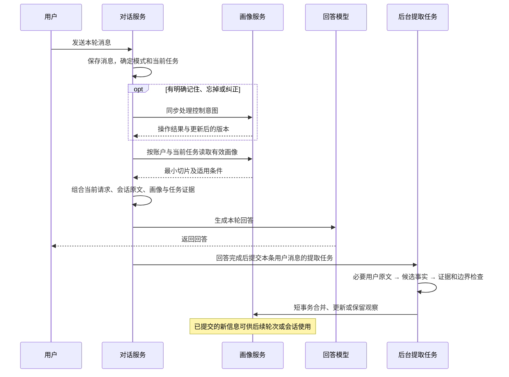

# 画像何时提取、何时注入、怎样改善回答

日期：2026-09-30。状态：用户已确认普通提取异步、不阻塞回答，以及生成前读取已提交画像的时序原则；应用与实现细节继续讨论，尚未实施。

用户追加问题：“画像何时提取？画像信息注入对话上下文的时机？系统怎么获取画像信息改进对话内容？给我建议”。

## 1. 建议的三个时机

| 操作 | 建议时机 | 对本轮回答的影响 |
| --- | --- | --- |
| 用户明确记住、忘掉或纠正 | 用户消息保存后、开始生成回答前，先完成受控操作 | 本轮取得更新后的有效信息；成功或失败如实反馈 |
| 普通对话自动提取 | 本轮回答完成后，提交后台任务 | 本轮新自述已经通过用户原文影响回答；保存结果用于后续相关任务 |
| 读取并注入已有画像 | 每轮确定当前任务后、第一次相关生成调用前，由后端编译最小切片 | 只有此时已经提交、有效且适用的信息进入本轮上下文 |

**普通提取异步完成，所以不能无条件承诺“下一轮一定已写好”。** 下一轮读取当时已经提交的最新有效信息，不等待新的后台提取；如果任务还没完成，使用原有版本。本会话仍有用户原文，可以直接使用其中的当前信息；跨会话生效可能有短暂延迟。

如果希望跨会话立即可用，用户明确“记住”走同步路径即可。此建议不需要先自动提取本轮画像才能理解本轮自述。

本轮结束后的提取应以用户消息为处理单位，保持幂等；模型重试不能重复增加证据次数。失败或停止终态是否补提取，定稿时另行明确；用户撤回、禁止记录或来源已失效的消息不应继续提取。

## 2. 一轮对话的完整顺序



前台读取已有画像应是本地、快速且有边界的过程。异步提取需要可恢复队列，但无需为它重新构造整个聊天工作流；可复用当前项目已有提取状态、重试队列和事务提交设施。

## 3. 提取器具体看什么

每次普通提取以本条**用户原文**为主体，必要时取得少量邻近用户原文，用于理解“这个专业”“还是上次那个目标”等回指。可查阅相关既有事实的标识和有效状态，以判断补充、替代或冲突。

不把助手提出的建议、生成的总结、工具搜索结果或第三方材料直接当成用户事实。例如助手说“你可能适合考研”，不会产生“用户准备考研”；用户随后明确说“对，我决定今年考研”，才有支持依据。

模型输出候选时至少要保留：完整事实、精确原话出处、事实关系、适用范围以及原文明示的时间。候选经过系统检查后，可以有四种结果：

- 写入新的明确事实。
- 补充同一事实的证据，或更新明确变化的对应事实。
- 证据不足，只保留观察，不进入回答画像。
- 不相关、不可复用、被删除抑制或越界，不写入。

“每轮检查”不等于“每轮必须新增”，也不等于“每条消息都必须调用模型”。本地预检可跳过没有可复用信号的消息，但不能继续以狭窄兴趣词表挡掉明确的回答偏好或约束。

## 4. 系统怎样取得画像

模型不会自动知道数据库中存了什么。**后端对话服务调用画像服务，把经过筛选的信息显式加入本轮模型输入。** 不向模型开放整个账户画像库。

取用流程建议如下：

1. **确定当前任务。** 使用本轮要求、必要前文、已选模式和模块、当前学习阶段，判断要解释概念、制定计划还是推荐资料。
2. **过滤有效性。** 只读取当前账户、活动、未删除、未过期、证据充分且范围适用的条目；关闭画像使用时不读取长期画像正文。
3. **取得适用的默认偏好。** 例如“先例子后公式”跨学科解释可适用，不要求它与“贝叶斯定理”共享字词。
4. **召回任务所需的事实。** 制定学习计划需要时间与目标，解释概念需要基础和表达偏好，资料推荐可能需要专业、目标与资源限制。无关爱好不注入。
5. **处理当前要求覆盖与冲突。** 本轮要求详细推导时覆盖默认简短偏好；未解决冲突不用作确定事实，不猜测缺失基础。
6. **按预算选择完整条目。** 保留条件和否定，不能只截前 80 字。记录哪些条目被选中、为什么适用，便于解释和评测。

先用可理解的任务规则解决偏好和约束的取用，再依据评测决定语义检索或索引。不要一上来把“更了解用户”等同于建立大而全的向量记忆库。

## 5. 注入的是可应用的信息

画像应成为独立、明确标注的上下文数据块，不拼成“完整用户总结”，也不作为能覆盖系统要求的高权限指令。它需要告诉生成模型这些事实可用于哪项回答决策。

示例输入块：

```text
本轮可参考的用户信息：
- 用户明确说自己刚开始学习概率；尚无答题证据证明具体掌握程度。
- 默认讲解偏好：先用直观例子，再引入公式；适用于概念讲解。

本轮应用：从概率入门起点解释贝叶斯定理，先给可计算的例子再给公式。
本轮明确要求优先；保留数学条件和结论，不推断未提供的个人信息。
```

“本轮应用”可以由任务与已确认偏好的规则编译，也可以在主生成调用中要求模型按这些信息完成任务；**不必额外增加一次模型调用来写应用计划。** 画像更新的语义模型与回答模型是两个不同职责。

| 画像信息 | 本轮任务 | 应出现的具体变化 |
| --- | --- | --- |
| 概率入门 | 解释贝叶斯定理 | 先解释先验、证据和更新，再引入公式 |
| 先例子后公式 | 解释概念 | 调整讲解顺序，仍保留必要公式与条件 |
| 每天可学习 30 分钟 | 制定一周学习计划 | 每天安排不超过该时间，步骤可执行 |
| 备考六级 | 推荐英语练习 | 选择与六级任务相关的训练 |
| 喜欢跑步 | 解释贝叶斯定理 | 默认无必要影响，不强行使用跑步类比 |

画像使用有效的证据是这些行为变化，不是回答开头出现“结合你的情况”。

## 6. 多轮、模块与重试的边界

- **在本轮开始生成前取得一次画像版本。** 同轮后续模块或工具相关模型调用，从这份有效信息中再选任务所需子集；不在生成中途偷偷加入新提取结果。
- **重试保持可追溯。** 正常重试复用可追溯的本轮切片；发生删除、撤回或用户纠正后，旧切片应失效，后续调用重新编译，不能为了重现旧回答继续发送失效信息。
- **用户删除之后的调用必须受控。** 已发给模型的上下文无法收回，删除应阻止后续调用和后续轮次继续注入，并使缓存与重试切片失效。
- **忘掉长期画像与原消息保留需要解释清楚。** 原聊天历史仍可能显示该原话；若要保证被忘掉的事实也不从旧会话原文重新影响后续回答，需要在原文回补与摘要中沿用该事实的抑制边界。这是现有画像删除之外的实现议题，不能只删画像表就宣称模型完全遗忘。
- **关闭长期画像使用时，当前用户原文仍参与回答。** 因为理解用户本轮提供的信息是基本对话能力，这不等于从长期画像取用信息。

## 7. 用一个连续例子核对时序

| 用户消息 | 本轮如何回答 | 回答后如何处理 |
| --- | --- | --- |
| “我刚开始学概率，平时希望先举例再讲公式” | 直接使用这条原文选择入门解释与例子，不等待长期记录 | 验证原话后形成基础与默认讲解偏好两个事实 |
| “讲讲贝叶斯定理” | 若新记录已提交，则取基础与偏好；尚未提交时，同会话可参考前轮原文 | 单纯提问不自动生成“长期喜欢贝叶斯”的事实 |
| “这次直接给详细推导” | 本轮直接详细推导，覆盖默认顺序与篇幅要求 | 本次例外不改写长期偏好 |
| “记住我以后更喜欢先给结论” | 同步处理明确记住或变更，再使用适用的新偏好 | 不再为同一操作重复写一次自动记录 |
| “忘掉我的讲解偏好” | 生成前抑制明确定位到的偏好，不再注入 | 旧证据与普通近义提及不自动恢复 |

## 8. 建议的首期验收场景

1. **当前自述即时有效。** 新用户在首轮声明基础与偏好，首轮回答已经按原文适配；后台提取失败不会拖住回答。
2. **跨会话有效使用。** 提取已完成后开启新会话，主题没有共享词语也能取得适用偏好和基础；无关爱好不注入。
3. **变更与删除及时有效。** 明确记住、纠正和忘掉在生成前生效；过期、删除和旧重试不会恢复失效事实。
4. **画像确实改善内容。** 固定当前任务与模型配置，对照有画像、无画像、错误或过时画像；检查解释起点、篇幅结构、时间可行性和事实正确性。

用户已选择“普通提取异步，不阻塞回答”：普通提取回答后异步，每轮生成前读取已提交信息，不等新提取完成；接受后台尚未完成时新信息可能暂时无法跨会话使用。其余调用与状态合同继续细化。
